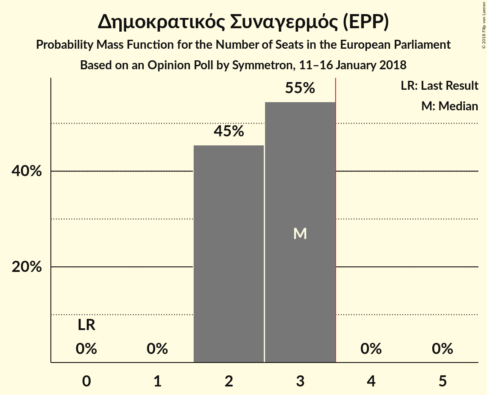
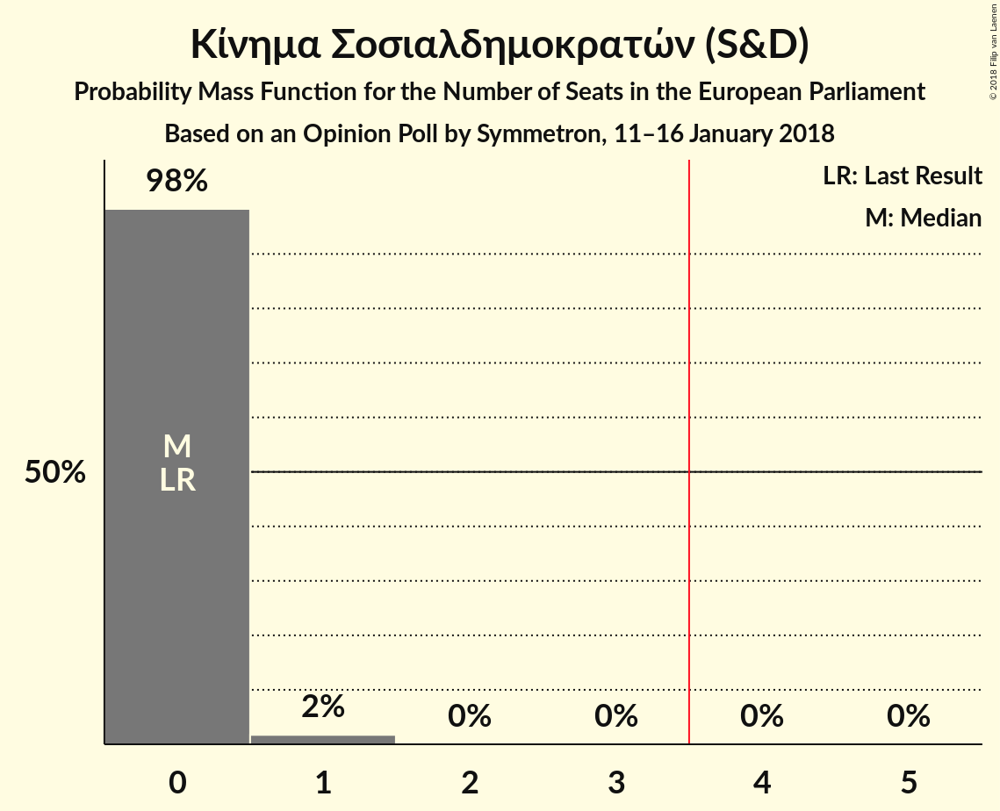
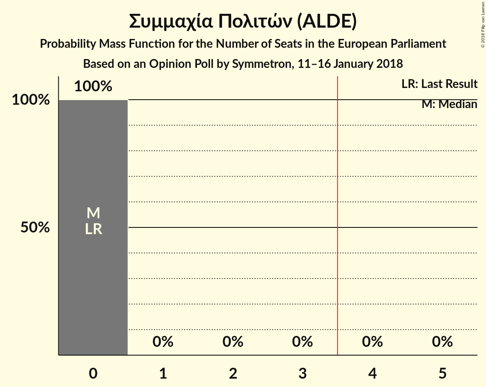
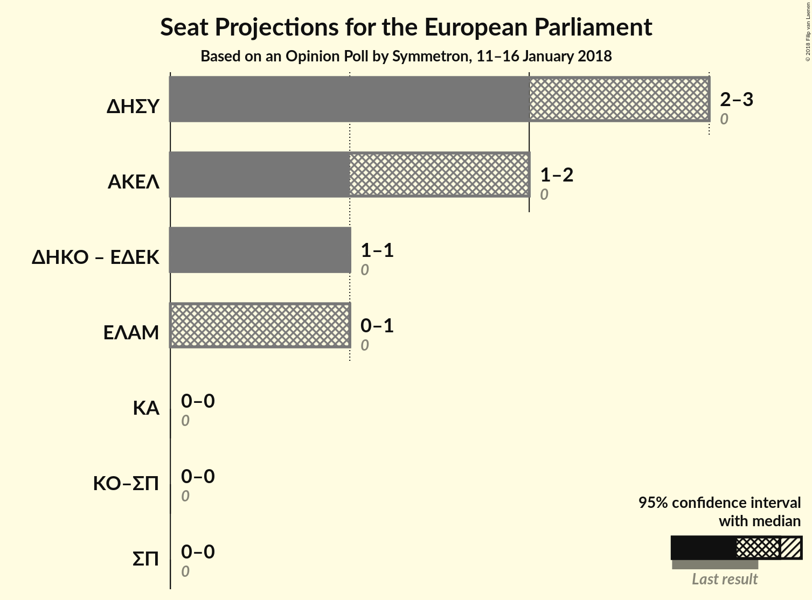

# Opinion Poll by Symmetron, 11–16 January 2018

<a href="#voting-intentions">Voting Intentions</a> | <a href="#seats">Seats</a> | <a href="#coalitions">Coalitions</a> | <a href="#technical-information">Technical Information</a>

## Voting Intentions

### Confidence Intervals

| Party | Last Result | Poll Result | 80% Confidence Interval | 90% Confidence Interval | 95% Confidence Interval | 99% Confidence Interval |
|:-----:|:-----------:|:-----------:|:-----------------------:|:-----------------------:|:-----------------------:|:-----------------------:|
| Δημοκρατικός Συναγερμός (EPP) | 0.0% | 40.0% | 38.0–42.0% |37.5–42.6% |37.0–43.1% |36.1–44.0% |
| Ανορθωτικό Κόμμα Εργαζόμενου Λαού (GUE/NGL) | 0.0% | 25.0% | 23.3–26.8% |22.8–27.3% |22.4–27.8% |21.6–28.7% |
| Δημοκρατικό Κόμμα (S&D) | 0.0% | 16.0% | 14.6–17.6% |14.2–18.0% |13.9–18.4% |13.2–19.2% |
| Εθνικό Λαϊκό Μέτωπο (*) | 0.0% | 7.0% | 6.1–8.1% |5.8–8.5% |5.6–8.8% |5.2–9.3% |
| Κίνημα Σοσιαλδημοκρατών (S&D) | 0.0% | 5.0% | 4.2–6.0% |4.0–6.3% |3.8–6.5% |3.5–7.0% |
| Συμμαχία Πολιτών (ALDE) | 0.0% | 3.0% | 2.4–3.8% |2.2–4.1% |2.1–4.3% |1.9–4.7% |
| Κίνημα Οικολόγων—Συνεργασία Πολιτών (Greens/EFA) | 0.0% | 2.0% | 1.5–2.7% |1.4–2.9% |1.3–3.1% |1.1–3.4% |
| Κίνημα Αλληλεγγύη (ECR) | 0.0% | 2.0% | 1.5–2.7% |1.4–2.9% |1.3–3.1% |1.1–3.4% |

*Note:* The poll result column reflects the actual value used in the calculations. Published results may vary slightly, and in addition be rounded to fewer digits.

## Seats

### Confidence Intervals

| Party | Last Result | Median | 80% Confidence Interval | 90% Confidence Interval | 95% Confidence Interval | 99% Confidence Interval |
|:-----:|:-----------:|:------:|:-----------------------:|:-----------------------:|:-----------------------:|:-----------------------:|
| <a href="#δημοκρατικός-συναγερμός-(epp)">Δημοκρατικός Συναγερμός (EPP)</a> | 0 | 3 | 2–3 |2–3 |2–3 |2–3 |
| <a href="#ανορθωτικό-κόμμα-εργαζόμενου-λαού-(gue/ngl)">Ανορθωτικό Κόμμα Εργαζόμενου Λαού (GUE/NGL)</a> | 0 | 2 | 1–2 |1–2 |1–2 |1–2 |
| <a href="#δημοκρατικό-κόμμα-(s&d)">Δημοκρατικό Κόμμα (S&D)</a> | 0 | 1 | 1 |1 |1 |1 |
| <a href="#εθνικό-λαϊκό-μέτωπο-(*)">Εθνικό Λαϊκό Μέτωπο (*)</a> | 0 | 1 | 0–1 |0–1 |0–1 |0–1 |
| <a href="#κίνημα-σοσιαλδημοκρατών-(s&d)">Κίνημα Σοσιαλδημοκρατών (S&D)</a> | 0 | 0 | 0 |0 |0 |0–1 |
| <a href="#συμμαχία-πολιτών-(alde)">Συμμαχία Πολιτών (ALDE)</a> | 0 | 0 | 0 |0 |0 |0 |
| <a href="#κίνημα-οικολόγων—συνεργασία-πολιτών-(greens/efa)">Κίνημα Οικολόγων—Συνεργασία Πολιτών (Greens/EFA)</a> | 0 | 0 | 0 |0 |0 |0 |
| <a href="#κίνημα-αλληλεγγύη-(ecr)">Κίνημα Αλληλεγγύη (ECR)</a> | 0 | 0 | 0 |0 |0 |0 |

### Δημοκρατικός Συναγερμός (EPP)

*For a full overview of the results for this party, see the [Δημοκρατικός Συναγερμός (EPP)](party-δημοκρατικόςσυναγερμόςepp.html) page.*

| Number of Seats | Probability | Accumulated | Special Marks |
|:---------------:|:-----------:|:-----------:|:-------------:|
| 0 | 0% | 100% | Last Result |
| 1 | 0% | 100% |  |
| 2 | 45% | 100% |  |
| 3 | 55% | 55% | Median |
| 4 | 0% | 0% | Majority |

### Ανορθωτικό Κόμμα Εργαζόμενου Λαού (GUE/NGL)

*For a full overview of the results for this party, see the [Ανορθωτικό Κόμμα Εργαζόμενου Λαού (GUE/NGL)](party-ανορθωτικόκόμμαεργαζόμενουλαούguengl.html) page.*

| Number of Seats | Probability | Accumulated | Special Marks |
|:---------------:|:-----------:|:-----------:|:-------------:|
| 0 | 0% | 100% | Last Result |
| 1 | 15% | 100% |  |
| 2 | 85% | 85% | Median |
| 3 | 0% | 0% |  |

### Δημοκρατικό Κόμμα (S&D)

*For a full overview of the results for this party, see the [Δημοκρατικό Κόμμα (S&D)](party-δημοκρατικόκόμμαsd.html) page.*

| Number of Seats | Probability | Accumulated | Special Marks |
|:---------------:|:-----------:|:-----------:|:-------------:|
| 0 | 0% | 100% | Last Result |
| 1 | 100% | 100% | Median |

### Εθνικό Λαϊκό Μέτωπο (*)

*For a full overview of the results for this party, see the [Εθνικό Λαϊκό Μέτωπο (*)](party-εθνικόλαϊκόμέτωπο.html) page.*

| Number of Seats | Probability | Accumulated | Special Marks |
|:---------------:|:-----------:|:-----------:|:-------------:|
| 0 | 41% | 100% | Last Result |
| 1 | 59% | 59% | Median |
| 2 | 0% | 0% |  |

### Κίνημα Σοσιαλδημοκρατών (S&D)

*For a full overview of the results for this party, see the [Κίνημα Σοσιαλδημοκρατών (S&D)](party-κίνημασοσιαλδημοκρατώνsd.html) page.*

| Number of Seats | Probability | Accumulated | Special Marks |
|:---------------:|:-----------:|:-----------:|:-------------:|
| 0 | 98% | 100% | Last Result, Median |
| 1 | 2% | 2% |  |
| 2 | 0% | 0% |  |

### Συμμαχία Πολιτών (ALDE)

*For a full overview of the results for this party, see the [Συμμαχία Πολιτών (ALDE)](party-συμμαχίαπολιτώνalde.html) page.*

| Number of Seats | Probability | Accumulated | Special Marks |
|:---------------:|:-----------:|:-----------:|:-------------:|
| 0 | 100% | 100% | Last Result, Median |

### Κίνημα Οικολόγων—Συνεργασία Πολιτών (Greens/EFA)

*For a full overview of the results for this party, see the [Κίνημα Οικολόγων—Συνεργασία Πολιτών (Greens/EFA)](party-κίνημαοικολόγων—συνεργασίαπολιτώνgreensefa.html) page.*

| Number of Seats | Probability | Accumulated | Special Marks |
|:---------------:|:-----------:|:-----------:|:-------------:|
| 0 | 100% | 100% | Last Result, Median |

### Κίνημα Αλληλεγγύη (ECR)

*For a full overview of the results for this party, see the [Κίνημα Αλληλεγγύη (ECR)](party-κίνημααλληλεγγύηecr.html) page.*

| Number of Seats | Probability | Accumulated | Special Marks |
|:---------------:|:-----------:|:-----------:|:-------------:|
| 0 | 100% | 100% | Last Result, Median |

## Coalitions

### Confidence Intervals

| Coalition | Last Result | Median | Majority? | 80% Confidence Interval | 90% Confidence Interval | 95% Confidence Interval | 99% Confidence Interval |
|:---------:|:-----------:|:------:|:---------:|:-----------------------:|:-----------------------:|:-----------------------:|:-----------------------:|
| Δημοκρατικός Συναγερμός (EPP) | 0 | 3 | 0% | 2–3 | 2–3 | 2–3 | 2–3 |
| Ανορθωτικό Κόμμα Εργαζόμενου Λαού (GUE/NGL) | 0 | 2 | 0% | 1–2 | 1–2 | 1–2 | 1–2 |
| Δημοκρατικό Κόμμα (S&D) – Κίνημα Σοσιαλδημοκρατών (S&D) | 0 | 1 | 0% | 1 | 1 | 1 | 1–2 |
| Εθνικό Λαϊκό Μέτωπο (*) | 0 | 1 | 0% | 0–1 | 0–1 | 0–1 | 0–1 |
| Κίνημα Αλληλεγγύη (ECR) | 0 | 0 | 0% | 0 | 0 | 0 | 0 |
| Κίνημα Οικολόγων—Συνεργασία Πολιτών (Greens/EFA) | 0 | 0 | 0% | 0 | 0 | 0 | 0 |
| Συμμαχία Πολιτών (ALDE) | 0 | 0 | 0% | 0 | 0 | 0 | 0 |

### Δημοκρατικός Συναγερμός (EPP)

| Number of Seats | Probability | Accumulated | Special Marks |
|:---------------:|:-----------:|:-----------:|:-------------:|
| 0 | 0% | 100% | Last Result |
| 1 | 0% | 100% |  |
| 2 | 45% | 100% |  |
| 3 | 55% | 55% | Median |
| 4 | 0% | 0% | Majority |

### Ανορθωτικό Κόμμα Εργαζόμενου Λαού (GUE/NGL)

| Number of Seats | Probability | Accumulated | Special Marks |
|:---------------:|:-----------:|:-----------:|:-------------:|
| 0 | 0% | 100% | Last Result |
| 1 | 15% | 100% |  |
| 2 | 85% | 85% | Median |
| 3 | 0% | 0% |  |

### Δημοκρατικό Κόμμα (S&D) – Κίνημα Σοσιαλδημοκρατών (S&D)

| Number of Seats | Probability | Accumulated | Special Marks |
|:---------------:|:-----------:|:-----------:|:-------------:|
| 0 | 0% | 100% | Last Result |
| 1 | 98% | 100% | Median |
| 2 | 2% | 2% |  |
| 3 | 0% | 0% |  |

### Εθνικό Λαϊκό Μέτωπο (*)

| Number of Seats | Probability | Accumulated | Special Marks |
|:---------------:|:-----------:|:-----------:|:-------------:|
| 0 | 41% | 100% | Last Result |
| 1 | 59% | 59% | Median |
| 2 | 0% | 0% |  |

### Κίνημα Αλληλεγγύη (ECR)

| Number of Seats | Probability | Accumulated | Special Marks |
|:---------------:|:-----------:|:-----------:|:-------------:|
| 0 | 100% | 100% | Last Result, Median |

### Κίνημα Οικολόγων—Συνεργασία Πολιτών (Greens/EFA)

| Number of Seats | Probability | Accumulated | Special Marks |
|:---------------:|:-----------:|:-----------:|:-------------:|
| 0 | 100% | 100% | Last Result, Median |

### Συμμαχία Πολιτών (ALDE)

| Number of Seats | Probability | Accumulated | Special Marks |
|:---------------:|:-----------:|:-----------:|:-------------:|
| 0 | 100% | 100% | Last Result, Median |

## Technical Information

### Opinion Poll

+ **Polling firm:** Symmetron
+ **Commissioner(s):** —
+ **Fieldwork period:** 11–16 January 2018

### Calculations

+ **Sample size:** 1000
+ **Simulations done:** 1,048,576
+ **Error estimate:** 1.48%

