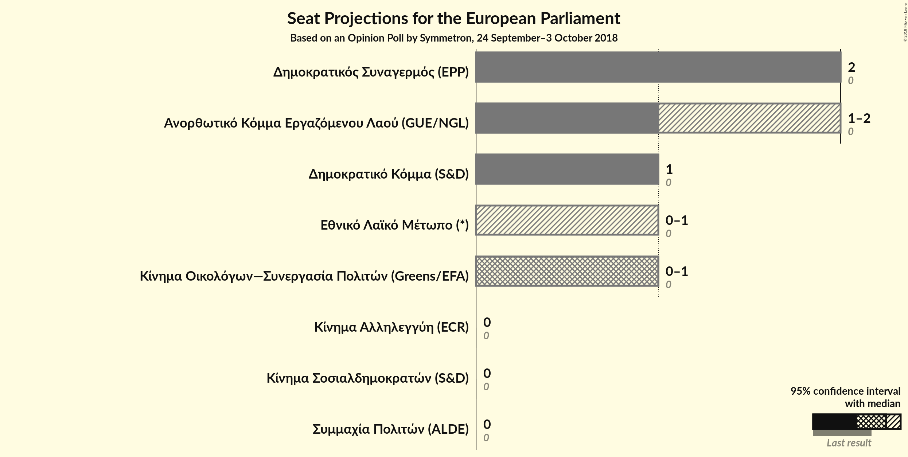
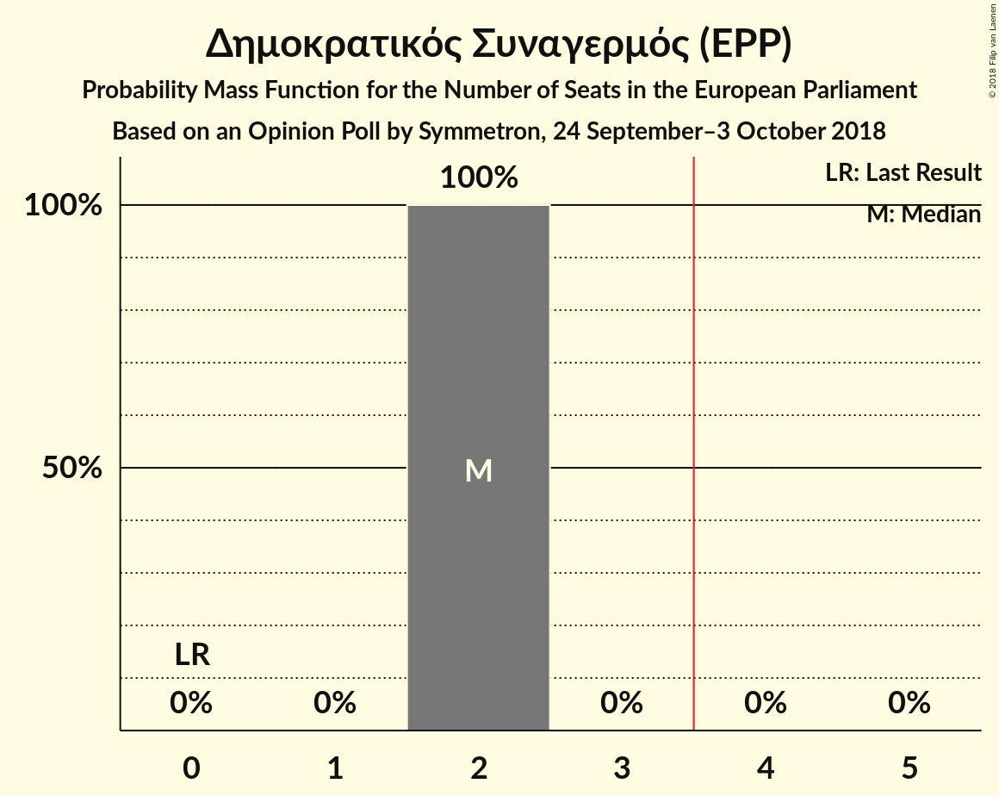
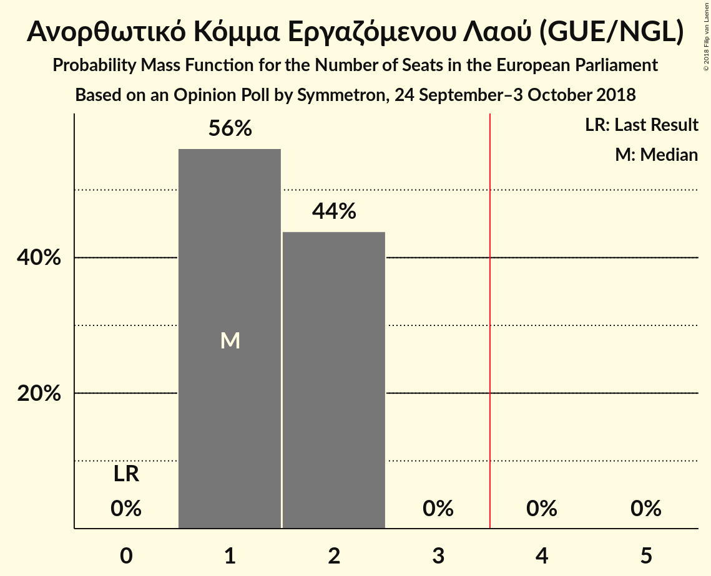
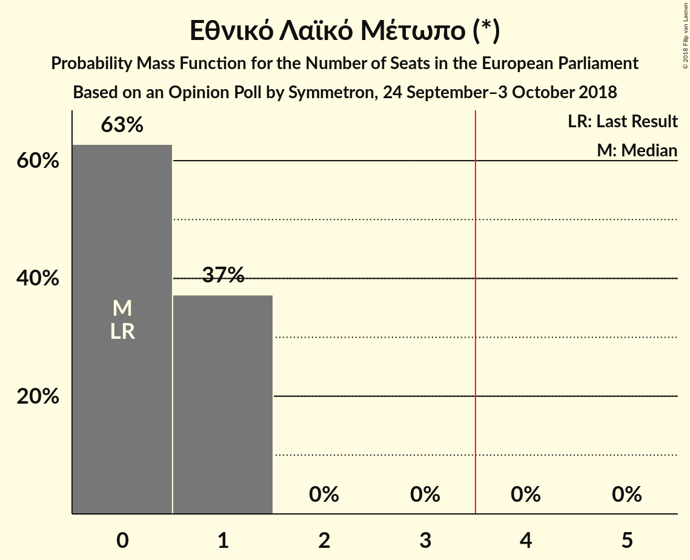
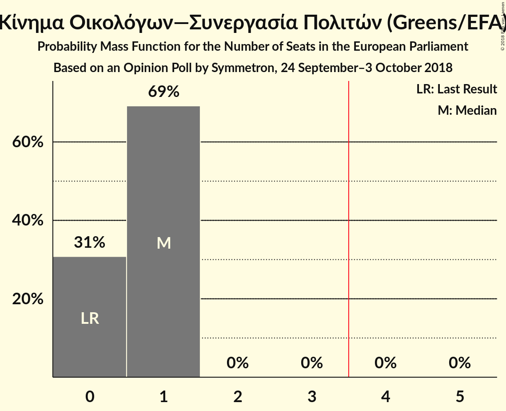
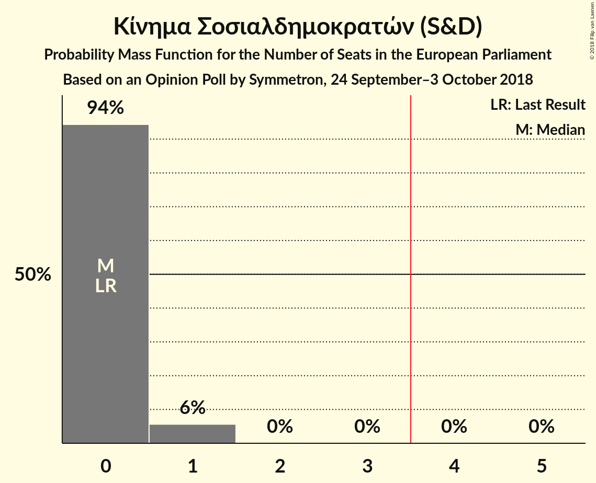
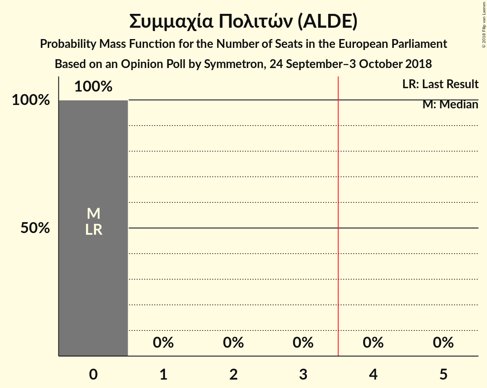
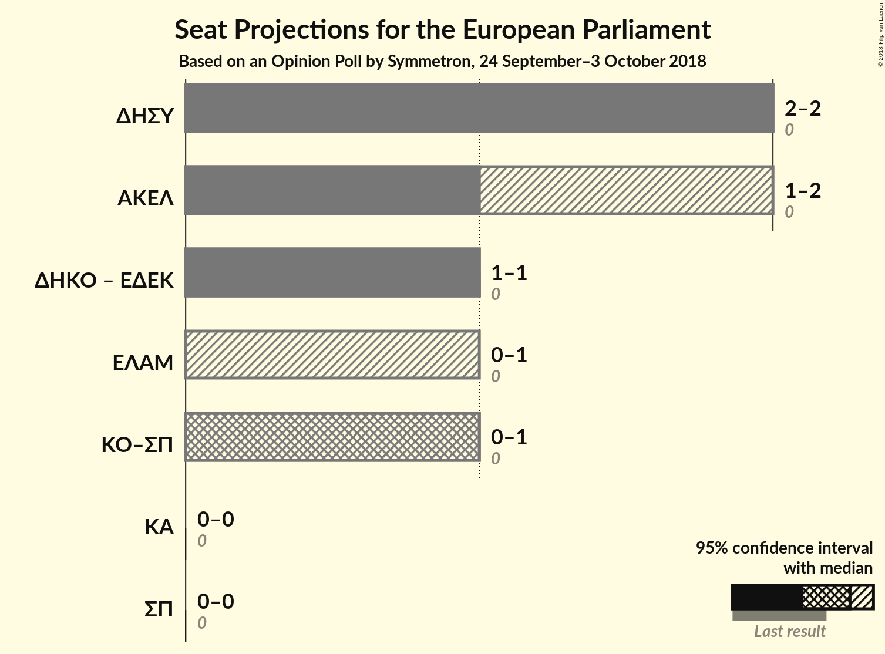

# Opinion Poll by Symmetron, 24 September–3 October 2018

<a href="#voting-intentions">Voting Intentions</a> | <a href="#seats">Seats</a> | <a href="#coalitions">Coalitions</a> | <a href="#technical-information">Technical Information</a>

## Voting Intentions

### Confidence Intervals

| Party | Last Result | Poll Result | 80% Confidence Interval | 90% Confidence Interval | 95% Confidence Interval | 99% Confidence Interval |
|:-----:|:-----------:|:-----------:|:-----------------------:|:-----------------------:|:-----------------------:|:-----------------------:|
| Δημοκρατικός Συναγερμός (EPP) | 0.0% | 33.0% | 30.9–35.2% |30.3–35.8% |29.8–36.3% |28.9–37.4% |
| Ανορθωτικό Κόμμα Εργαζόμενου Λαού (GUE/NGL) | 0.0% | 23.0% | 21.2–25.0% |20.7–25.6% |20.2–26.0% |19.4–27.0% |
| Δημοκρατικό Κόμμα (S&D) | 0.0% | 15.0% | 13.5–16.7% |13.1–17.2% |12.7–17.6% |12.0–18.5% |
| Εθνικό Λαϊκό Μέτωπο (*) | 0.0% | 6.0% | 5.0–7.2% |4.8–7.6% |4.6–7.9% |4.1–8.5% |
| Κίνημα Οικολόγων—Συνεργασία Πολιτών (Greens/EFA) | 0.0% | 6.0% | 5.0–7.2% |4.8–7.6% |4.6–7.9% |4.1–8.5% |
| Κίνημα Σοσιαλδημοκρατών (S&D) | 0.0% | 5.0% | 4.1–6.1% |3.9–6.5% |3.7–6.7% |3.3–7.3% |
| Κίνημα Αλληλεγγύη (ECR) | 0.0% | 3.0% | 2.3–3.9% |2.2–4.2% |2.0–4.4% |1.8–4.9% |
| Συμμαχία Πολιτών (ALDE) | 0.0% | 2.0% | 1.5–2.8% |1.4–3.0% |1.2–3.2% |1.0–3.7% |

*Note:* The poll result column reflects the actual value used in the calculations. Published results may vary slightly, and in addition be rounded to fewer digits.

## Seats

### Confidence Intervals

| Party | Last Result | Median | 80% Confidence Interval | 90% Confidence Interval | 95% Confidence Interval | 99% Confidence Interval |
|:-----:|:-----------:|:------:|:-----------------------:|:-----------------------:|:-----------------------:|:-----------------------:|
| <a href="#δημοκρατικός-συναγερμός-(epp)">Δημοκρατικός Συναγερμός (EPP)</a> | 0 | 2 | 2 |2 |2 |2 |
| <a href="#ανορθωτικό-κόμμα-εργαζόμενου-λαού-(gue/ngl)">Ανορθωτικό Κόμμα Εργαζόμενου Λαού (GUE/NGL)</a> | 0 | 1 | 1–2 |1–2 |1–2 |1–2 |
| <a href="#δημοκρατικό-κόμμα-(s&d)">Δημοκρατικό Κόμμα (S&D)</a> | 0 | 1 | 1 |1 |1 |1 |
| <a href="#εθνικό-λαϊκό-μέτωπο-(*)">Εθνικό Λαϊκό Μέτωπο (*)</a> | 0 | 0 | 0–1 |0–1 |0–1 |0–1 |
| <a href="#κίνημα-οικολόγων—συνεργασία-πολιτών-(greens/efa)">Κίνημα Οικολόγων—Συνεργασία Πολιτών (Greens/EFA)</a> | 0 | 0 | 0–1 |0–1 |0–1 |0–1 |
| <a href="#κίνημα-σοσιαλδημοκρατών-(s&d)">Κίνημα Σοσιαλδημοκρατών (S&D)</a> | 0 | 0 | 0 |0–1 |0–1 |0–1 |
| <a href="#κίνημα-αλληλεγγύη-(ecr)">Κίνημα Αλληλεγγύη (ECR)</a> | 0 | 0 | 0 |0 |0 |0 |
| <a href="#συμμαχία-πολιτών-(alde)">Συμμαχία Πολιτών (ALDE)</a> | 0 | 0 | 0 |0 |0 |0 |

### Δημοκρατικός Συναγερμός (EPP)

*For a full overview of the results for this party, see the [Δημοκρατικός Συναγερμός (EPP)](party-δημοκρατικόςσυναγερμόςepp.html) page.*

| Number of Seats | Probability | Accumulated | Special Marks |
|:---------------:|:-----------:|:-----------:|:-------------:|
| 0 | 0% | 100% | Last Result |
| 1 | 0% | 100% |  |
| 2 | 100% | 100% | Median |

### Ανορθωτικό Κόμμα Εργαζόμενου Λαού (GUE/NGL)

*For a full overview of the results for this party, see the [Ανορθωτικό Κόμμα Εργαζόμενου Λαού (GUE/NGL)](party-ανορθωτικόκόμμαεργαζόμενουλαούguengl.html) page.*

| Number of Seats | Probability | Accumulated | Special Marks |
|:---------------:|:-----------:|:-----------:|:-------------:|
| 0 | 0% | 100% | Last Result |
| 1 | 54% | 100% | Median |
| 2 | 46% | 46% |  |
| 3 | 0% | 0% |  |

### Δημοκρατικό Κόμμα (S&D)

*For a full overview of the results for this party, see the [Δημοκρατικό Κόμμα (S&D)](party-δημοκρατικόκόμμαsd.html) page.*

| Number of Seats | Probability | Accumulated | Special Marks |
|:---------------:|:-----------:|:-----------:|:-------------:|
| 0 | 0% | 100% | Last Result |
| 1 | 100% | 100% | Median |

### Εθνικό Λαϊκό Μέτωπο (*)

*For a full overview of the results for this party, see the [Εθνικό Λαϊκό Μέτωπο (*)](party-εθνικόλαϊκόμέτωπο.html) page.*

| Number of Seats | Probability | Accumulated | Special Marks |
|:---------------:|:-----------:|:-----------:|:-------------:|
| 0 | 63% | 100% | Last Result, Median |
| 1 | 37% | 37% |  |
| 2 | 0% | 0% |  |

### Κίνημα Οικολόγων—Συνεργασία Πολιτών (Greens/EFA)

*For a full overview of the results for this party, see the [Κίνημα Οικολόγων—Συνεργασία Πολιτών (Greens/EFA)](party-κίνημαοικολόγων—συνεργασίαπολιτώνgreensefa.html) page.*

| Number of Seats | Probability | Accumulated | Special Marks |
|:---------------:|:-----------:|:-----------:|:-------------:|
| 0 | 65% | 100% | Last Result, Median |
| 1 | 35% | 35% |  |
| 2 | 0% | 0% |  |

### Κίνημα Σοσιαλδημοκρατών (S&D)

*For a full overview of the results for this party, see the [Κίνημα Σοσιαλδημοκρατών (S&D)](party-κίνημασοσιαλδημοκρατώνsd.html) page.*

| Number of Seats | Probability | Accumulated | Special Marks |
|:---------------:|:-----------:|:-----------:|:-------------:|
| 0 | 94% | 100% | Last Result, Median |
| 1 | 6% | 6% |  |
| 2 | 0% | 0% |  |

### Κίνημα Αλληλεγγύη (ECR)

*For a full overview of the results for this party, see the [Κίνημα Αλληλεγγύη (ECR)](party-κίνημααλληλεγγύηecr.html) page.*

| Number of Seats | Probability | Accumulated | Special Marks |
|:---------------:|:-----------:|:-----------:|:-------------:|
| 0 | 100% | 100% | Last Result, Median |

### Συμμαχία Πολιτών (ALDE)

*For a full overview of the results for this party, see the [Συμμαχία Πολιτών (ALDE)](party-συμμαχίαπολιτώνalde.html) page.*

| Number of Seats | Probability | Accumulated | Special Marks |
|:---------------:|:-----------:|:-----------:|:-------------:|
| 0 | 100% | 100% | Last Result, Median |

## Coalitions

### Confidence Intervals

| Coalition | Last Result | Median | Majority? | 80% Confidence Interval | 90% Confidence Interval | 95% Confidence Interval | 99% Confidence Interval |
|:---------:|:-----------:|:------:|:---------:|:-----------------------:|:-----------------------:|:-----------------------:|:-----------------------:|
| Δημοκρατικός Συναγερμός (EPP) | 0 | 2 | 0% | 2 | 2 | 2 | 2 |
| Ανορθωτικό Κόμμα Εργαζόμενου Λαού (GUE/NGL) | 0 | 1 | 0% | 1–2 | 1–2 | 1–2 | 1–2 |
| Δημοκρατικό Κόμμα (S&D) – Κίνημα Σοσιαλδημοκρατών (S&D) | 0 | 1 | 0% | 1 | 1–2 | 1–2 | 1–2 |
| Εθνικό Λαϊκό Μέτωπο (*) | 0 | 0 | 0% | 0–1 | 0–1 | 0–1 | 0–1 |
| Κίνημα Οικολόγων—Συνεργασία Πολιτών (Greens/EFA) | 0 | 0 | 0% | 0–1 | 0–1 | 0–1 | 0–1 |
| Κίνημα Αλληλεγγύη (ECR) | 0 | 0 | 0% | 0 | 0 | 0 | 0 |
| Συμμαχία Πολιτών (ALDE) | 0 | 0 | 0% | 0 | 0 | 0 | 0 |

### Δημοκρατικός Συναγερμός (EPP)

| Number of Seats | Probability | Accumulated | Special Marks |
|:---------------:|:-----------:|:-----------:|:-------------:|
| 0 | 0% | 100% | Last Result |
| 1 | 0% | 100% |  |
| 2 | 100% | 100% | Median |

### Ανορθωτικό Κόμμα Εργαζόμενου Λαού (GUE/NGL)

| Number of Seats | Probability | Accumulated | Special Marks |
|:---------------:|:-----------:|:-----------:|:-------------:|
| 0 | 0% | 100% | Last Result |
| 1 | 54% | 100% | Median |
| 2 | 46% | 46% |  |
| 3 | 0% | 0% |  |

### Δημοκρατικό Κόμμα (S&D) – Κίνημα Σοσιαλδημοκρατών (S&D)

| Number of Seats | Probability | Accumulated | Special Marks |
|:---------------:|:-----------:|:-----------:|:-------------:|
| 0 | 0% | 100% | Last Result |
| 1 | 94% | 100% | Median |
| 2 | 6% | 6% |  |
| 3 | 0% | 0% |  |

### Εθνικό Λαϊκό Μέτωπο (*)

| Number of Seats | Probability | Accumulated | Special Marks |
|:---------------:|:-----------:|:-----------:|:-------------:|
| 0 | 63% | 100% | Last Result, Median |
| 1 | 37% | 37% |  |
| 2 | 0% | 0% |  |

### Κίνημα Οικολόγων—Συνεργασία Πολιτών (Greens/EFA)

| Number of Seats | Probability | Accumulated | Special Marks |
|:---------------:|:-----------:|:-----------:|:-------------:|
| 0 | 65% | 100% | Last Result, Median |
| 1 | 35% | 35% |  |
| 2 | 0% | 0% |  |

### Κίνημα Αλληλεγγύη (ECR)

| Number of Seats | Probability | Accumulated | Special Marks |
|:---------------:|:-----------:|:-----------:|:-------------:|
| 0 | 100% | 100% | Last Result, Median |

### Συμμαχία Πολιτών (ALDE)

| Number of Seats | Probability | Accumulated | Special Marks |
|:---------------:|:-----------:|:-----------:|:-------------:|
| 0 | 100% | 100% | Last Result, Median |

## Technical Information

### Opinion Poll

+ **Polling firm:** Symmetron
+ **Commissioner(s):** —
+ **Fieldwork period:** 24 September–3 October 2018

### Calculations

+ **Sample size:** 800
+ **Simulations done:** 1,048,576
+ **Error estimate:** 0.90%

