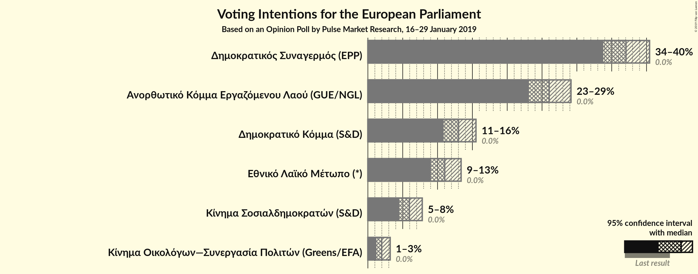
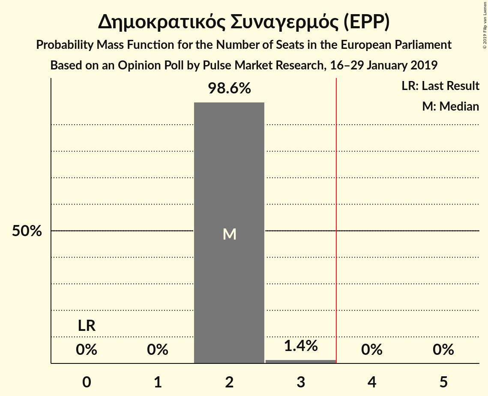
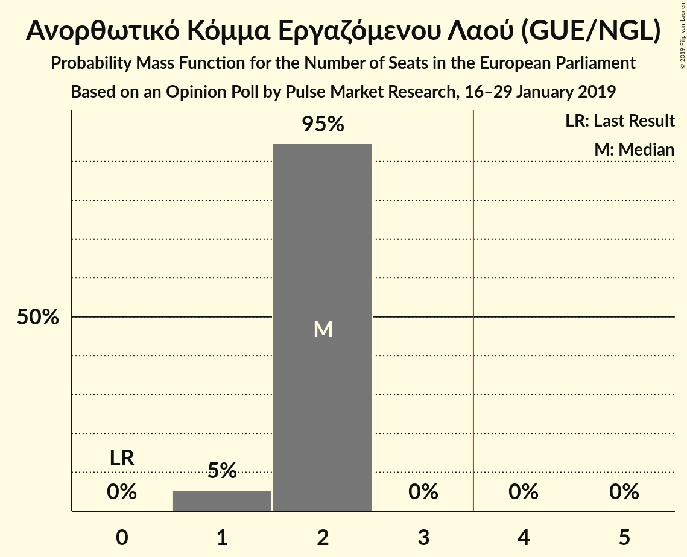
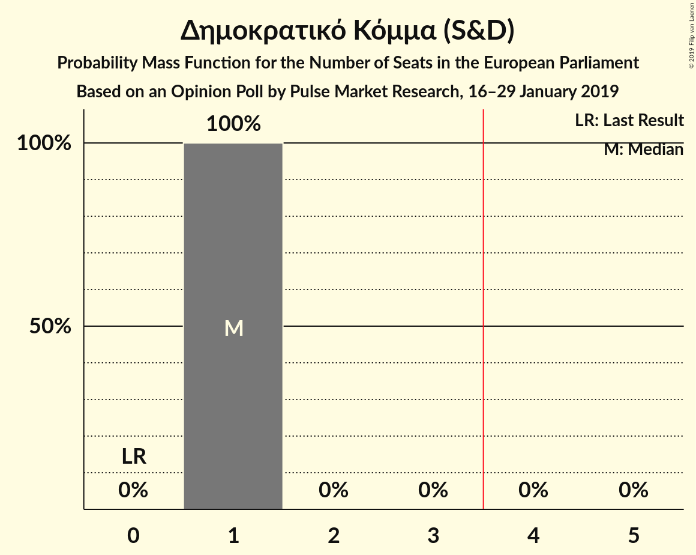
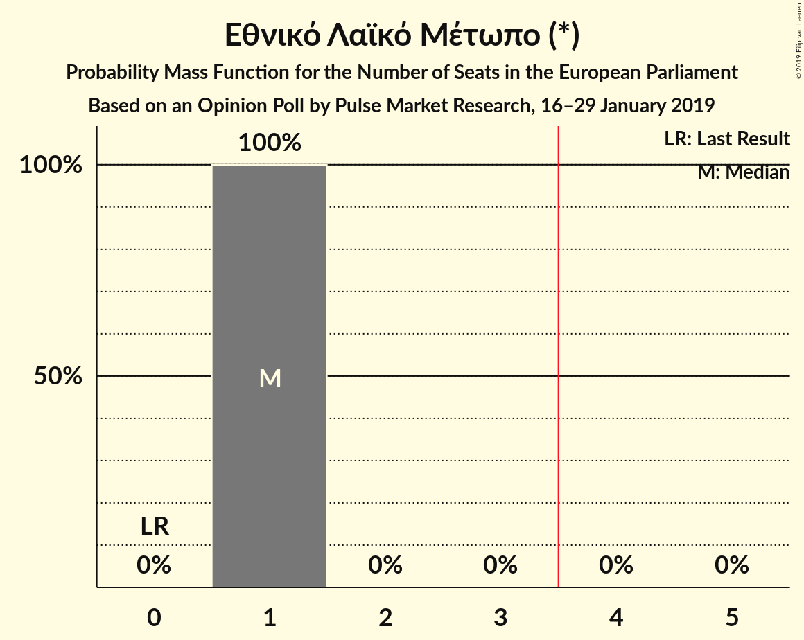
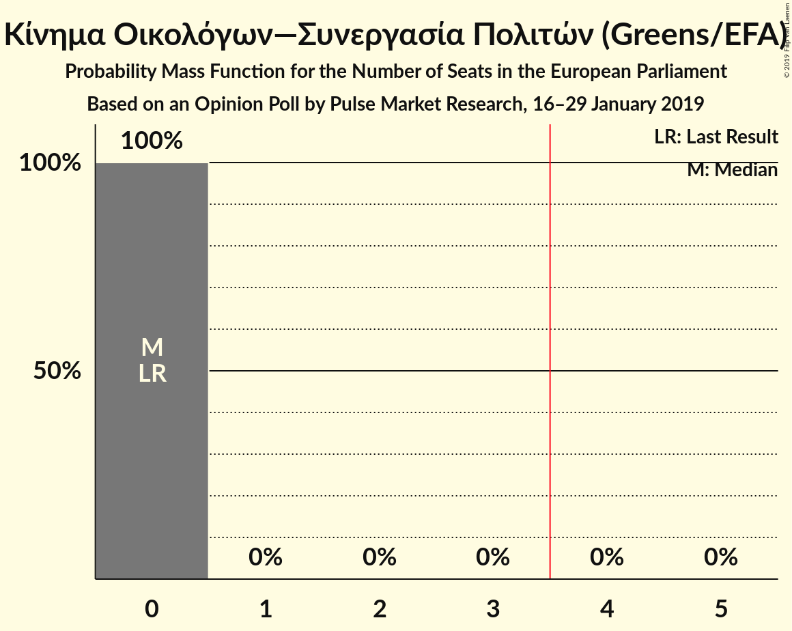
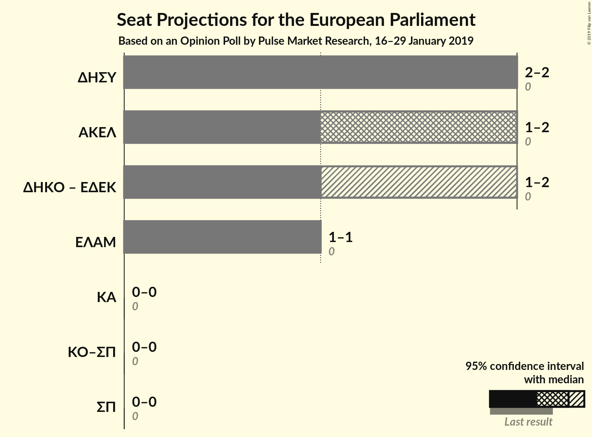
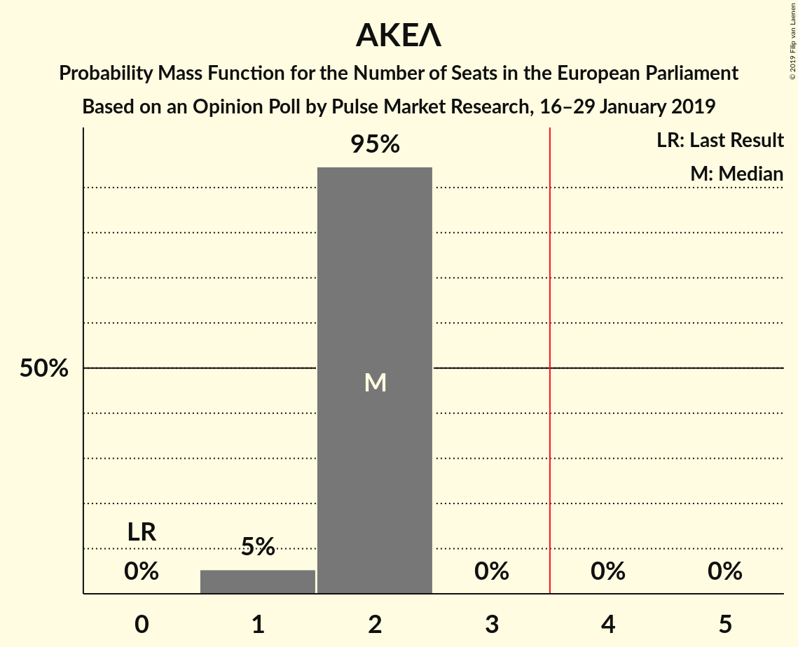
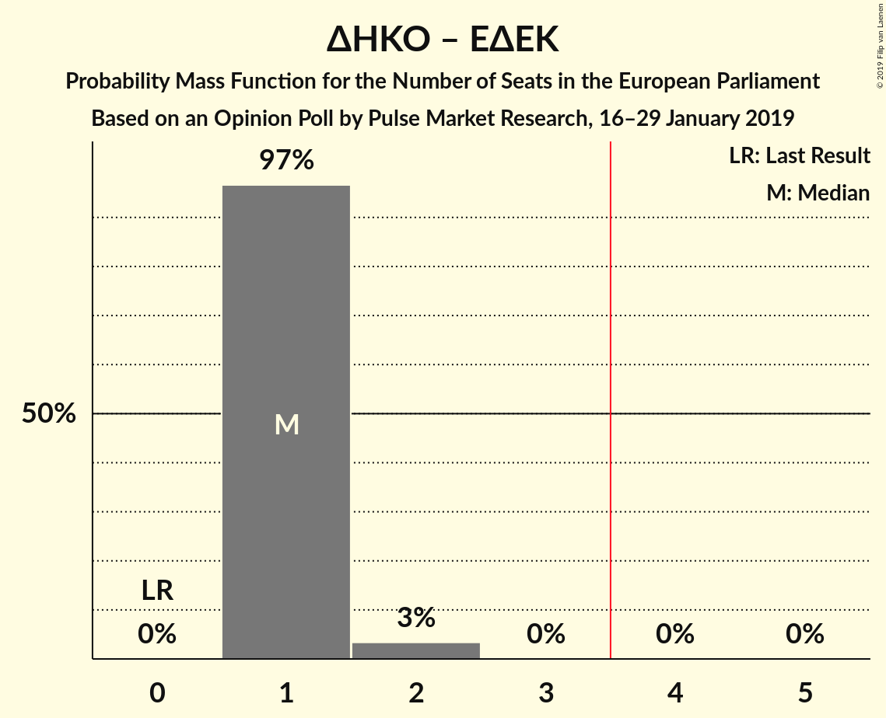
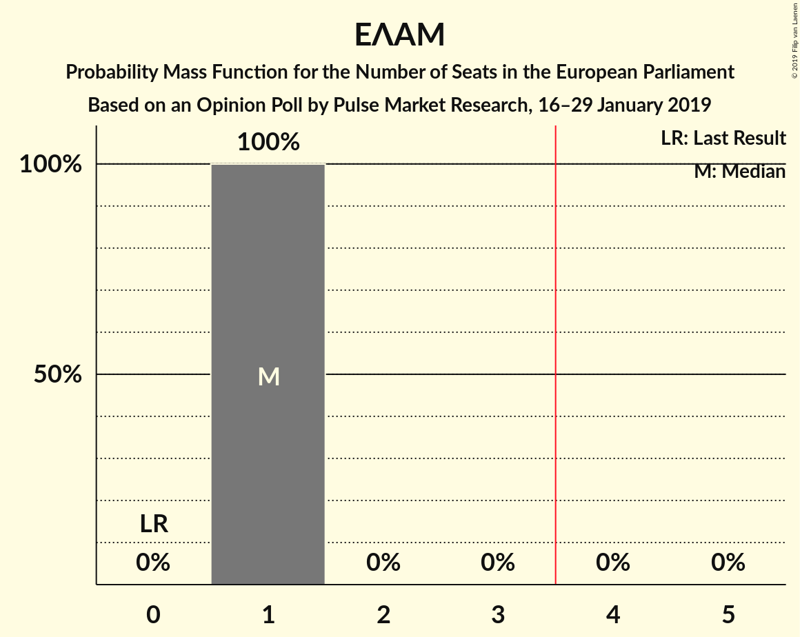

# Opinion Poll by Pulse Market Research, 16–29 January 2019

<a href="#voting-intentions">Voting Intentions</a> | <a href="#seats">Seats</a> | <a href="#coalitions">Coalitions</a> | <a href="#technical-information">Technical Information</a>

## Voting Intentions

### Confidence Intervals

| Party | Last Result | Poll Result | 80% Confidence Interval | 90% Confidence Interval | 95% Confidence Interval | 99% Confidence Interval |
|:-----:|:-----------:|:-----------:|:-----------------------:|:-----------------------:|:-----------------------:|:-----------------------:|
| Δημοκρατικός Συναγερμός (EPP) | 0.0% | 37.1% | 34.9–39.3% |34.3–39.9% |33.8–40.4% |32.8–41.5% |
| Ανορθωτικό Κόμμα Εργαζόμενου Λαού (GUE/NGL) | 0.0% | 26.0% | 24.1–28.1% |23.6–28.7% |23.1–29.2% |22.2–30.2% |
| Δημοκρατικό Κόμμα (S&D) | 0.0% | 13.0% | 11.6–14.6% |11.2–15.1% |10.9–15.5% |10.2–16.3% |
| Εθνικό Λαϊκό Μέτωπο (*) | 0.0% | 11.0% | 9.7–12.6% |9.4–13.0% |9.1–13.4% |8.5–14.1% |
| Κίνημα Σοσιαλδημοκρατών (S&D) | 0.0% | 5.9% | 5.0–7.2% |4.7–7.5% |4.5–7.8% |4.1–8.4% |
| Κίνημα Οικολόγων—Συνεργασία Πολιτών (Greens/EFA) | 0.0% | 2.0% | 1.5–2.8% |1.3–3.0% |1.2–3.2% |1.0–3.6% |

*Note:* The poll result column reflects the actual value used in the calculations. Published results may vary slightly, and in addition be rounded to fewer digits.

## Seats

### Confidence Intervals

| Party | Last Result | Median | 80% Confidence Interval | 90% Confidence Interval | 95% Confidence Interval | 99% Confidence Interval |
|:-----:|:-----------:|:------:|:-----------------------:|:-----------------------:|:-----------------------:|:-----------------------:|
| <a href="#δημοκρατικός-συναγερμός-(epp)">Δημοκρατικός Συναγερμός (EPP)</a> | 0 | 2 | 2 |2 |2 |2–3 |
| <a href="#ανορθωτικό-κόμμα-εργαζόμενου-λαού-(gue/ngl)">Ανορθωτικό Κόμμα Εργαζόμενου Λαού (GUE/NGL)</a> | 0 | 2 | 2 |1–2 |1–2 |1–2 |
| <a href="#δημοκρατικό-κόμμα-(s&d)">Δημοκρατικό Κόμμα (S&D)</a> | 0 | 1 | 1 |1 |1 |1 |
| <a href="#εθνικό-λαϊκό-μέτωπο-(*)">Εθνικό Λαϊκό Μέτωπο (*)</a> | 0 | 1 | 1 |1 |1 |1 |
| <a href="#κίνημα-σοσιαλδημοκρατών-(s&d)">Κίνημα Σοσιαλδημοκρατών (S&D)</a> | 0 | 0 | 0 |0 |0–1 |0–1 |
| <a href="#κίνημα-οικολόγων—συνεργασία-πολιτών-(greens/efa)">Κίνημα Οικολόγων—Συνεργασία Πολιτών (Greens/EFA)</a> | 0 | 0 | 0 |0 |0 |0 |

### Δημοκρατικός Συναγερμός (EPP)

*For a full overview of the results for this party, see the [Δημοκρατικός Συναγερμός (EPP)](party-δημοκρατικόςσυναγερμόςepp.html) page.*

| Number of Seats | Probability | Accumulated | Special Marks |
|:---------------:|:-----------:|:-----------:|:-------------:|
| 0 | 0% | 100% | Last Result |
| 1 | 0% | 100% |  |
| 2 | 98.6% | 100% | Median |
| 3 | 1.4% | 1.4% |  |
| 4 | 0% | 0% | Majority |

### Ανορθωτικό Κόμμα Εργαζόμενου Λαού (GUE/NGL)

*For a full overview of the results for this party, see the [Ανορθωτικό Κόμμα Εργαζόμενου Λαού (GUE/NGL)](party-ανορθωτικόκόμμαεργαζόμενουλαούguengl.html) page.*

| Number of Seats | Probability | Accumulated | Special Marks |
|:---------------:|:-----------:|:-----------:|:-------------:|
| 0 | 0% | 100% | Last Result |
| 1 | 5% | 100% |  |
| 2 | 95% | 95% | Median |
| 3 | 0% | 0% |  |

### Δημοκρατικό Κόμμα (S&D)

*For a full overview of the results for this party, see the [Δημοκρατικό Κόμμα (S&D)](party-δημοκρατικόκόμμαsd.html) page.*

| Number of Seats | Probability | Accumulated | Special Marks |
|:---------------:|:-----------:|:-----------:|:-------------:|
| 0 | 0% | 100% | Last Result |
| 1 | 100% | 100% | Median |

### Εθνικό Λαϊκό Μέτωπο (*)

*For a full overview of the results for this party, see the [Εθνικό Λαϊκό Μέτωπο (*)](party-εθνικόλαϊκόμέτωπο.html) page.*

| Number of Seats | Probability | Accumulated | Special Marks |
|:---------------:|:-----------:|:-----------:|:-------------:|
| 0 | 0% | 100% | Last Result |
| 1 | 100% | 100% | Median |

### Κίνημα Σοσιαλδημοκρατών (S&D)

*For a full overview of the results for this party, see the [Κίνημα Σοσιαλδημοκρατών (S&D)](party-κίνημασοσιαλδημοκρατώνsd.html) page.*

| Number of Seats | Probability | Accumulated | Special Marks |
|:---------------:|:-----------:|:-----------:|:-------------:|
| 0 | 97% | 100% | Last Result, Median |
| 1 | 3% | 3% |  |
| 2 | 0% | 0% |  |

### Κίνημα Οικολόγων—Συνεργασία Πολιτών (Greens/EFA)

*For a full overview of the results for this party, see the [Κίνημα Οικολόγων—Συνεργασία Πολιτών (Greens/EFA)](party-κίνημαοικολόγων—συνεργασίαπολιτώνgreensefa.html) page.*

| Number of Seats | Probability | Accumulated | Special Marks |
|:---------------:|:-----------:|:-----------:|:-------------:|
| 0 | 100% | 100% | Last Result, Median |

## Coalitions

### Confidence Intervals

| Coalition | Last Result | Median | Majority? | 80% Confidence Interval | 90% Confidence Interval | 95% Confidence Interval | 99% Confidence Interval |
|:---------:|:-----------:|:------:|:---------:|:-----------------------:|:-----------------------:|:-----------------------:|:-----------------------:|
| Δημοκρατικός Συναγερμός (EPP) | 0 | 2 | 0% | 2 | 2 | 2 | 2–3 |
| Ανορθωτικό Κόμμα Εργαζόμενου Λαού (GUE/NGL) | 0 | 2 | 0% | 2 | 1–2 | 1–2 | 1–2 |
| Δημοκρατικό Κόμμα (S&D) – Κίνημα Σοσιαλδημοκρατών (S&D) | 0 | 1 | 0% | 1 | 1 | 1–2 | 1–2 |
| Εθνικό Λαϊκό Μέτωπο (*) | 0 | 1 | 0% | 1 | 1 | 1 | 1 |
| Κίνημα Οικολόγων—Συνεργασία Πολιτών (Greens/EFA) | 0 | 0 | 0% | 0 | 0 | 0 | 0 |

### Δημοκρατικός Συναγερμός (EPP)

| Number of Seats | Probability | Accumulated | Special Marks |
|:---------------:|:-----------:|:-----------:|:-------------:|
| 0 | 0% | 100% | Last Result |
| 1 | 0% | 100% |  |
| 2 | 98.6% | 100% | Median |
| 3 | 1.4% | 1.4% |  |
| 4 | 0% | 0% | Majority |

### Ανορθωτικό Κόμμα Εργαζόμενου Λαού (GUE/NGL)

| Number of Seats | Probability | Accumulated | Special Marks |
|:---------------:|:-----------:|:-----------:|:-------------:|
| 0 | 0% | 100% | Last Result |
| 1 | 5% | 100% |  |
| 2 | 95% | 95% | Median |
| 3 | 0% | 0% |  |

### Δημοκρατικό Κόμμα (S&D) – Κίνημα Σοσιαλδημοκρατών (S&D)

| Number of Seats | Probability | Accumulated | Special Marks |
|:---------------:|:-----------:|:-----------:|:-------------:|
| 0 | 0% | 100% | Last Result |
| 1 | 97% | 100% | Median |
| 2 | 3% | 3% |  |
| 3 | 0% | 0% |  |

### Εθνικό Λαϊκό Μέτωπο (*)

| Number of Seats | Probability | Accumulated | Special Marks |
|:---------------:|:-----------:|:-----------:|:-------------:|
| 0 | 0% | 100% | Last Result |
| 1 | 100% | 100% | Median |

### Κίνημα Οικολόγων—Συνεργασία Πολιτών (Greens/EFA)

| Number of Seats | Probability | Accumulated | Special Marks |
|:---------------:|:-----------:|:-----------:|:-------------:|
| 0 | 100% | 100% | Last Result, Median |

## Technical Information

### Opinion Poll

+ **Polling firm:** Pulse Market Research
+ **Commissioner(s):** —
+ **Fieldwork period:** 16–29 January 2019

### Calculations

+ **Sample size:** 807
+ **Simulations done:** 1,048,576
+ **Error estimate:** 0.53%

