# Opinion Poll by Prime Consulting, 8–15 March 2019

<a href="#voting-intentions">Voting Intentions</a> | <a href="#seats">Seats</a> | <a href="#coalitions">Coalitions</a> | <a href="#technical-information">Technical Information</a>

## Voting Intentions

### Confidence Intervals

| Party | Last Result | Poll Result | 80% Confidence Interval | 90% Confidence Interval | 95% Confidence Interval | 99% Confidence Interval |
|:-----:|:-----------:|:-----------:|:-----------------------:|:-----------------------:|:-----------------------:|:-----------------------:|
| Δημοκρατικός Συναγερμός (EPP) | 0.0% | 33.0% | 31.0–35.1% |30.5–35.6% |30.0–36.1% |29.1–37.1% |
| Ανορθωτικό Κόμμα Εργαζόμενου Λαού (GUE/NGL) | 0.0% | 26.0% | 24.2–27.9% |23.7–28.5% |23.2–29.0% |22.4–29.9% |
| Δημοκρατικό Κόμμα (S&D) | 0.0% | 15.0% | 13.6–16.6% |13.2–17.1% |12.8–17.5% |12.2–18.3% |
| Εθνικό Λαϊκό Μέτωπο (*) | 0.0% | 8.0% | 7.0–9.3% |6.6–9.6% |6.4–10.0% |5.9–10.6% |
| Κίνημα Σοσιαλδημοκρατών (S&D) | 0.0% | 8.0% | 7.0–9.3% |6.6–9.6% |6.4–10.0% |5.9–10.6% |
| Κίνημα Οικολόγων—Συνεργασία Πολιτών (Greens/EFA) | 0.0% | 4.0% | 3.3–5.0% |3.1–5.2% |2.9–5.5% |2.6–6.0% |

*Note:* The poll result column reflects the actual value used in the calculations. Published results may vary slightly, and in addition be rounded to fewer digits.

## Seats

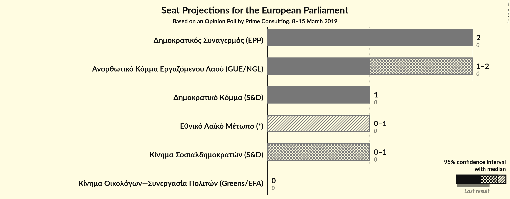

### Confidence Intervals

| Party | Last Result | Median | 80% Confidence Interval | 90% Confidence Interval | 95% Confidence Interval | 99% Confidence Interval |
|:-----:|:-----------:|:------:|:-----------------------:|:-----------------------:|:-----------------------:|:-----------------------:|
| <a href="#δημοκρατικός-συναγερμός-(epp)">Δημοκρατικός Συναγερμός (EPP)</a> | 0 | 2 | 2 |2 |2 |2 |
| <a href="#ανορθωτικό-κόμμα-εργαζόμενου-λαού-(gue/ngl)">Ανορθωτικό Κόμμα Εργαζόμενου Λαού (GUE/NGL)</a> | 0 | 2 | 2 |1–2 |1–2 |1–2 |
| <a href="#δημοκρατικό-κόμμα-(s&d)">Δημοκρατικό Κόμμα (S&D)</a> | 0 | 1 | 1 |1 |1 |1 |
| <a href="#εθνικό-λαϊκό-μέτωπο-(*)">Εθνικό Λαϊκό Μέτωπο (*)</a> | 0 | 0 | 0 |0–1 |0–1 |0–1 |
| <a href="#κίνημα-σοσιαλδημοκρατών-(s&d)">Κίνημα Σοσιαλδημοκρατών (S&D)</a> | 0 | 1 | 1 |0–1 |0–1 |0–1 |
| <a href="#κίνημα-οικολόγων—συνεργασία-πολιτών-(greens/efa)">Κίνημα Οικολόγων—Συνεργασία Πολιτών (Greens/EFA)</a> | 0 | 0 | 0 |0 |0 |0 |

### Δημοκρατικός Συναγερμός (EPP)

*For a full overview of the results for this party, see the [Δημοκρατικός Συναγερμός (EPP)](party-δημοκρατικόςσυναγερμόςepp.html) page.*

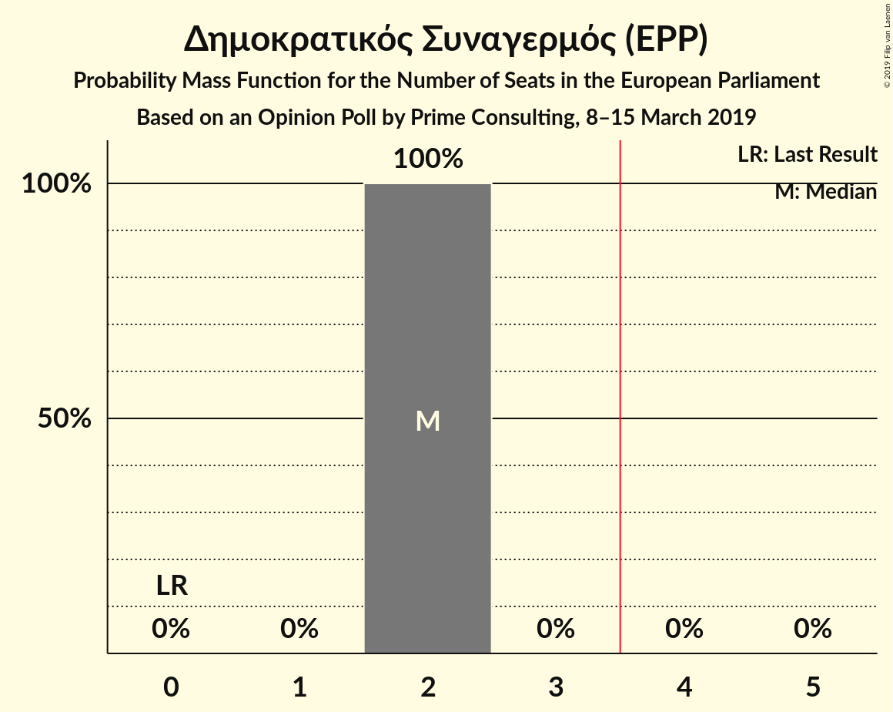

| Number of Seats | Probability | Accumulated | Special Marks |
|:---------------:|:-----------:|:-----------:|:-------------:|
| 0 | 0% | 100% | Last Result |
| 1 | 0% | 100% |  |
| 2 | 100% | 100% | Median |

### Ανορθωτικό Κόμμα Εργαζόμενου Λαού (GUE/NGL)

*For a full overview of the results for this party, see the [Ανορθωτικό Κόμμα Εργαζόμενου Λαού (GUE/NGL)](party-ανορθωτικόκόμμαεργαζόμενουλαούguengl.html) page.*

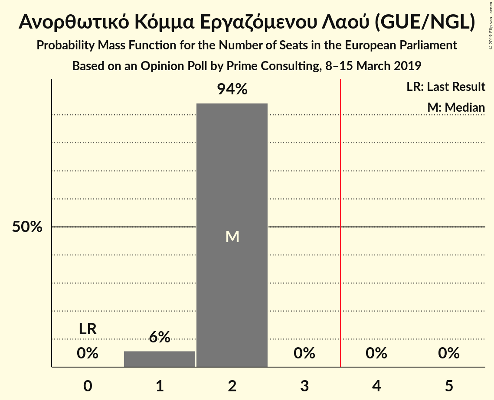

| Number of Seats | Probability | Accumulated | Special Marks |
|:---------------:|:-----------:|:-----------:|:-------------:|
| 0 | 0% | 100% | Last Result |
| 1 | 6% | 100% |  |
| 2 | 94% | 94% | Median |
| 3 | 0% | 0% |  |

### Δημοκρατικό Κόμμα (S&D)

*For a full overview of the results for this party, see the [Δημοκρατικό Κόμμα (S&D)](party-δημοκρατικόκόμμαsd.html) page.*

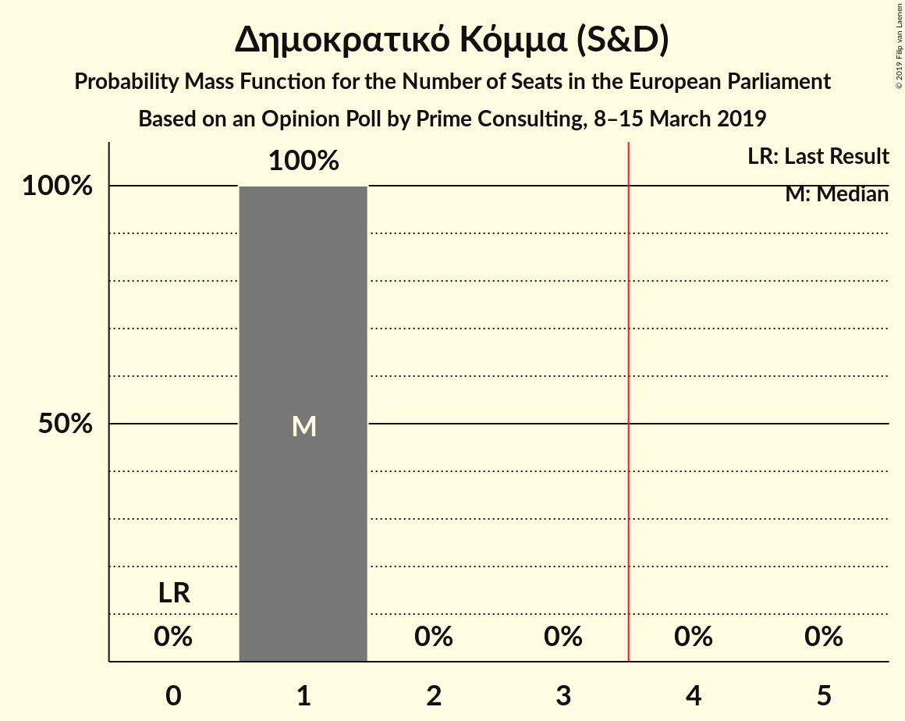

| Number of Seats | Probability | Accumulated | Special Marks |
|:---------------:|:-----------:|:-----------:|:-------------:|
| 0 | 0% | 100% | Last Result |
| 1 | 100% | 100% | Median |

### Εθνικό Λαϊκό Μέτωπο (*)

*For a full overview of the results for this party, see the [Εθνικό Λαϊκό Μέτωπο (*)](party-εθνικόλαϊκόμέτωπο.html) page.*

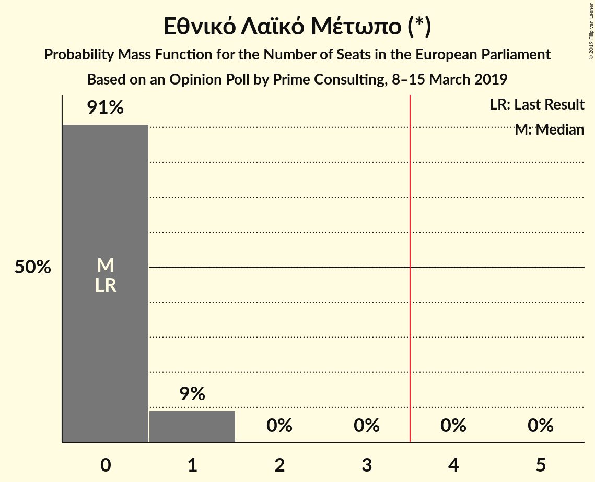

| Number of Seats | Probability | Accumulated | Special Marks |
|:---------------:|:-----------:|:-----------:|:-------------:|
| 0 | 91% | 100% | Last Result, Median |
| 1 | 9% | 9% |  |
| 2 | 0% | 0% |  |

### Κίνημα Σοσιαλδημοκρατών (S&D)

*For a full overview of the results for this party, see the [Κίνημα Σοσιαλδημοκρατών (S&D)](party-κίνημασοσιαλδημοκρατώνsd.html) page.*

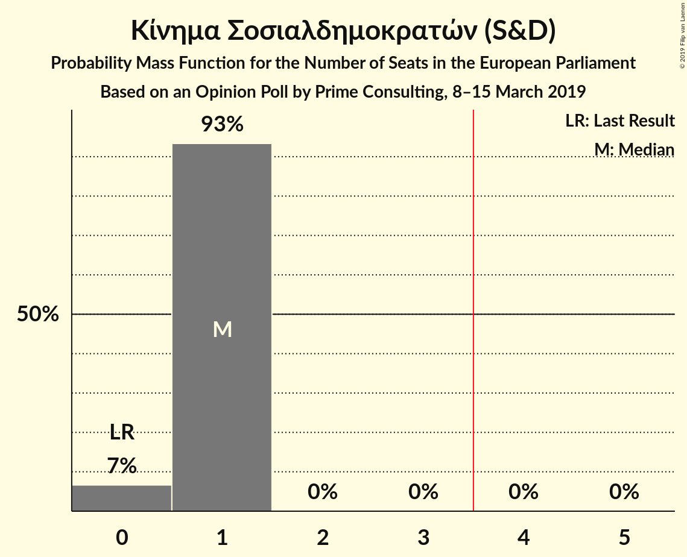

| Number of Seats | Probability | Accumulated | Special Marks |
|:---------------:|:-----------:|:-----------:|:-------------:|
| 0 | 7% | 100% | Last Result |
| 1 | 93% | 93% | Median |
| 2 | 0% | 0% |  |

### Κίνημα Οικολόγων—Συνεργασία Πολιτών (Greens/EFA)

*For a full overview of the results for this party, see the [Κίνημα Οικολόγων—Συνεργασία Πολιτών (Greens/EFA)](party-κίνημαοικολόγων—συνεργασίαπολιτώνgreensefa.html) page.*

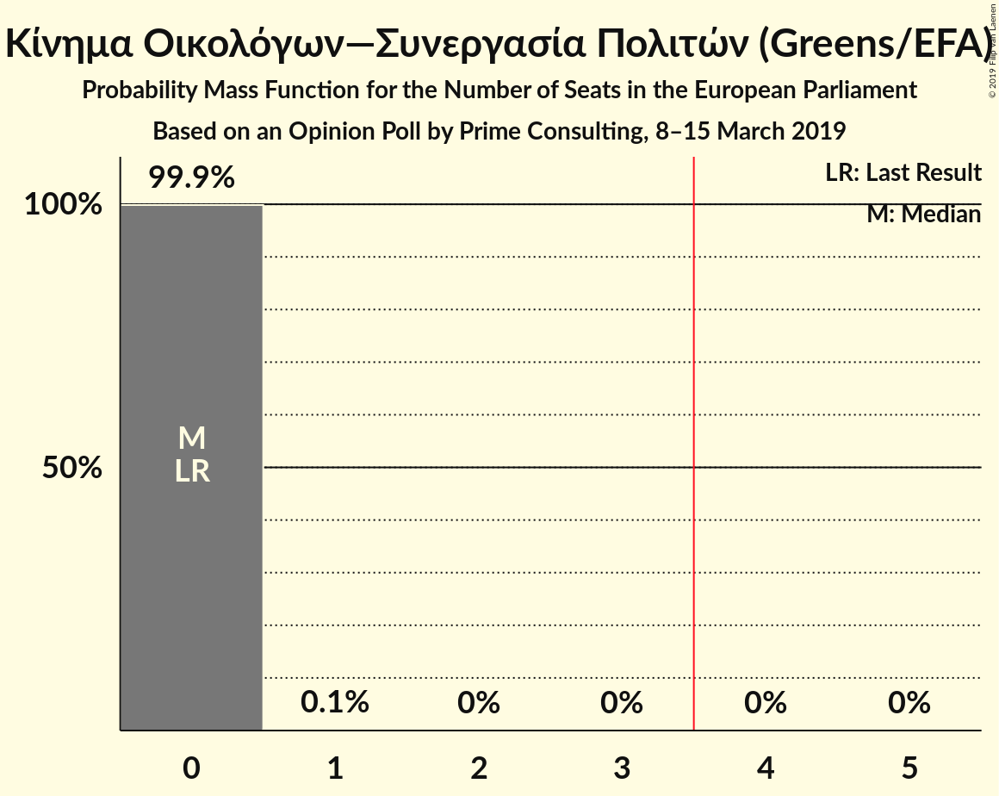

| Number of Seats | Probability | Accumulated | Special Marks |
|:---------------:|:-----------:|:-----------:|:-------------:|
| 0 | 99.9% | 100% | Last Result, Median |
| 1 | 0.1% | 0.1% |  |
| 2 | 0% | 0% |  |

## Coalitions

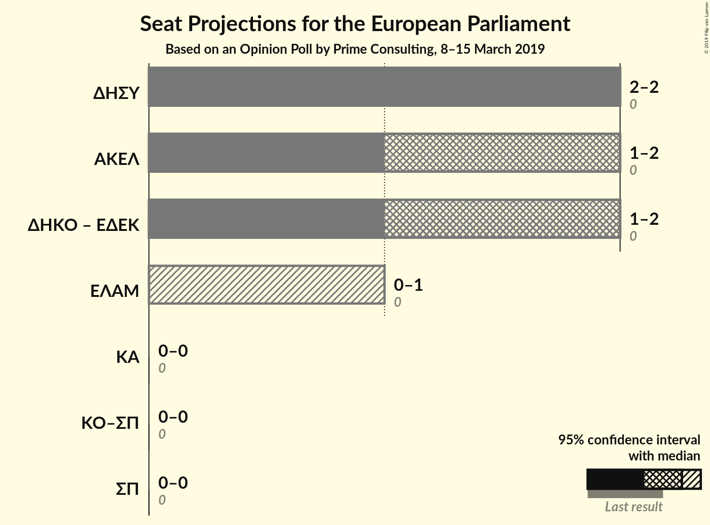

### Confidence Intervals

| Coalition | Last Result | Median | Majority? | 80% Confidence Interval | 90% Confidence Interval | 95% Confidence Interval | 99% Confidence Interval |
|:---------:|:-----------:|:------:|:---------:|:-----------------------:|:-----------------------:|:-----------------------:|:-----------------------:|
| Δημοκρατικός Συναγερμός (EPP) | 0 | 2 | 0% | 2 | 2 | 2 | 2 |
| Ανορθωτικό Κόμμα Εργαζόμενου Λαού (GUE/NGL) | 0 | 2 | 0% | 2 | 1–2 | 1–2 | 1–2 |
| Δημοκρατικό Κόμμα (S&D) – Κίνημα Σοσιαλδημοκρατών (S&D) | 0 | 2 | 0% | 2 | 1–2 | 1–2 | 1–2 |
| Εθνικό Λαϊκό Μέτωπο (*) | 0 | 0 | 0% | 0 | 0–1 | 0–1 | 0–1 |
| Κίνημα Οικολόγων—Συνεργασία Πολιτών (Greens/EFA) | 0 | 0 | 0% | 0 | 0 | 0 | 0 |

### Δημοκρατικός Συναγερμός (EPP)

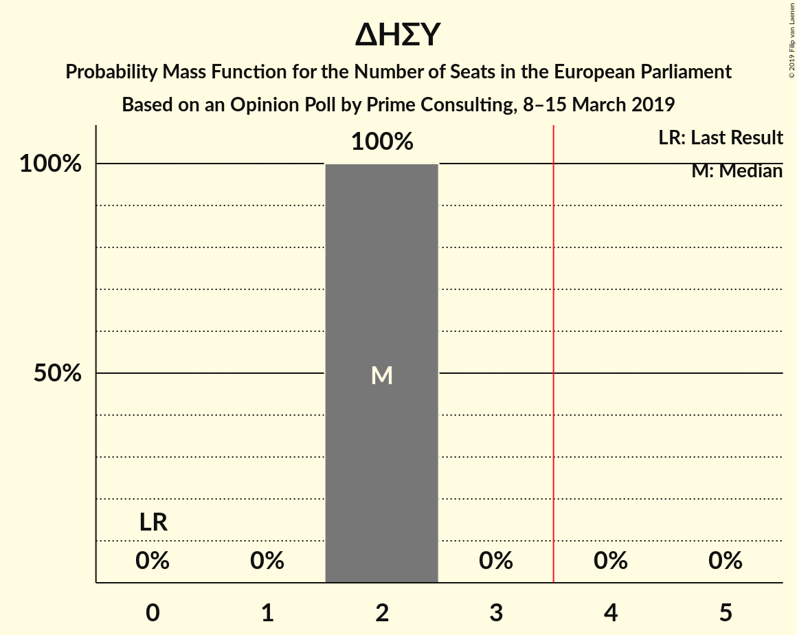

| Number of Seats | Probability | Accumulated | Special Marks |
|:---------------:|:-----------:|:-----------:|:-------------:|
| 0 | 0% | 100% | Last Result |
| 1 | 0% | 100% |  |
| 2 | 100% | 100% | Median |

### Ανορθωτικό Κόμμα Εργαζόμενου Λαού (GUE/NGL)

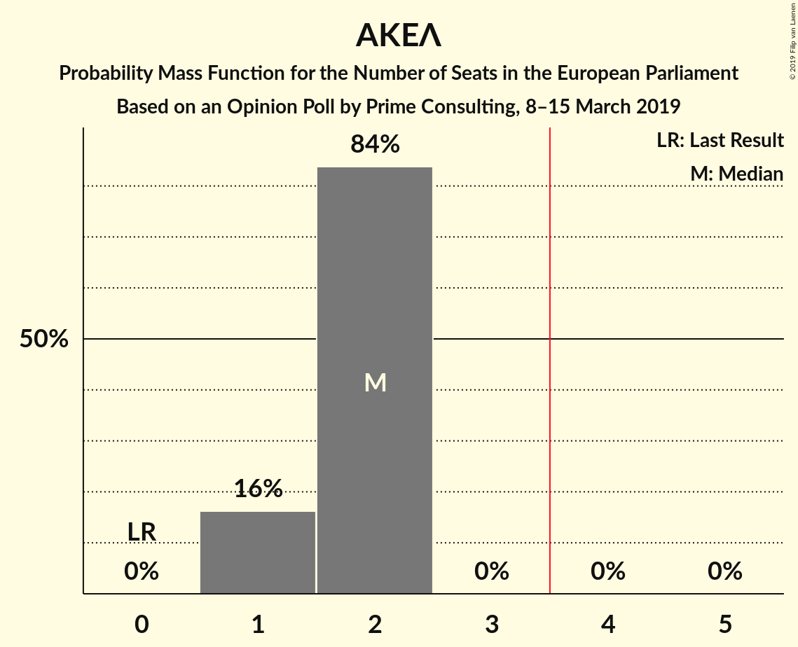

| Number of Seats | Probability | Accumulated | Special Marks |
|:---------------:|:-----------:|:-----------:|:-------------:|
| 0 | 0% | 100% | Last Result |
| 1 | 6% | 100% |  |
| 2 | 94% | 94% | Median |
| 3 | 0% | 0% |  |

### Δημοκρατικό Κόμμα (S&D) – Κίνημα Σοσιαλδημοκρατών (S&D)

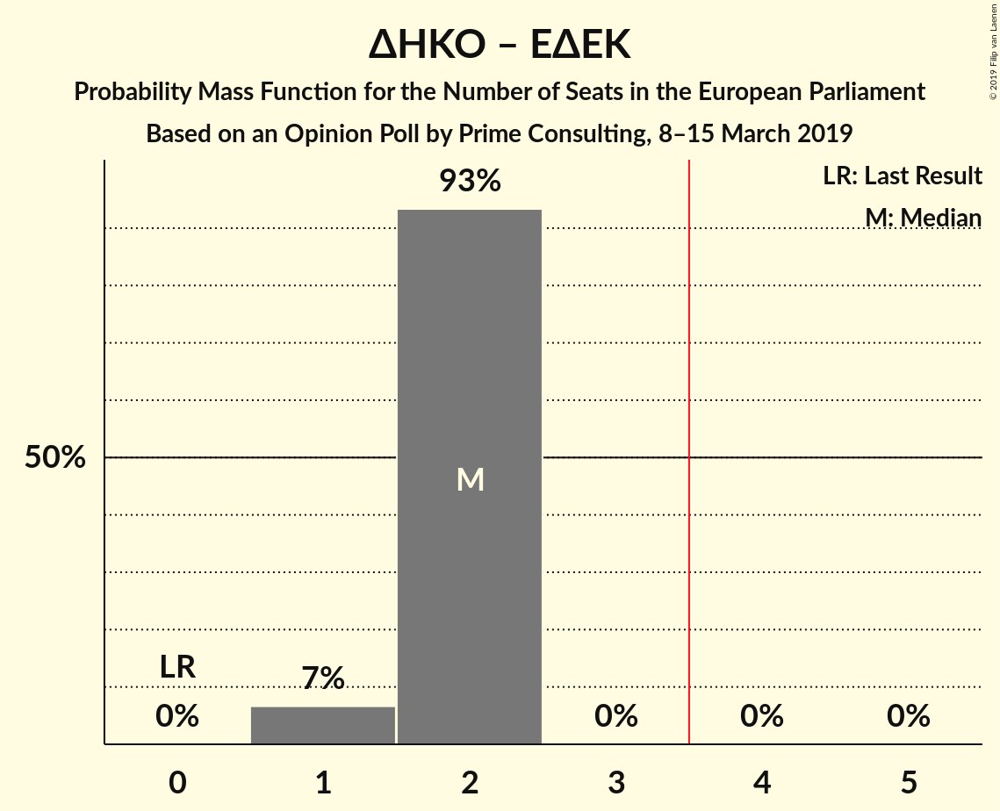

| Number of Seats | Probability | Accumulated | Special Marks |
|:---------------:|:-----------:|:-----------:|:-------------:|
| 0 | 0% | 100% | Last Result |
| 1 | 7% | 100% |  |
| 2 | 93% | 93% | Median |
| 3 | 0% | 0% |  |

### Εθνικό Λαϊκό Μέτωπο (*)

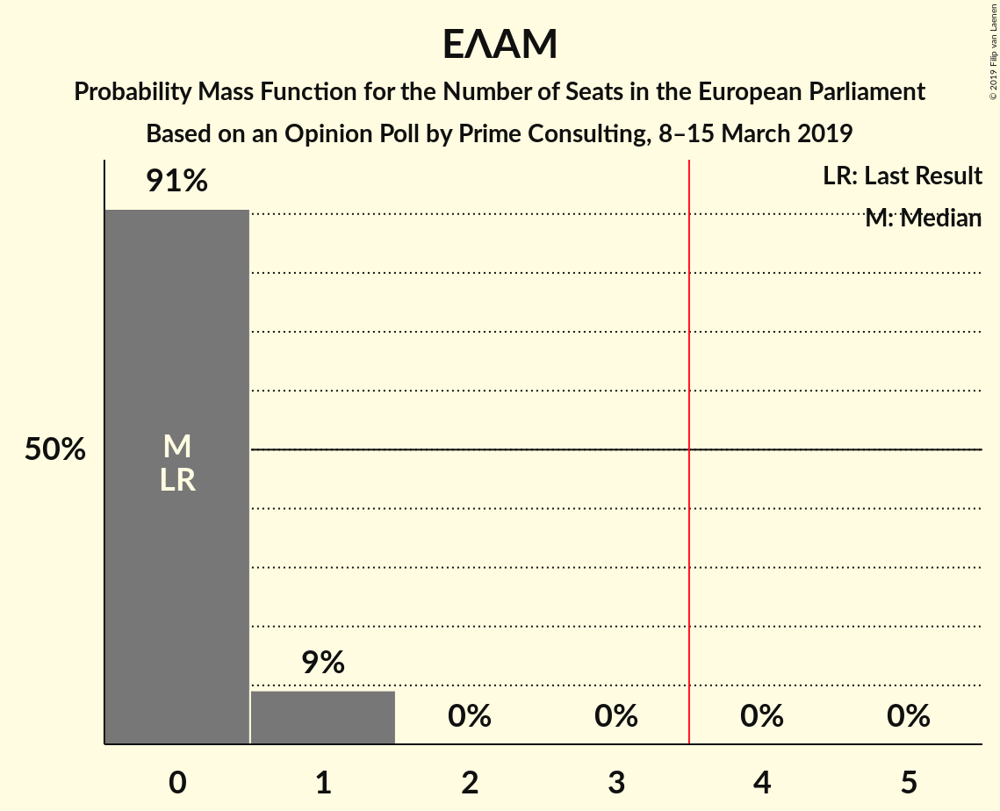

| Number of Seats | Probability | Accumulated | Special Marks |
|:---------------:|:-----------:|:-----------:|:-------------:|
| 0 | 91% | 100% | Last Result, Median |
| 1 | 9% | 9% |  |
| 2 | 0% | 0% |  |

### Κίνημα Οικολόγων—Συνεργασία Πολιτών (Greens/EFA)

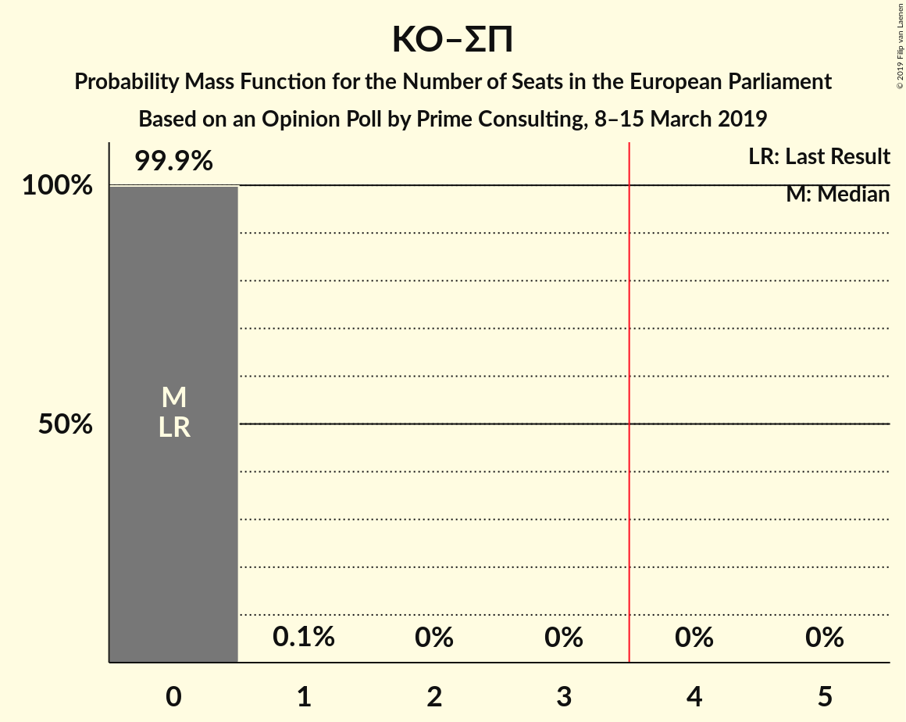

| Number of Seats | Probability | Accumulated | Special Marks |
|:---------------:|:-----------:|:-----------:|:-------------:|
| 0 | 99.9% | 100% | Last Result, Median |
| 1 | 0.1% | 0.1% |  |
| 2 | 0% | 0% |  |

## Technical Information

### Opinion Poll

+ **Polling firm:** Prime Consulting
+ **Commissioner(s):** —
+ **Fieldwork period:** 8–15 March 2019

### Calculations

+ **Sample size:** 900
+ **Simulations done:** 1,024
+ **Error estimate:** 4.37%

