# Opinion Poll by IMR for University of Nicosia, 18 March–4 April 2019

<a href="#voting-intentions">Voting Intentions</a> | <a href="#seats">Seats</a> | <a href="#coalitions">Coalitions</a> | <a href="#technical-information">Technical Information</a>

## Voting Intentions

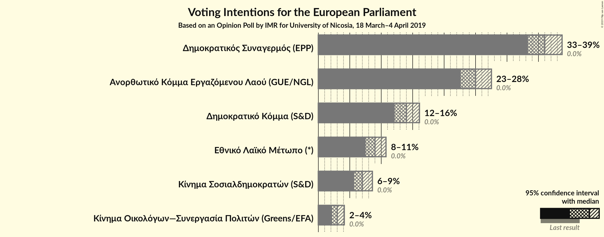

### Confidence Intervals

| Party | Last Result | Poll Result | 80% Confidence Interval | 90% Confidence Interval | 95% Confidence Interval | 99% Confidence Interval |
|:-----:|:-----------:|:-----------:|:-----------------------:|:-----------------------:|:-----------------------:|:-----------------------:|
| Δημοκρατικός Συναγερμός (EPP) | 0.0% | 36.0% | 34.2–37.8% |33.8–38.3% |33.3–38.8% |32.5–39.6% |
| Ανορθωτικό Κόμμα Εργαζόμενου Λαού (GUE/NGL) | 0.0% | 25.0% | 23.4–26.7% |23.0–27.1% |22.6–27.5% |21.9–28.3% |
| Δημοκρατικό Κόμμα (S&D) | 0.0% | 14.0% | 12.8–15.4% |12.4–15.7% |12.1–16.1% |11.6–16.8% |
| Εθνικό Λαϊκό Μέτωπο (*) | 0.0% | 9.0% | 8.0–10.2% |7.7–10.5% |7.5–10.8% |7.1–11.3% |
| Κίνημα Σοσιαλδημοκρατών (S&D) | 0.0% | 7.0% | 6.1–8.0% |5.9–8.3% |5.7–8.6% |5.3–9.1% |
| Κίνημα Οικολόγων—Συνεργασία Πολιτών (Greens/EFA) | 0.0% | 3.0% | 2.5–3.7% |2.3–3.9% |2.2–4.1% |1.9–4.5% |

*Note:* The poll result column reflects the actual value used in the calculations. Published results may vary slightly, and in addition be rounded to fewer digits.

## Seats

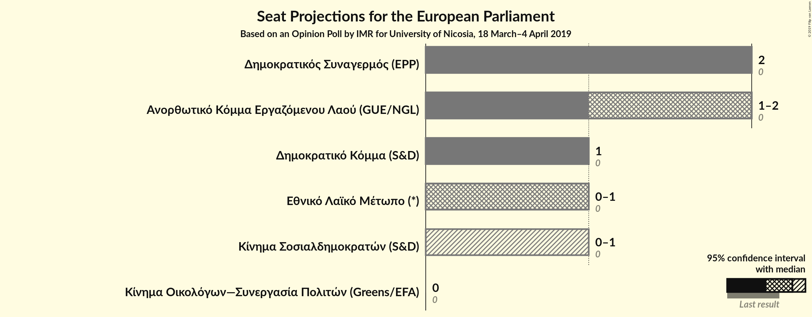

### Confidence Intervals

| Party | Last Result | Median | 80% Confidence Interval | 90% Confidence Interval | 95% Confidence Interval | 99% Confidence Interval |
|:-----:|:-----------:|:------:|:-----------------------:|:-----------------------:|:-----------------------:|:-----------------------:|
| <a href="#δημοκρατικός-συναγερμός-(epp)">Δημοκρατικός Συναγερμός (EPP)</a> | 0 | 2 | 2 |2 |2 |2 |
| <a href="#ανορθωτικό-κόμμα-εργαζόμενου-λαού-(gue/ngl)">Ανορθωτικό Κόμμα Εργαζόμενου Λαού (GUE/NGL)</a> | 0 | 2 | 1–2 |1–2 |1–2 |1–2 |
| <a href="#δημοκρατικό-κόμμα-(s&d)">Δημοκρατικό Κόμμα (S&D)</a> | 0 | 1 | 1 |1 |1 |1 |
| <a href="#εθνικό-λαϊκό-μέτωπο-(*)">Εθνικό Λαϊκό Μέτωπο (*)</a> | 0 | 1 | 1 |1 |0–1 |0–1 |
| <a href="#κίνημα-σοσιαλδημοκρατών-(s&d)">Κίνημα Σοσιαλδημοκρατών (S&D)</a> | 0 | 0 | 0–1 |0–1 |0–1 |0–1 |
| <a href="#κίνημα-οικολόγων—συνεργασία-πολιτών-(greens/efa)">Κίνημα Οικολόγων—Συνεργασία Πολιτών (Greens/EFA)</a> | 0 | 0 | 0 |0 |0 |0 |

### Δημοκρατικός Συναγερμός (EPP)

*For a full overview of the results for this party, see the [Δημοκρατικός Συναγερμός (EPP)](party-δημοκρατικόςσυναγερμόςepp.html) page.*

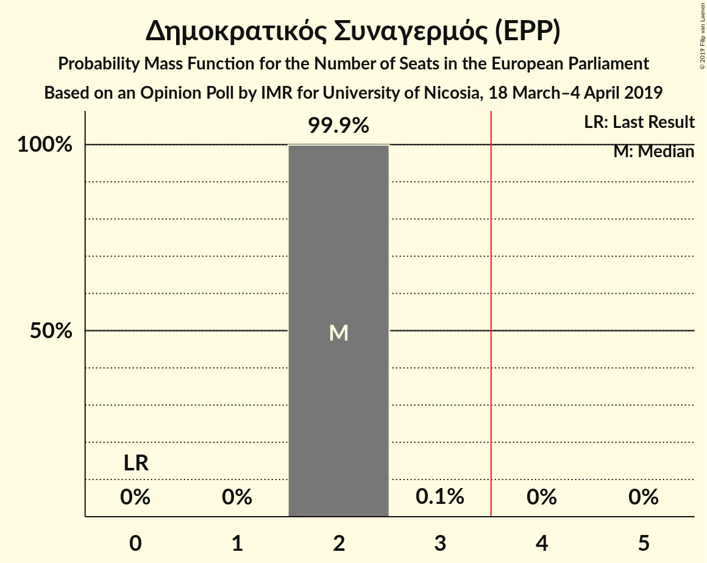

| Number of Seats | Probability | Accumulated | Special Marks |
|:---------------:|:-----------:|:-----------:|:-------------:|
| 0 | 0% | 100% | Last Result |
| 1 | 0% | 100% |  |
| 2 | 99.9% | 100% | Median |
| 3 | 0.1% | 0.1% |  |
| 4 | 0% | 0% | Majority |

### Ανορθωτικό Κόμμα Εργαζόμενου Λαού (GUE/NGL)

*For a full overview of the results for this party, see the [Ανορθωτικό Κόμμα Εργαζόμενου Λαού (GUE/NGL)](party-ανορθωτικόκόμμαεργαζόμενουλαούguengl.html) page.*

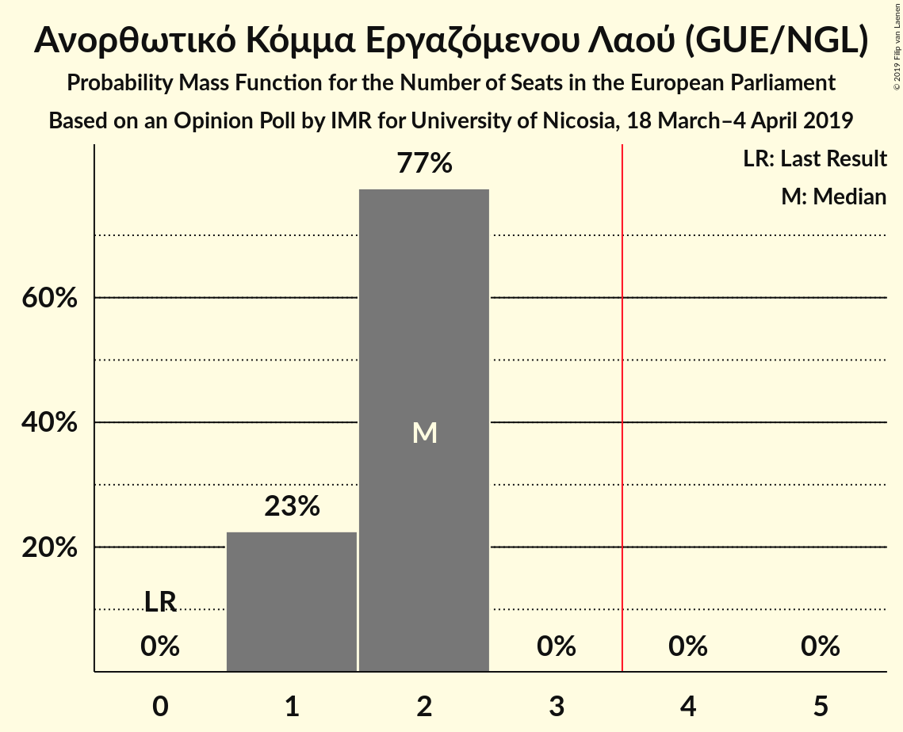

| Number of Seats | Probability | Accumulated | Special Marks |
|:---------------:|:-----------:|:-----------:|:-------------:|
| 0 | 0% | 100% | Last Result |
| 1 | 22% | 100% |  |
| 2 | 78% | 78% | Median |
| 3 | 0% | 0% |  |

### Δημοκρατικό Κόμμα (S&D)

*For a full overview of the results for this party, see the [Δημοκρατικό Κόμμα (S&D)](party-δημοκρατικόκόμμαsd.html) page.*

| Number of Seats | Probability | Accumulated | Special Marks |
|:---------------:|:-----------:|:-----------:|:-------------:|
| 0 | 0% | 100% | Last Result |
| 1 | 100% | 100% | Median |

### Εθνικό Λαϊκό Μέτωπο (*)

*For a full overview of the results for this party, see the [Εθνικό Λαϊκό Μέτωπο (*)](party-εθνικόλαϊκόμέτωπο.html) page.*

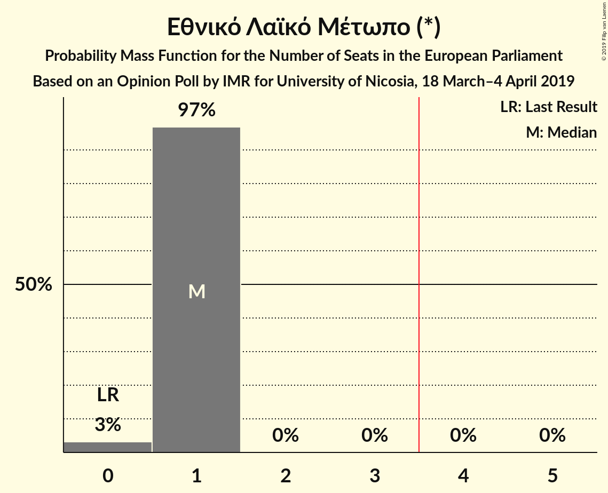

| Number of Seats | Probability | Accumulated | Special Marks |
|:---------------:|:-----------:|:-----------:|:-------------:|
| 0 | 3% | 100% | Last Result |
| 1 | 97% | 97% | Median |
| 2 | 0% | 0% |  |

### Κίνημα Σοσιαλδημοκρατών (S&D)

*For a full overview of the results for this party, see the [Κίνημα Σοσιαλδημοκρατών (S&D)](party-κίνημασοσιαλδημοκρατώνsd.html) page.*

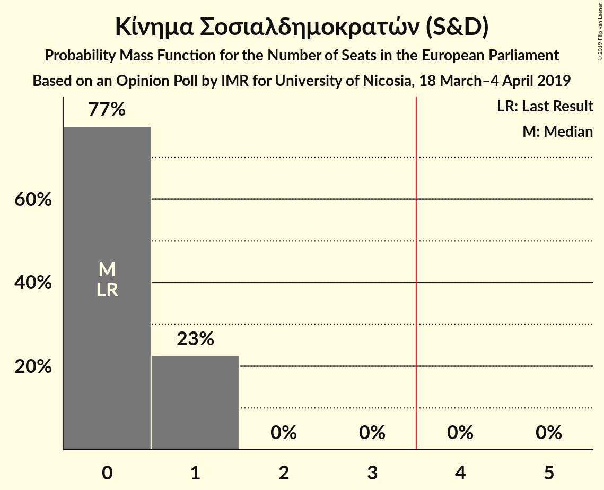

| Number of Seats | Probability | Accumulated | Special Marks |
|:---------------:|:-----------:|:-----------:|:-------------:|
| 0 | 78% | 100% | Last Result, Median |
| 1 | 22% | 22% |  |
| 2 | 0% | 0% |  |

### Κίνημα Οικολόγων—Συνεργασία Πολιτών (Greens/EFA)

*For a full overview of the results for this party, see the [Κίνημα Οικολόγων—Συνεργασία Πολιτών (Greens/EFA)](party-κίνημαοικολόγων—συνεργασίαπολιτώνgreensefa.html) page.*

| Number of Seats | Probability | Accumulated | Special Marks |
|:---------------:|:-----------:|:-----------:|:-------------:|
| 0 | 100% | 100% | Last Result, Median |

## Coalitions

### Confidence Intervals

| Coalition | Last Result | Median | Majority? | 80% Confidence Interval | 90% Confidence Interval | 95% Confidence Interval | 99% Confidence Interval |
|:---------:|:-----------:|:------:|:---------:|:-----------------------:|:-----------------------:|:-----------------------:|:-----------------------:|
| Δημοκρατικός Συναγερμός (EPP) | 0 | 2 | 0% | 2 | 2 | 2 | 2 |
| Ανορθωτικό Κόμμα Εργαζόμενου Λαού (GUE/NGL) | 0 | 2 | 0% | 1–2 | 1–2 | 1–2 | 1–2 |
| Δημοκρατικό Κόμμα (S&D) – Κίνημα Σοσιαλδημοκρατών (S&D) | 0 | 1 | 0% | 1–2 | 1–2 | 1–2 | 1–2 |
| Εθνικό Λαϊκό Μέτωπο (*) | 0 | 1 | 0% | 1 | 1 | 0–1 | 0–1 |
| Κίνημα Οικολόγων—Συνεργασία Πολιτών (Greens/EFA) | 0 | 0 | 0% | 0 | 0 | 0 | 0 |

### Δημοκρατικός Συναγερμός (EPP)

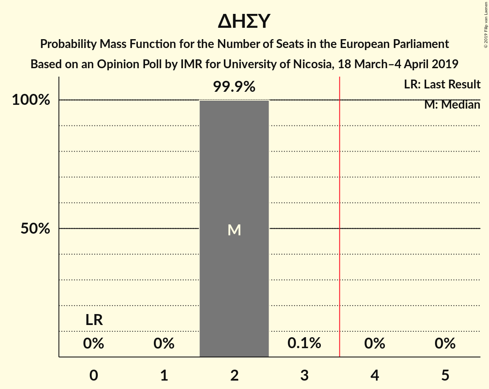

| Number of Seats | Probability | Accumulated | Special Marks |
|:---------------:|:-----------:|:-----------:|:-------------:|
| 0 | 0% | 100% | Last Result |
| 1 | 0% | 100% |  |
| 2 | 99.9% | 100% | Median |
| 3 | 0.1% | 0.1% |  |
| 4 | 0% | 0% | Majority |

### Ανορθωτικό Κόμμα Εργαζόμενου Λαού (GUE/NGL)

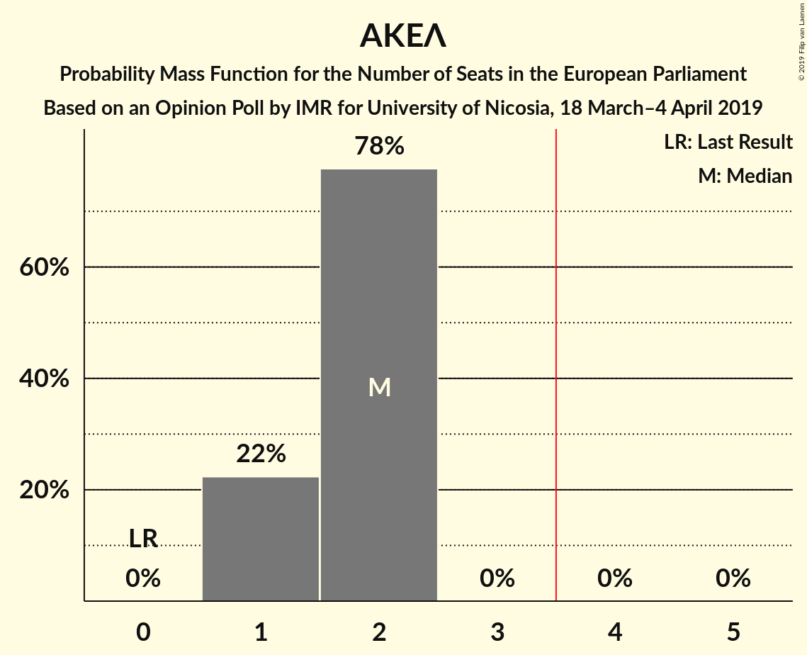

| Number of Seats | Probability | Accumulated | Special Marks |
|:---------------:|:-----------:|:-----------:|:-------------:|
| 0 | 0% | 100% | Last Result |
| 1 | 22% | 100% |  |
| 2 | 78% | 78% | Median |
| 3 | 0% | 0% |  |

### Δημοκρατικό Κόμμα (S&D) – Κίνημα Σοσιαλδημοκρατών (S&D)

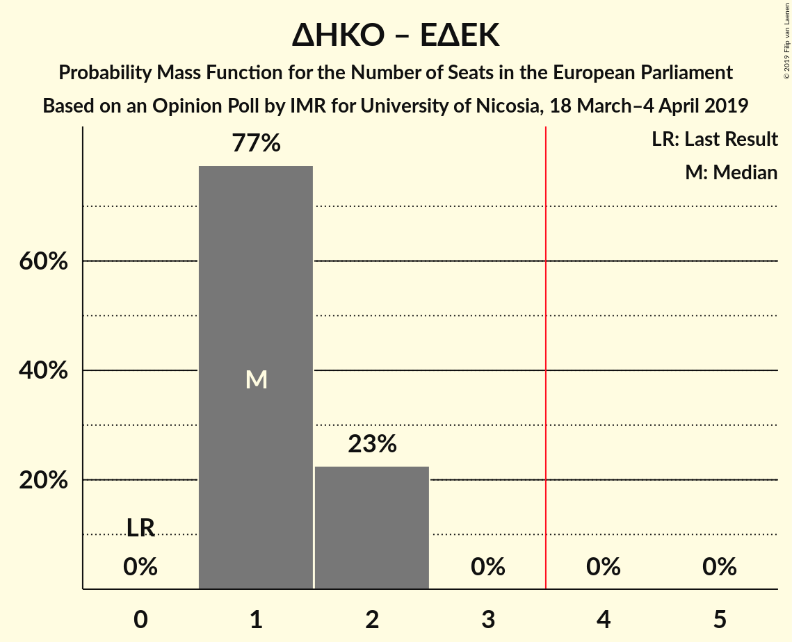

| Number of Seats | Probability | Accumulated | Special Marks |
|:---------------:|:-----------:|:-----------:|:-------------:|
| 0 | 0% | 100% | Last Result |
| 1 | 78% | 100% | Median |
| 2 | 22% | 22% |  |
| 3 | 0% | 0% |  |

### Εθνικό Λαϊκό Μέτωπο (*)

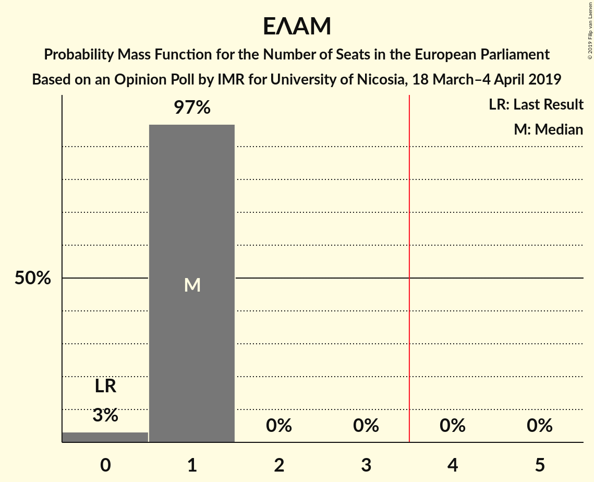

| Number of Seats | Probability | Accumulated | Special Marks |
|:---------------:|:-----------:|:-----------:|:-------------:|
| 0 | 3% | 100% | Last Result |
| 1 | 97% | 97% | Median |
| 2 | 0% | 0% |  |

### Κίνημα Οικολόγων—Συνεργασία Πολιτών (Greens/EFA)

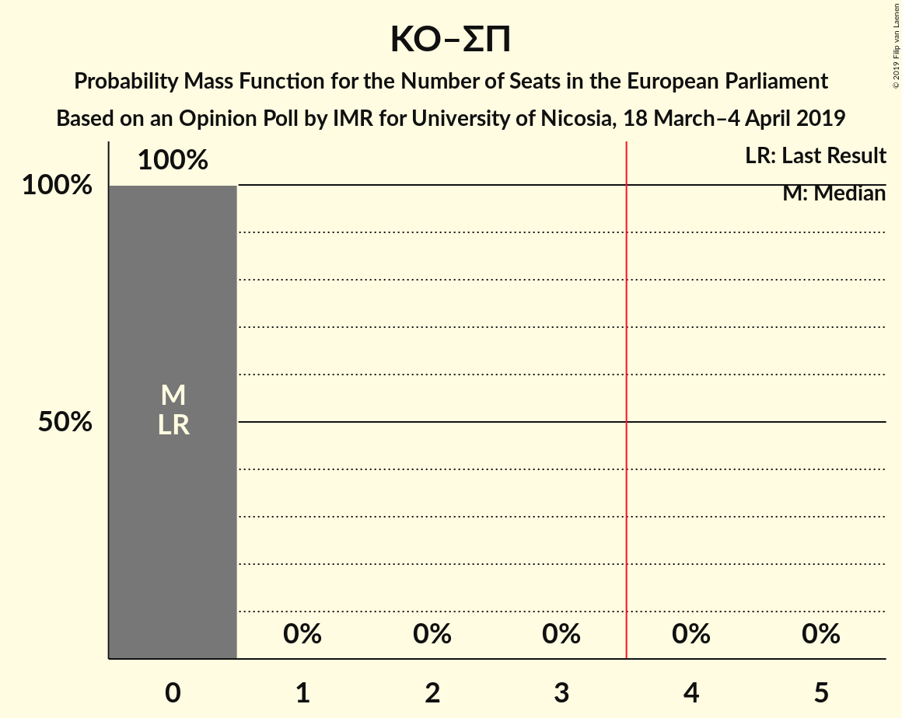

| Number of Seats | Probability | Accumulated | Special Marks |
|:---------------:|:-----------:|:-----------:|:-------------:|
| 0 | 100% | 100% | Last Result, Median |

## Technical Information

### Opinion Poll

+ **Polling firm:** IMR
+ **Commissioner(s):** University of Nicosia
+ **Fieldwork period:** 18 March–4 April 2019

### Calculations

+ **Sample size:** 1200
+ **Simulations done:** 1,048,576
+ **Error estimate:** 1.48%

