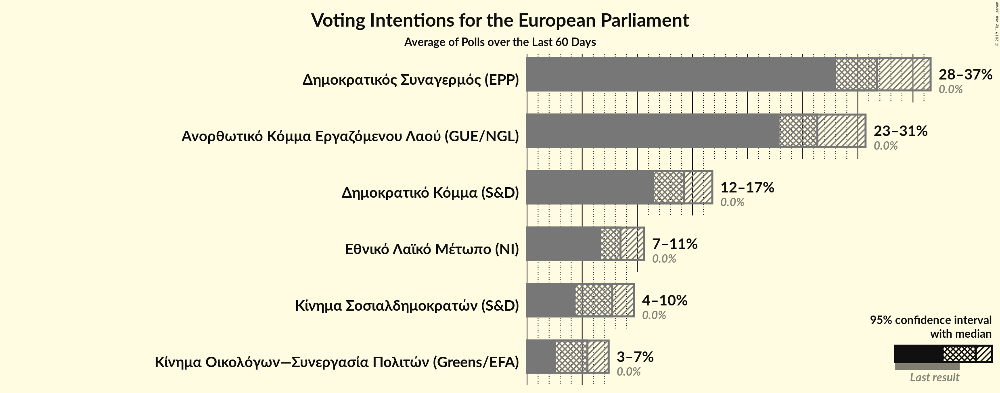
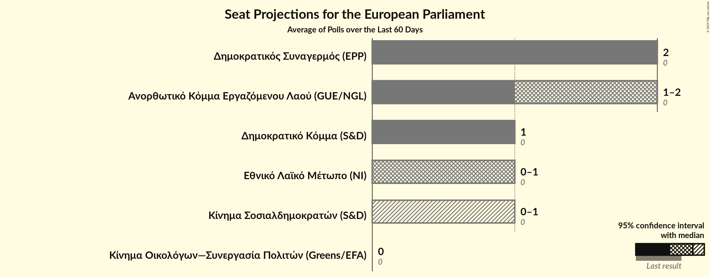

# Overview

The table below lists the most recent polls (less than 60 days old) registered and analyzed so far.

| Period     | Polling firm/Commissioner(s) | ΔΗΣΥ | ΑΚΕΛ | ΔΗΚΟ | ΕΛΑΜ | ΕΔΕΚ | ΣΠ | ΚΟ–ΣΠ | ΚΑ |
|:----------:|:----------------------------:|:--:|:--:|:--:|:--:|:--:|:--:|:--:|:--:|
| 25 May 2014 | General Election | 0.0%   0 | 0.0%   0 | 0.0%   0 | 0.0%   0 | 0.0%   0 | 0.0%   0 | 0.0%   0 | 0.0%   0 |
| N/A | [Poll Average](average.html) | 28–37%   2 | 23–31%   1–2 | 12–17%   1 | 7–11%   0–1 | 4–10%   0–1 | N/A   N/A | 3–7%   0 | N/A   N/A |
| [10–17 May 2019](2019-05-17-Symmetron.html) | Symmetron | 27–33%   2 | 22–28%   1–2 | 13–17%   1 | 7–11%   0–1 | 6–10%   0–1 | N/A   N/A | 5–8%   0 | N/A   N/A |
| [13–17 May 2019](2019-05-17-IMR.html) | IMR   University of Nicosia | 32–38%   2 | 22–28%   1–2 | 12–16%   1 | 6–10%   0–1 | 6–10%   0–1 | N/A   N/A | 4–7%   0 | N/A   N/A |
| [2–14 May 2019](2019-05-14-Cypronetwork.html) | Cypronetwork | 30–34%   2 | 26–30%   2 | 13–17%   1 | 7–10%   0–1 | 7–10%   0–1 | N/A   N/A | 5–7%   0 | N/A   N/A |
| [9–13 May 2019](2019-05-13-PulseMarketResearch.html) | Pulse Market Research | 28–34%   2 | 23–29%   1–2 | 11–15%   1 | 7–11%   0–1 | 6–10%   0–1 | N/A   N/A | 5–8%   0 | N/A   N/A |
| [4–13 May 2019](2019-05-13-Noverna.html) | Noverna | 30–36%   2 | 26–32%   2 | 11–16%   1 | 6–10%   0–1 | 5–9%   0–1 | N/A   N/A | 3–6%   0 | N/A   N/A |
| [2–12 May 2019](2019-05-12-Cymar.html) | Cymar | 29–35%   2 | 24–30%   1–2 | 13–17%   1 | 6–10%   0–1 | 4–7%   0 | N/A   N/A | 2–4%   0 | N/A   N/A |
| [6–10 May 2019](2019-05-10-PrimeConsulting.html) | Prime Consulting | 27–33%   2 | 23–28%   1–2 | 12–16%   1 | 7–11%   0–1 | 7–10%   0–1 | N/A   N/A | 5–8%   0 | N/A   N/A |
| 25 May 2014 | General Election | 0.0%   0 | 0.0%   0 | 0.0%   0 | 0.0%   0 | 0.0%   0 | 0.0%   0 | 0.0%   0 | 0.0%   0 |

Only polls for which at least the sample size has been published are included in the table above.

**Legend:**
+ **Top half of each row:** Voting intentions (95% confidence interval)
+ **Bottom half of each row:** Seat projections for the European Parliament (95% confidence interval)
+ **ΔΗΣΥ:** Δημοκρατικός Συναγερμός (EPP)
+ **ΑΚΕΛ:** Ανορθωτικό Κόμμα Εργαζόμενου Λαού (GUE/NGL)
+ **ΔΗΚΟ:** Δημοκρατικό Κόμμα (S&D)
+ **ΕΛΑΜ:** Εθνικό Λαϊκό Μέτωπο (NI)
+ **ΕΔΕΚ:** Κίνημα Σοσιαλδημοκρατών (S&D)
+ **ΣΠ:** Συμμαχία Πολιτών (ALDE)
+ **ΚΟ–ΣΠ:** Κίνημα Οικολόγων—Συνεργασία Πολιτών (Greens/EFA)
+ **ΚΑ:** Κίνημα Αλληλεγγύη (ECR)
+ **N/A (single party):** Party not included the published results
+ **N/A (entire row):** Calculation for this opinion poll not started yet

