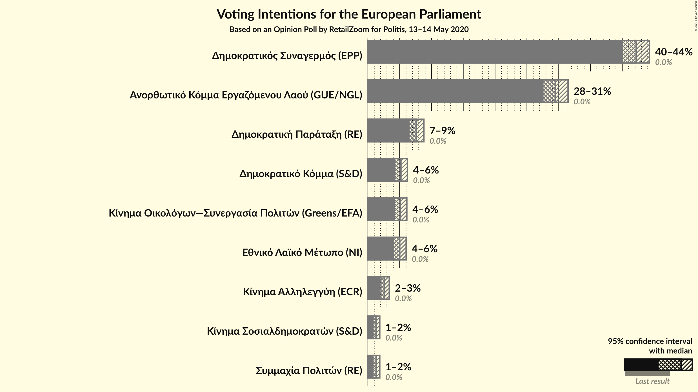
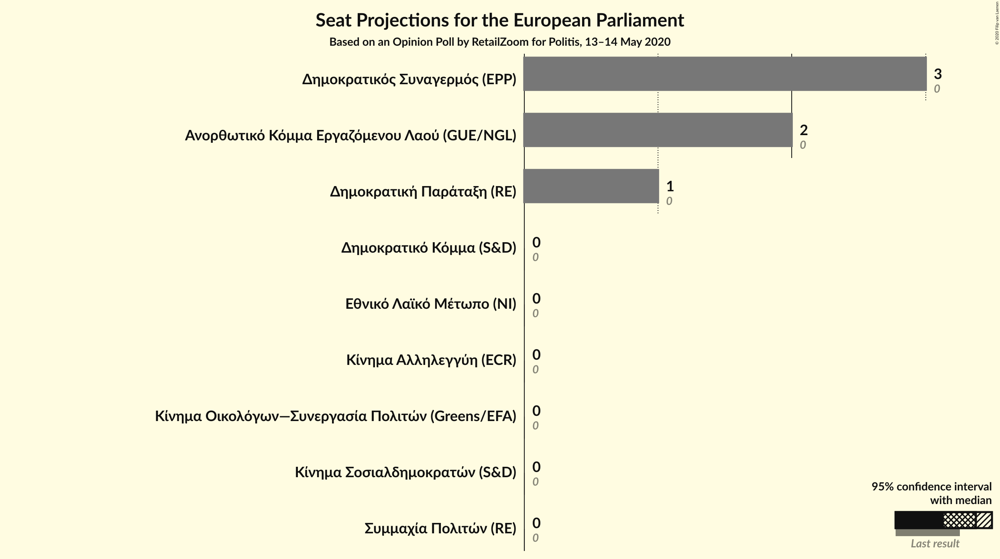
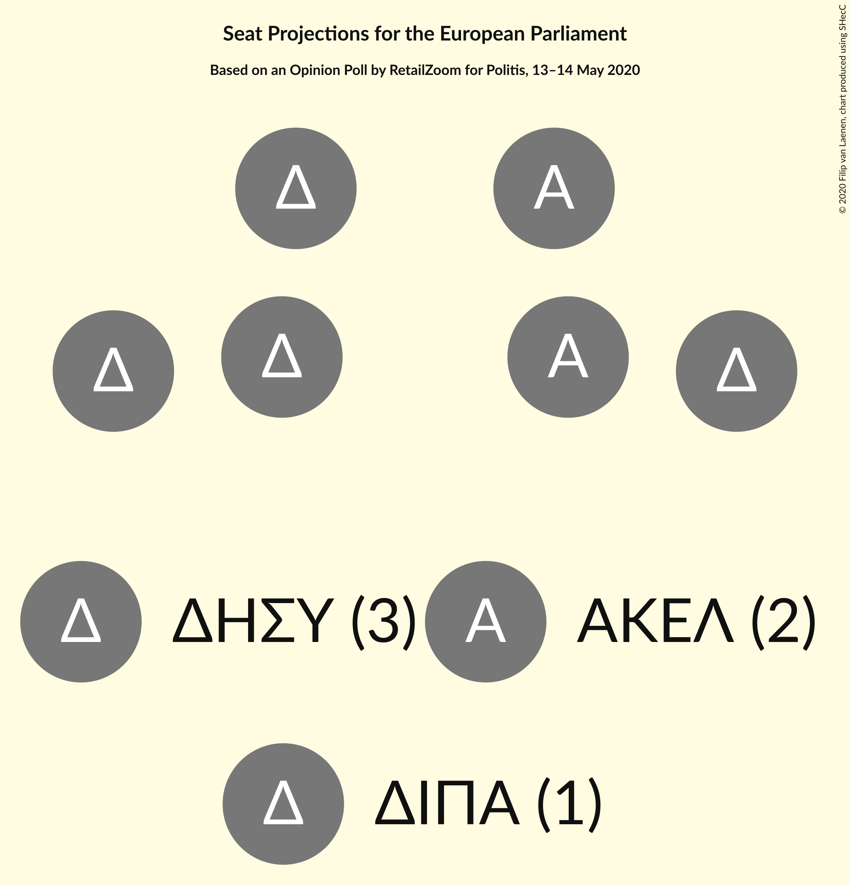

# Opinion Poll by RetailZoom for Politis, 13–14 May 2020

<a href="#voting-intentions">Voting Intentions</a> | <a href="#seats">Seats</a> | <a href="#coalitions">Coalitions</a> | <a href="#technical-information">Technical Information</a>

## Voting Intentions

### Confidence Intervals

| Party | Last Result | Poll Result | 80% Confidence Interval | 90% Confidence Interval | 95% Confidence Interval | 99% Confidence Interval |
|:-----:|:-----------:|:-----------:|:-----------------------:|:-----------------------:|:-----------------------:|:-----------------------:|
| Δημοκρατικός Συναγερμός (EPP) | 0.0% | 42.2% | 40.8–43.6% |40.4–43.9% |40.1–44.3% |39.5–44.9% |
| Ανορθωτικό Κόμμα Εργαζόμενου Λαού (GUE/NGL) | 0.0% | 29.5% | 28.3–30.8% |27.9–31.2% |27.6–31.5% |27.0–32.1% |
| Δημοκρατική Παράταξη (RE) | 0.0% | 7.6% | 6.9–8.4% |6.7–8.6% |6.6–8.8% |6.2–9.2% |
| Δημοκρατικό Κόμμα (S&D) | 0.0% | 5.2% | 4.6–5.9% |4.5–6.1% |4.3–6.2% |4.1–6.6% |
| Κίνημα Οικολόγων—Συνεργασία Πολιτών (Greens/EFA) | 0.0% | 5.1% | 4.5–5.8% |4.4–6.0% |4.3–6.1% |4.0–6.4% |
| Εθνικό Λαϊκό Μέτωπο (NI) | 0.0% | 5.0% | 4.5–5.7% |4.3–5.9% |4.2–6.0% |3.9–6.3% |
| Κίνημα Αλληλεγγύη (ECR) | 0.0% | 2.6% | 2.2–3.1% |2.1–3.2% |2.0–3.4% |1.8–3.6% |
| Κίνημα Σοσιαλδημοκρατών (S&D) | 0.0% | 1.3% | 1.0–1.7% |1.0–1.8% |0.9–1.9% |0.8–2.1% |
| Συμμαχία Πολιτών (RE) | N/A | 1.3% | 1.0–1.7% |1.0–1.8% |0.9–1.9% |0.8–2.1% |

*Note:* The poll result column reflects the actual value used in the calculations. Published results may vary slightly, and in addition be rounded to fewer digits.

## Seats

### Confidence Intervals

| Party | Last Result | Median | 80% Confidence Interval | 90% Confidence Interval | 95% Confidence Interval | 99% Confidence Interval |
|:-----:|:-----------:|:------:|:-----------------------:|:-----------------------:|:-----------------------:|:-----------------------:|
| <a href="#δημοκρατικός-συναγερμός-(epp)">Δημοκρατικός Συναγερμός (EPP)</a> | 0 | 3 | 3 |3 |3 |3 |
| <a href="#ανορθωτικό-κόμμα-εργαζόμενου-λαού-(gue/ngl)">Ανορθωτικό Κόμμα Εργαζόμενου Λαού (GUE/NGL)</a> | 0 | 2 | 2 |2 |2 |2 |
| <a href="#δημοκρατική-παράταξη-(re)">Δημοκρατική Παράταξη (RE)</a> | 0 | 1 | 1 |1 |1 |1 |
| <a href="#δημοκρατικό-κόμμα-(s&d)">Δημοκρατικό Κόμμα (S&D)</a> | 0 | 0 | 0 |0 |0 |0 |
| <a href="#κίνημα-οικολόγων—συνεργασία-πολιτών-(greens/efa)">Κίνημα Οικολόγων—Συνεργασία Πολιτών (Greens/EFA)</a> | 0 | 0 | 0 |0 |0 |0 |
| <a href="#εθνικό-λαϊκό-μέτωπο-(ni)">Εθνικό Λαϊκό Μέτωπο (NI)</a> | 0 | 0 | 0 |0 |0 |0 |
| <a href="#κίνημα-αλληλεγγύη-(ecr)">Κίνημα Αλληλεγγύη (ECR)</a> | 0 | 0 | 0 |0 |0 |0 |
| <a href="#κίνημα-σοσιαλδημοκρατών-(s&d)">Κίνημα Σοσιαλδημοκρατών (S&D)</a> | 0 | 0 | 0 |0 |0 |0 |
| <a href="#συμμαχία-πολιτών-(re)">Συμμαχία Πολιτών (RE)</a> | N/A | 0 | 0 |0 |0 |0 |

