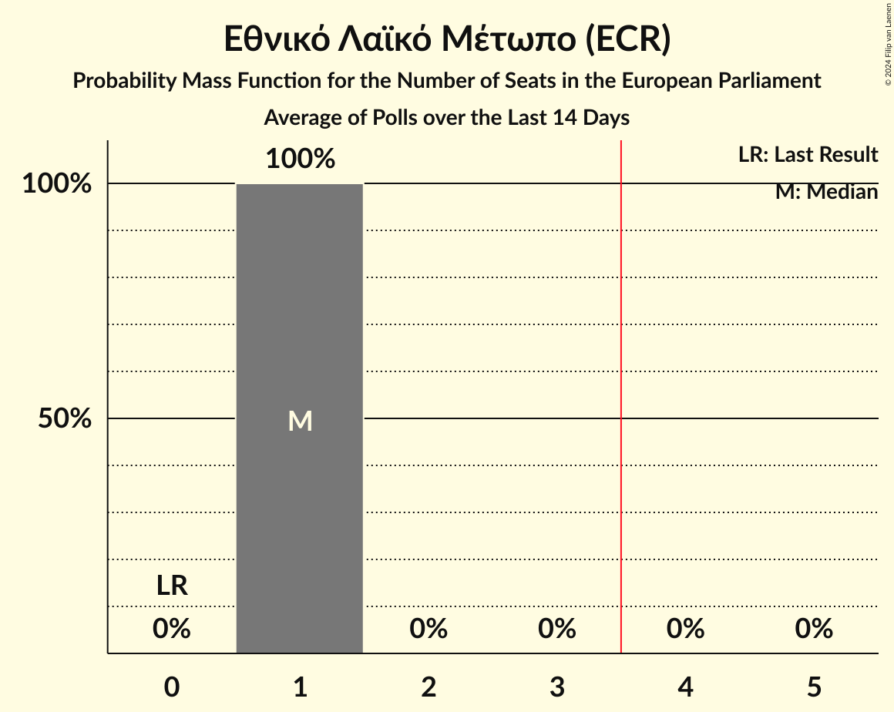

# Εθνικό Λαϊκό Μέτωπο (ECR)

<a href="#voting-intentions">Voting Intentions</a> | <a href="#seats">Seats</a>

## Voting Intentions

Last result: **0.0%** (General Election of 26 May 2019)

### Confidence Intervals

| Period     | Polling firm/Commissioner(s) | Median | 80% Confidence Interval | 90% Confidence Interval | 95% Confidence Interval | 99% Confidence Interval |
|:----------:|:----------------:|:-----------:|:-----------------------:|:-----------------------:|:-----------------------:|:-----------------------:|
| N/A | [Poll Average](average.html) | 13.4% | 12.0–14.8% | 11.7–15.2% | 11.4–15.6% | 10.8–16.3% |
| [27–30 May 2024](2024-05-30-IMRUNic.html) | IMR/UNic   Reporter | 13.5% | 12.2–15.0% | 11.8–15.4% | 11.5–15.8% | 10.9–16.5% |
| [22–28 May 2024](2024-05-28-Cypronetwork.html) | Cypronetwork   CyBC | 13.8% | 12.6–15.2% | 12.3–15.6% | 12.0–15.9% | 11.4–16.6% |
| [20–25 May 2024](2024-05-25-RAIConsultants.html) | RAI Consultants   Alpha TV | 12.5% | 11.5–13.6% | 11.2–13.9% | 10.9–14.2% | 10.5–14.8% |
| [13–25 May 2024](2024-05-25-CYMAR.html) | CYMAR   ANT1 | 13.0% | 11.9–14.2% | 11.6–14.5% | 11.4–14.8% | 10.9–15.4% |
| [20–24 May 2024](2024-05-24-Symmetron.html) | Symmetron   Η Καθημερινή | 13.4% | 11.9–15.0% | 11.5–15.5% | 11.2–15.9% | 10.5–16.7% |
| [17–24 May 2024](2024-05-24-PrimeConsulting.html) | Prime Consulting   Sigma TV | 13.5% | 12.2–14.9% | 11.9–15.3% | 11.6–15.7% | 11.0–16.3% |
| [16–22 May 2024](2024-05-22-Pulse.html) | Pulse   Omega TV | 13.6% | 12.7–14.6% | 12.4–14.9% | 12.2–15.2% | 11.7–15.7% |
| [9–14 May 2024](2024-05-14-AnalyticaMarketResearch.html) | Analytica Market Research   Cyprus Times | 14.5% | 13.8–15.2% | 13.6–15.4% | 13.5–15.6% | 13.2–16.0% |
| [10–22 April 2024](2024-04-22-Cypronetwork.html) | Cypronetwork | 15.2% | 14.0–16.6% | 13.6–17.0% | 13.3–17.4% | 12.8–18.0% |
| [8–19 April 2024](2024-04-19-CYMAR.html) | CYMAR   ANT1 | 15.6% | 14.4–16.8% | 14.1–17.2% | 13.8–17.5% | 13.3–18.1% |
| [14–23 March 2024](2024-03-23-PrimeConsulting.html) | Prime Consulting   Sigma TV | 15.1% | 13.8–16.6% | 13.4–17.0% | 13.1–17.4% | 12.5–18.1% |
| [20–26 February 2024](2024-02-26-Pulse.html) | Pulse   Φ | 14.7% | 13.0–16.7% | 12.5–17.2% | 12.1–17.7% | 11.3–18.7% |
| [12–16 February 2024](2024-02-16-PrimeConsulting.html) | Prime Consulting   Sigma TV | 14.5% | 13.2–16.1% | 12.8–16.5% | 12.5–16.9% | 11.9–17.6% |
| [11 February 2024](2024-02-11-Symmetron.html) | Symmetron   Η Καθημερινή | 13.8% | 12.3–15.4% | 11.9–15.9% | 11.5–16.3% | 10.9–17.1% |
| [18–22 September 2023](2023-09-22-IMRUNic.html) | IMR/UNic   Reporter | 17.0% | 15.2–18.9% | 14.8–19.5% | 14.3–20.0% | 13.5–20.9% |
| [17–21 May 2021](2021-05-21-Pulse.html) | Pulse   Alpha TV | 7.8% | 6.9–9.0% | 6.6–9.3% | 6.4–9.6% | 5.9–10.2% |
| [14–20 May 2021](2021-05-20-Symmetron.html) | Symmetron   Η Καθημερινή | 6.7% | 5.6–8.0% | 5.3–8.4% | 5.1–8.7% | 4.6–9.4% |
| [10–18 May 2021](2021-05-18-Cypronetwork.html) | Cypronetwork   Omega TV | 5.9% | 5.1–6.9% | 4.9–7.2% | 4.7–7.4% | 4.3–7.9% |
| [5–15 May 2021](2021-05-15-IMRUNic.html) | IMR/UNic   CyBC | 6.9% | 6.0–8.0% | 5.8–8.3% | 5.6–8.6% | 5.2–9.1% |
| [10–14 May 2021](2021-05-14-PrimeConsulting.html) | Prime Consulting   Sigma TV | 6.8% | 5.8–8.1% | 5.5–8.5% | 5.3–8.8% | 4.8–9.4% |
| [5–13 May 2021](2021-05-13-Noverna.html) | Noverna   Politis | 8.5% | 7.3–10.0% | 7.0–10.4% | 6.7–10.8% | 6.2–11.5% |
| [6–12 May 2021](2021-05-12-PrimeConsulting.html) | Prime Consulting   Cyprus Times | 6.7% | 5.8–7.8% | 5.5–8.1% | 5.3–8.4% | 4.9–9.0% |
| [4–12 May 2021](2021-05-12-CYMAR.html) | CYMAR   ANT1 | 6.2% | 5.4–7.2% | 5.1–7.5% | 4.9–7.8% | 4.6–8.3% |
| [4–7 May 2021](2021-05-07-Pulse.html) | Pulse   Alpha TV | 7.1% | 6.2–8.1% | 6.0–8.4% | 5.8–8.7% | 5.4–9.2% |
| [7–23 April 2021](2021-04-23-Noverna.html) | Noverna   Politis | 6.5% | 5.5–7.8% | 5.2–8.2% | 5.0–8.5% | 4.5–9.2% |
| [13–17 April 2021](2021-04-17-Cypronetwork.html) | Cypronetwork   Omega TV | 6.2% | 5.3–7.3% | 5.1–7.6% | 4.9–7.9% | 4.5–8.4% |
| [12–16 April 2021](2021-04-16-PrimeConsulting.html) | Prime Consulting   Sigma TV | 6.6% | 5.8–7.8% | 5.5–8.1% | 5.3–8.4% | 4.9–8.9% |
| [31 March–16 April 2021](2021-04-16-IMRUNic.html) | IMR/UNic   CyBC | 6.1% | 5.3–7.0% | 5.1–7.2% | 4.9–7.5% | 4.6–7.9% |
| [2–9 April 2021](2021-04-09-Symmetron.html) | Symmetron   Η Καθημερινή | 5.8% | 4.8–6.9% | 4.6–7.3% | 4.3–7.6% | 3.9–8.2% |
| [26 March–9 April 2021](2021-04-09-CYMAR.html) | CYMAR   ANT1 | 8.5% | 7.5–9.7% | 7.2–10.1% | 6.9–10.4% | 6.4–11.0% |
| [9 March–4 April 2021](2021-04-04-Conread.html) | Conread   CyprusNews | 6.2% | 5.2–7.4% | 4.9–7.7% | 4.7–8.0% | 4.3–8.6% |
| [21–30 March 2021](2021-03-30-Cypronetwork.html) | Cypronetwork   Ὁ Φιλελεύθερος | 7.4% | 6.4–8.6% | 6.2–8.9% | 5.9–9.2% | 5.5–9.8% |
| [8–20 March 2021](2021-03-20-IMRUNic.html) | IMR/UNic   CyBC | 6.2% | 5.5–7.1% | 5.2–7.4% | 5.1–7.6% | 4.7–8.0% |
| [8–18 March 2021](2021-03-18-Pulse.html) | Pulse   Alpha TV | 4.5% | 3.8–5.5% | 3.6–5.7% | 3.4–6.0% | 3.0–6.5% |
| [8–12 March 2021](2021-03-12-PrimeConsulting.html) | Prime Consulting   Sigma TV | 6.4% | 5.5–7.5% | 5.3–7.8% | 5.1–8.0% | 4.7–8.6% |
| [25 February–2 March 2021](2021-03-02-GPO.html) | GPO   Χαραυγή | 9.0% | 7.8–10.4% | 7.5–10.8% | 7.2–11.2% | 6.7–11.9% |
| [12–19 February 2021](2021-02-19-Symmetron.html) | Symmetron   Η Καθημερινή | 6.1% | 5.2–7.4% | 4.9–7.7% | 4.7–8.0% | 4.2–8.6% |
| [1–6 February 2021](2021-02-06-PrimeConsulting.html) | Prime Consulting   Sigma TV | 6.7% | 5.9–7.8% | 5.6–8.1% | 5.4–8.4% | 5.0–8.9% |
| [20–25 January 2021](2021-01-25-Interview.html) | Interview   Politis | 4.8% | 3.9–6.0% | 3.7–6.4% | 3.5–6.7% | 3.1–7.3% |
| [16–23 October 2020](2020-10-23-PrimeConsulting.html) | Prime Consulting   Sigma TV | 6.2% | 5.3–7.3% | 5.1–7.6% | 4.9–7.8% | 4.5–8.4% |
| [19–25 June 2020](2020-06-25-Symmetron.html) | Symmetron | 4.7% | 3.7–6.0% | 3.5–6.3% | 3.2–6.7% | 2.9–7.3% |
| [13–14 May 2020](2020-05-14-RetailZoom.html) | RetailZoom   Politis | 5.0% | 4.5–5.7% | 4.3–5.9% | 4.2–6.0% | 3.9–6.3% |

### Probability Mass Function

The following table shows the probability mass function per percentage block of voting intentions for the [poll average](average.html) for Εθνικό Λαϊκό Μέτωπο (ECR).

| Voting Intentions | Probability | Accumulated | Special Marks |
|:-----------------:|:-----------:|:-----------:|:-------------:|
| 0.0–0.5% | 0% | 100% | Last Result |
| 0.5–1.5% | 0% | 100% |  |
| 1.5–2.5% | 0% | 100% |  |
| 2.5–3.5% | 0% | 100% |  |
| 3.5–4.5% | 0% | 100% |  |
| 4.5–5.5% | 0% | 100% |  |
| 5.5–6.5% | 0% | 100% |  |
| 6.5–7.5% | 0% | 100% |  |
| 7.5–8.5% | 0% | 100% |  |
| 8.5–9.5% | 0% | 100% |  |
| 9.5–10.5% | 0.2% | 100% |  |
| 10.5–11.5% | 4% | 99.8% |  |
| 11.5–12.5% | 18% | 96% |  |
| 12.5–13.5% | 35% | 78% | Median |
| 13.5–14.5% | 30% | 43% |  |
| 14.5–15.5% | 11% | 14% |  |
| 15.5–16.5% | 2% | 3% |  |
| 16.5–17.5% | 0.3% | 0.3% |  |
| 17.5–18.5% | 0% | 0% |  |

## Seats

Last result: **0** seats (General Election of 26 May 2019)

### Confidence Intervals

| Period     | Polling firm/Commissioner(s) | Median | 80% Confidence Interval | 90% Confidence Interval | 95% Confidence Interval | 99% Confidence Interval |
|:----------:|:----------------:|:------:|:-----------------------:|:-----------------------:|:-----------------------:|:-----------------------:|
| N/A | [Poll Average](average.html) | 1 | 1 | 1 | 1 | 1 |
| [27–30 May 2024](2024-05-30-IMRUNic.html) | IMR/UNic   Reporter | 1 | 1 | 1 | 1 | 1 |
| [22–28 May 2024](2024-05-28-Cypronetwork.html) | Cypronetwork   CyBC | 1 | 1 | 1 | 1 | 1 |
| [20–25 May 2024](2024-05-25-RAIConsultants.html) | RAI Consultants   Alpha TV | 1 | 1 | 1 | 1 | 1 |
| [13–25 May 2024](2024-05-25-CYMAR.html) | CYMAR   ANT1 | 1 | 1 | 1 | 1 | 1 |
| [20–24 May 2024](2024-05-24-Symmetron.html) | Symmetron   Η Καθημερινή | 1 | 1 | 1 | 1 | 1 |
| [17–24 May 2024](2024-05-24-PrimeConsulting.html) | Prime Consulting   Sigma TV | 1 | 1 | 1 | 1 | 1 |
| [16–22 May 2024](2024-05-22-Pulse.html) | Pulse   Omega TV | 1 | 1 | 1 | 1 | 1 |
| [9–14 May 2024](2024-05-14-AnalyticaMarketResearch.html) | Analytica Market Research   Cyprus Times | 1 | 1 | 1 | 1 | 1 |
| [10–22 April 2024](2024-04-22-Cypronetwork.html) | Cypronetwork | 1 | 1 | 1 | 1 | 1 |
| [8–19 April 2024](2024-04-19-CYMAR.html) | CYMAR   ANT1 | 1 | 1 | 1 | 1 | 1 |
| [14–23 March 2024](2024-03-23-PrimeConsulting.html) | Prime Consulting   Sigma TV | 1 | 1 | 1 | 1 | 1 |
| [20–26 February 2024](2024-02-26-Pulse.html) | Pulse   Φ | 1 | 1 | 1 | 1 | 1 |
| [12–16 February 2024](2024-02-16-PrimeConsulting.html) | Prime Consulting   Sigma TV | 1 | 1 | 1 | 1 | 1 |
| [11 February 2024](2024-02-11-Symmetron.html) | Symmetron   Η Καθημερινή | 1 | 1 | 1 | 1 | 1 |
| [18–22 September 2023](2023-09-22-IMRUNic.html) | IMR/UNic   Reporter | 1 | 1 | 1 | 1 | 1 |
| [17–21 May 2021](2021-05-21-Pulse.html) | Pulse   Alpha TV | 1 | 0–1 | 0–1 | 0–1 | 0–1 |
| [14–20 May 2021](2021-05-20-Symmetron.html) | Symmetron   Η Καθημερινή | 0 | 0–1 | 0–1 | 0–1 | 0–1 |
| [10–18 May 2021](2021-05-18-Cypronetwork.html) | Cypronetwork   Omega TV | 0 | 0–1 | 0–1 | 0–1 | 0–1 |
| [5–15 May 2021](2021-05-15-IMRUNic.html) | IMR/UNic   CyBC | 0 | 0–1 | 0–1 | 0–1 | 0–1 |
| [10–14 May 2021](2021-05-14-PrimeConsulting.html) | Prime Consulting   Sigma TV | 1 | 0–1 | 0–1 | 0–1 | 0–1 |
| [5–13 May 2021](2021-05-13-Noverna.html) | Noverna   Politis | 1 | 0–1 | 0–1 | 0–1 | 0–1 |
| [6–12 May 2021](2021-05-12-PrimeConsulting.html) | Prime Consulting   Cyprus Times | 0 | 0–1 | 0–1 | 0–1 | 0–1 |
| [4–12 May 2021](2021-05-12-CYMAR.html) | CYMAR   ANT1 | 0 | 0–1 | 0–1 | 0–1 | 0–1 |
| [4–7 May 2021](2021-05-07-Pulse.html) | Pulse   Alpha TV | 0 | 0–1 | 0–1 | 0–1 | 0–1 |
| [7–23 April 2021](2021-04-23-Noverna.html) | Noverna   Politis | 0 | 0–1 | 0–1 | 0–1 | 0–1 |
| [13–17 April 2021](2021-04-17-Cypronetwork.html) | Cypronetwork   Omega TV | 0 | 0–1 | 0–1 | 0–1 | 0–1 |
| [12–16 April 2021](2021-04-16-PrimeConsulting.html) | Prime Consulting   Sigma TV | 0 | 0–1 | 0–1 | 0–1 | 0–1 |
| [31 March–16 April 2021](2021-04-16-IMRUNic.html) | IMR/UNic   CyBC | 0 | 0–1 | 0–1 | 0–1 | 0–1 |
| [2–9 April 2021](2021-04-09-Symmetron.html) | Symmetron   Η Καθημερινή | 0 | 0–1 | 0–1 | 0–1 | 0–1 |
| [26 March–9 April 2021](2021-04-09-CYMAR.html) | CYMAR   ANT1 | 1 | 1 | 0–1 | 0–1 | 0–1 |
| [9 March–4 April 2021](2021-04-04-Conread.html) | Conread   CyprusNews | 0 | 0–1 | 0–1 | 0–1 | 0–1 |
| [21–30 March 2021](2021-03-30-Cypronetwork.html) | Cypronetwork   Ὁ Φιλελεύθερος | 1 | 0–1 | 0–1 | 0–1 | 0–1 |
| [8–20 March 2021](2021-03-20-IMRUNic.html) | IMR/UNic   CyBC | 0 | 0–1 | 0–1 | 0–1 | 0–1 |
| [8–18 March 2021](2021-03-18-Pulse.html) | Pulse   Alpha TV | 0 | 0 | 0 | 0 | 0 |
| [8–12 March 2021](2021-03-12-PrimeConsulting.html) | Prime Consulting   Sigma TV | 0 | 0–1 | 0–1 | 0–1 | 0–1 |
| [25 February–2 March 2021](2021-03-02-GPO.html) | GPO   Χαραυγή | 1 | 0–1 | 0–1 | 0–1 | 0–1 |
| [12–19 February 2021](2021-02-19-Symmetron.html) | Symmetron   Η Καθημερινή | 0 | 0–1 | 0–1 | 0–1 | 0–1 |
| [1–6 February 2021](2021-02-06-PrimeConsulting.html) | Prime Consulting   Sigma TV | 0 | 0–1 | 0–1 | 0–1 | 0–1 |
| [20–25 January 2021](2021-01-25-Interview.html) | Interview   Politis | 0 | 0–1 | 0–1 | 0–1 | 0–1 |
| [16–23 October 2020](2020-10-23-PrimeConsulting.html) | Prime Consulting   Sigma TV | 0 | 0–1 | 0–1 | 0–1 | 0–1 |
| [19–25 June 2020](2020-06-25-Symmetron.html) | Symmetron | 0 | 0–1 | 0–1 | 0–1 | 0–1 |
| [13–14 May 2020](2020-05-14-RetailZoom.html) | RetailZoom   Politis | 0 | 0 | 0 | 0 | 0 |

### Probability Mass Function

The following table shows the probability mass function per seat for the [poll average](average.html) for Εθνικό Λαϊκό Μέτωπο (ECR).

| Number of Seats | Probability | Accumulated | Special Marks |
|:---------------:|:-----------:|:-----------:|:-------------:|
| 0 | 0% | 100% | Last Result |
| 1 | 100% | 100% | Median |

