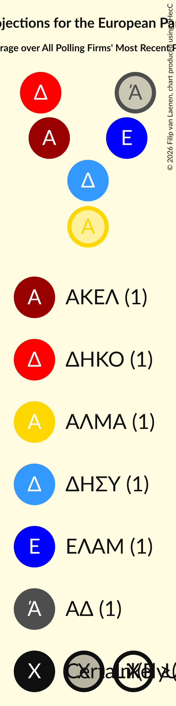

# Overview

The table below lists the most recent polls (less than 90 days old) registered and analyzed so far.

| Period     | Polling firm/Commissioner(s) | ΔΗΣΥ | ΑΚΕΛ | ΔΗΚΟ | ΕΛΑΜ | ΕΔΕΚ | ΣΥΠΟΛ | ΚΟ–ΣΠ | ΚΑ | ΔΙΠΑ | ΕΔΕΚ–ΣΥΠΟΛ | ΑΝΕΞ |
|:----------:|:----------------------------:|:--:|:--:|:--:|:--:|:--:|:--:|:--:|:--:|:--:|:--:|:--:|
| 26 May 2019 | General Election | 0.0%   0 | 0.0%   0 | 0.0%   0 | 0.0%   0 | 0.0%   0 | 0.0%   0 | 0.0%   0 | 0.0%   0 | 0.0%   0 | 0.0%   0 | 0.0%   0 |
| N/A | [Poll Average](average.html) | 24–30%   1–2 | 20–27%   1–2 | 11–16%   1 | 4–9%   0–1 | N/A   N/A | N/A   N/A | 5–10%   0–1 | 0–4%   0 | 2–5%   0 | 4–8%   0–1 | 4–9%   0–1 |
| [13–17 April 2021](2021-04-17-Cypronetwork.html) | Cypronetwork   Omega TV | 23–29%   1–2 | 20–25%   1–2 | 12–16%   1 | 5–8%   0–1 | N/A   N/A | N/A   N/A | 6–9%   0–1 | 2–4%   0 | 2–4%   0 | 5–9%   0–1 | 5–8%   0–1 |
| [12–16 April 2021](2021-04-16-PrimeConsulting.html) | Prime Consulting   Τηλεόραση ΣΙΓΜΑ | 24–29%   1–2 | 22–27%   1–2 | 11–16%   1 | 5–8%   0–1 | N/A   N/A | N/A   N/A | 5–8%   0–1 | 1–3%   0 | 2–5%   0 | 4–7%   0 | 4–6%   0 |
| [31 March–16 April 2021](2021-04-16-IMR.html) | IMR   University of Nicosia | 25–30%   2 | 22–27%   1–2 | 12–15%   1 | 5–7%   0–1 | N/A   N/A | N/A   N/A | 6–8%   0–1 | 1–2%   0 | 3–5%   0 | 6–8%   0–1 | 4–7%   0–1 |
| [2–9 April 2021](2021-04-09-Symmetron.html) | Symmetron   Η Καθημερινή | 23–30%   1–2 | 21–27%   1–2 | 12–17%   1 | 4–8%   0–1 | N/A   N/A | N/A   N/A | 6–9%   0–1 | 1–3%   0 | 3–6%   0 | 4–8%   0–1 | 4–8%   0–1 |
| [26 March–9 April 2021](2021-04-09-CYMAR.html) | CYMAR   ANT1 | 25–31%   2 | 22–27%   1–2 | 10–14%   1 | 7–10%   0–1 | N/A   N/A | N/A   N/A | 5–8%   0–1 | 0–1%   0 | 2–4%   0 | 4–6%   0 | 4–7%   0 |
| [9 March–4 April 2021](2021-04-04-Conread.html) | Conread   CyprusNews | 24–30%   2 | 19–25%   1–2 | 12–17%   1 | 5–8%   0–1 | N/A   N/A | N/A   N/A | 5–8%   0–1 | 0–1%   0 | 1–3%   0 | 5–8%   0–1 | 7–10%   0–1 |
| [8–18 March 2021](2021-03-18-Pulse.html) | Pulse   Alpha TV | 23–29%   1–2 | 19–24%   1 | 12–16%   1 | 3–6%   0 | N/A   N/A | N/A   N/A | 7–11%   1 | 1–2%   0 | 2–4%   0 | 5–8%   0–1 | 3–6%   0 |
| 26 May 2019 | General Election | 0.0%   0 | 0.0%   0 | 0.0%   0 | 0.0%   0 | 0.0%   0 | 0.0%   0 | 0.0%   0 | 0.0%   0 | 0.0%   0 | 0.0%   0 | 0.0%   0 |

Only polls for which at least the sample size has been published are included in the table above.

**Legend:**
+ **Top half of each row:** Voting intentions (95% confidence interval)
+ **Bottom half of each row:** Seat projections for the European Parliament (95% confidence interval)
+ **ΔΗΣΥ:** Δημοκρατικός Συναγερμός (EPP)
+ **ΑΚΕΛ:** Ανορθωτικό Κόμμα Εργαζόμενου Λαού (GUE/NGL)
+ **ΔΗΚΟ:** Δημοκρατικό Κόμμα (S&D)
+ **ΕΛΑΜ:** Εθνικό Λαϊκό Μέτωπο (NI)
+ **ΕΔΕΚ:** Κίνημα Σοσιαλδημοκρατών (S&D)
+ **ΣΥΠΟΛ:** Συμμαχία Πολιτών (RE)
+ **ΚΟ–ΣΠ:** Κίνημα Οικολόγων—Συνεργασία Πολιτών (Greens/EFA)
+ **ΚΑ:** Κίνημα Αλληλεγγύη (ECR)
+ **ΔΙΠΑ:** Δημοκρατική Παράταξη (RE)
+ **ΕΔΕΚ–ΣΥΠΟΛ:** Κίνημα Σοσιαλδημοκρατών–Συνεργασία Πολιτών (S&D)
+ **ΑΝΕΞ:** Ανεξάρτητοι (*)
+ **N/A (single party):** Party not included the published results
+ **N/A (entire row):** Calculation for this opinion poll not started yet

