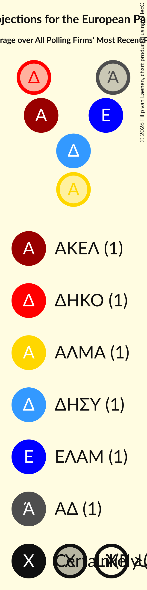

# Overview

The table below lists the most recent polls (less than 90 days old) registered and analyzed so far.

| Period     | Polling firm/Commissioner(s) | ΑΚΕΛ | APC | ΚΟ–ΣΠ | Βολτ | Βολτ–ΝΚ | ΔΗΚΟ | ΕΔΕΚ | ΕΔΕΚ–ΣΥΠΟΛ | ΑΛΜΑ | ΣΥΠΟΛ | ΔΙΠΑ | ΔΗΣΥ | ΕΛΑΜ | ΚΑ | ΆΔ | ΑΝΕΞ | ΕΠ–ΚΕΚΚ | ΣΠ |
|:----------:|:----------------------------:|:--:|:--:|:--:|:--:|:--:|:--:|:--:|:--:|:--:|:--:|:--:|:--:|:--:|:--:|:--:|:--:|:--:|:--:|
| 9 June 2024 | General Election | 0.0%   0 | 0.0%   0 | 0.0%   0 | 0.0%   0 | 0.0%   0 | 0.0%   0 | 0.0%   0 | 0.0%   0 | 0.0%   0 | 0.0%   0 | 0.0%   0 | 0.0%   0 | 0.0%   0 | 0.0%   0 | 0.0%   0 | 0.0%   0 | 0.0%   0 | 0.0%   0 |
| N/A | [Poll Average](average.html) | 18–24%   1–2 | N/A   N/A | 2–4%   0 | 3–7%   0 | N/A   N/A | 7–12%   0–1 | 2–5%   0 | N/A   N/A | 6–12%   0–1 | N/A   N/A | 1–4%   0 | 19–26%   1–2 | 11–16%   1 | N/A   N/A | 5–12%   0–1 | N/A   N/A | 1–4%   0 | 0–2%   0 |
| [11–15 May 2026](2026-05-15-Stratego-IMR.html) | Stratego-IMR   Η Καθημερινή | 17–23%   1 | N/A   N/A | 2–4%   0 | 3–6%   0 | N/A   N/A | 7–11%   0–1 | 2–4%   0 | N/A   N/A | 8–12%   1 | N/A   N/A | 1–3%   0 | 20–26%   1–2 | 11–16%   1 | N/A   N/A | 6–10%   0–1 | N/A   N/A | 1–3%   0 | 0–2%   0 |
| [6–13 May 2026](2026-05-13-Pulse.html) | Pulse   Omega TV | 19–24%   1–2 | N/A   N/A | 2–4%   0 | 4–6%   0 | N/A   N/A | 7–10%   0–1 | 3–5%   0 | N/A   N/A | 6–10%   0–1 | N/A   N/A | 2–4%   0 | 21–26%   1–2 | 11–16%   1 | N/A   N/A | 6–9%   0–1 | N/A   N/A | 1–3%   0 | N/A   N/A |
| [6–13 May 2026](2026-05-13-Explorer.html) | Explorer   Philenews | 20–25%   1–2 | N/A   N/A | 2–3%   0 | 3–5%   0 | N/A   N/A | 8–12%   1 | 2–3%   0 | N/A   N/A | 8–12%   1 | N/A   N/A | 1–2%   0 | 21–26%   1–2 | 12–16%   1 | N/A   N/A | 7–10%   0–1 | N/A   N/A | 1–2%   0 | N/A   N/A |
| [1–12 May 2026](2026-05-12-Noverna.html) | Noverna   Politis | 18–23%   1 | N/A   N/A | 1–3%   0 | 3–6%   0 | N/A   N/A | 6–10%   0–1 | 3–6%   0 | N/A   N/A | 7–11%   1 | N/A   N/A | 2–4%   0 | 19–25%   1–2 | 11–16%   1 | N/A   N/A | 9–13%   1 | N/A   N/A | 2–4%   0 | 0–1%   0 |
| [1–11 May 2026](2026-05-11-RAIConsultants.html) | RAI Consultants   Alpha Cyprus | 18–23%   1 | N/A   N/A | 1–3%   0 | 3–6%   0 | N/A   N/A | 8–12%   1 | 2–4%   0 | N/A   N/A | 6–10%   0–1 | N/A   N/A | 2–4%   0 | 22–27%   1–2 | 12–17%   1 | N/A   N/A | 5–8%   0–1 | N/A   N/A | 2–5%   0 | N/A   N/A |
| [30 April–10 May 2026](2026-05-10-IMR.html) | IMR   Reporter | 20–23%   1 | N/A   N/A | 2–3%   0 | 4–5%   0 | N/A   N/A | 8–10%   1 | 2–3%   0 | N/A   N/A | 10–12%   1 | N/A   N/A | 1–2%   0 | 22–25%   1–2 | 13–15%   1 | N/A   N/A | 7–8%   0–1 | N/A   N/A | 1–2%   0 | 1–2%   0 |
| [28 April–10 May 2026](2026-05-10-CYMAR.html) | CYMAR   ANT1 | 19–24%   1–2 | N/A   N/A | 2–4%   0 | 4–7%   0–1 | N/A   N/A | 9–13%   1 | 2–4%   0 | N/A   N/A | 5–8%   0–1 | N/A   N/A | 1–2%   0 | 21–26%   1–2 | 13–17%   1 | N/A   N/A | 5–8%   0–1 | N/A   N/A | 1–2%   0 | 1–2%   0 |
| [2–9 May 2026](2026-05-09-PrimeConsulting.html) | Prime Consulting   Sigma TV | 20–25%   1–2 | N/A   N/A | 2–3%   0 | 3–6%   0 | N/A   N/A | 8–11%   1 | 2–4%   0 | N/A   N/A | 8–12%   1 | N/A   N/A | 1–3%   0 | 20–25%   1–2 | 11–15%   1 | N/A   N/A | 6–10%   0–1 | N/A   N/A | 1–2%   0 | N/A   N/A |
| [5–8 May 2026](2026-05-08-AnalyticaMarketResearch.html) | Analytica Market Research   Cyprus Times | 17–20%   1 | N/A   N/A | 2–3%   0 | 4–5%   0 | N/A   N/A | 8–9%   1 | 3–4%   0 | N/A   N/A | 9–10%   1 | N/A   N/A | 2–3%   0 | 19–21%   1 | 12–14%   1 | N/A   N/A | 11–12%   1 | N/A   N/A | 3%   0 | N/A   N/A |
| [20 April–7 May 2026](2026-05-07-Cypronetwork.html) | Cypronetwork   CyBC | 19–23%   1 | N/A   N/A | 3–5%   0 | 3–5%   0 | N/A   N/A | 8–11%   1 | 3–5%   0 | N/A   N/A | 7–10%   1 | N/A   N/A | 1–3%   0 | 20–25%   1–2 | 11–14%   1 | N/A   N/A | 7–10%   0–1 | N/A   N/A | 1–2%   0 | N/A   N/A |
| [4–6 May 2026](2026-05-06-RealPolls.html) | RealPolls   afentiko.eu and CyprusNews | 17–21%   1 | N/A   N/A | 2–3%   0 | 5–8%   0–1 | N/A   N/A | 6–9%   0–1 | 4–6%   0 | N/A   N/A | 7–10%   1 | N/A   N/A | 3–5%   0 | 17–22%   1 | 13–17%   1 | N/A   N/A | 7–10%   1 | N/A   N/A | 2–4%   0 | 0–1%   0 |
| 9 June 2024 | General Election | 0.0%   0 | 0.0%   0 | 0.0%   0 | 0.0%   0 | 0.0%   0 | 0.0%   0 | 0.0%   0 | 0.0%   0 | 0.0%   0 | 0.0%   0 | 0.0%   0 | 0.0%   0 | 0.0%   0 | 0.0%   0 | 0.0%   0 | 0.0%   0 | 0.0%   0 | 0.0%   0 |

Only polls for which at least the sample size has been published are included in the table above.

**Legend:**
+ **Top half of each row:** Voting intentions (95% confidence interval)
+ **Bottom half of each row:** Seat projections for the European Parliament (95% confidence interval)
+ **ΑΚΕΛ:** Ανορθωτικό Κόμμα Εργαζόμενου Λαού (GUE/NGL)
+ **APC:** Κόμμα για τα Ζώα Κύπρου (GUE/NGL)
+ **ΚΟ–ΣΠ:** Κίνημα Οικολόγων—Συνεργασία Πολιτών (Greens/EFA)
+ **Βολτ:** Βολτ Κύπρος (Greens/EFA)
+ **Βολτ–ΝΚ:** Βολτ Κύπρος–Νέο Κύμα–Η Άλλη Κύπρος (Greens/EFA)
+ **ΔΗΚΟ:** Δημοκρατικό Κόμμα (S&D)
+ **ΕΔΕΚ:** Κίνημα Σοσιαλδημοκρατών (S&D)
+ **ΕΔΕΚ–ΣΥΠΟΛ:** Κίνημα Σοσιαλδημοκρατών–Συνεργασία Πολιτών (S&D)
+ **ΑΛΜΑ:** Αξιοπρέπεια Λογοδοσία Μεταρρύθμιση Ανάπτυξη (RE)
+ **ΣΥΠΟΛ:** Συμμαχία Πολιτών (RE)
+ **ΔΙΠΑ:** Δημοκρατική Παράταξη (RE)
+ **ΔΗΣΥ:** Δημοκρατικός Συναγερμός (EPP)
+ **ΕΛΑΜ:** Εθνικό Λαϊκό Μέτωπο (ECR)
+ **ΚΑ:** Κίνημα Αλληλεγγύη (ECR)
+ **ΆΔ:** Άμεσης Δημοκρατίας (NI)
+ **ΑΝΕΞ:** Ανεξάρτητοι (*)
+ **ΕΠ–ΚΕΚΚ:** Ενεργοί Πολίτες–Κίνημα Ενωμένων Κυπρίων Κυνηγών (*)
+ **ΣΠ:** Σήκου πάνω! (*)
+ **N/A (single party):** Party not included the published results
+ **N/A (entire row):** Calculation for this opinion poll not started yet

