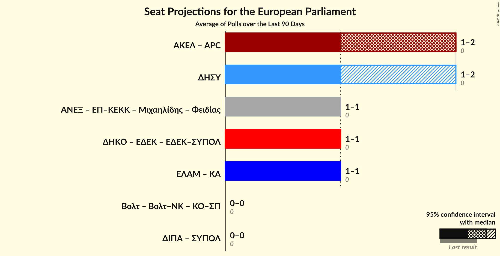

# Overview

The table below lists the most recent polls (less than 90 days old) registered and analyzed so far.

| Period     | Polling firm/Commissioner(s) | ΔΗΣΥ | ΑΚΕΛ | ΔΗΚΟ | ΕΛΑΜ | ΕΔΕΚ | ΣΠ | ΚΟ–ΣΠ | ΚΑ |
|:----------:|:----------------------------:|:--:|:--:|:--:|:--:|:--:|:--:|:--:|:--:|
| 25 May 2014 | General Election | 0.0%   0 | 0.0%   0 | 0.0%   0 | 0.0%   0 | 0.0%   0 | 0.0%   0 | 0.0%   0 | 0.0%   0 |
| N/A | [Poll Average](average.html) | 28–39%   2 | 23–29%   1–2 | 12–18%   1 | 6–12%   0–1 | 5–9%   0–1 | N/A   N/A | 2–7%   0 | N/A   N/A |
| [9–17 April 2019](2019-04-17-Cymar.html) | Cymar | 27–33%   2 | 23–29%   1–2 | 14–18%   1 | 7–11%   0–1 | 6–9%   0–1 | N/A   N/A | 3–5%   0 | N/A   N/A |
| [4–14 April 2019](2019-04-14-Cypronetwork.html) | Cypronetwork | 32–37%   2 | 24–28%   1–2 | 15–19%   1 | 6–8%   0–1 | 6–8%   0–1 | N/A   N/A | 5–7%   0–1 | N/A   N/A |
| [5–12 April 2019](2019-04-12-Symmetron.html) | Symmetron | 30–36%   2 | 22–28%   1–2 | 13–18%   1 | 7–11%   0–1 | 6–9%   0–1 | N/A   N/A | 4–7%   0 | N/A   N/A |
| [5–12 April 2019](2019-04-12-PrimeConsulting.html) | Prime Consulting | 29–35%   2 | 23–29%   1–2 | 13–18%   1 | 7–11%   0–1 | 6–10%   0–1 | N/A   N/A | 3–6%   0 | N/A   N/A |
| [18 March–4 April 2019](2019-04-04-IMR.html) | IMR   University of Nicosia | 33–39%   2 | 23–28%   1–2 | 12–16%   1 | 8–11%   0–1 | 6–9%   0–1 | N/A   N/A | 2–4%   0 | N/A   N/A |
| [16–29 January 2019](2019-01-29-PulseMarketResearch.html) | Pulse Market Research | 34–40%   2 | 23–29%   1–2 | 11–16%   1 | 9–13%   1 | 5–8%   0–1 | N/A   N/A | 1–3%   0 | N/A   N/A |
| 25 May 2014 | General Election | 0.0%   0 | 0.0%   0 | 0.0%   0 | 0.0%   0 | 0.0%   0 | 0.0%   0 | 0.0%   0 | 0.0%   0 |

Only polls for which at least the sample size has been published are included in the table above.

**Legend:**
+ **Top half of each row:** Voting intentions (95% confidence interval)
+ **Bottom half of each row:** Seat projections for the European Parliament (95% confidence interval)
+ **ΔΗΣΥ:** Δημοκρατικός Συναγερμός (EPP)
+ **ΑΚΕΛ:** Ανορθωτικό Κόμμα Εργαζόμενου Λαού (GUE/NGL)
+ **ΔΗΚΟ:** Δημοκρατικό Κόμμα (S&D)
+ **ΕΛΑΜ:** Εθνικό Λαϊκό Μέτωπο (NI)
+ **ΕΔΕΚ:** Κίνημα Σοσιαλδημοκρατών (S&D)
+ **ΣΠ:** Συμμαχία Πολιτών (ALDE)
+ **ΚΟ–ΣΠ:** Κίνημα Οικολόγων—Συνεργασία Πολιτών (Greens/EFA)
+ **ΚΑ:** Κίνημα Αλληλεγγύη (ECR)
+ **N/A (single party):** Party not included the published results
+ **N/A (entire row):** Calculation for this opinion poll not started yet

