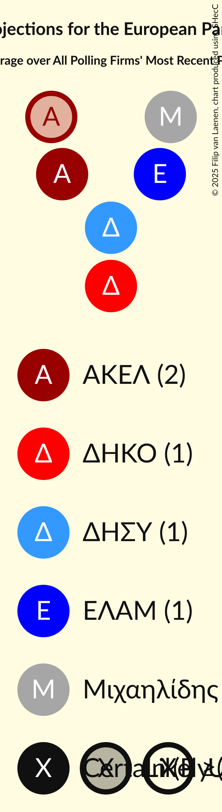

# Overview

The table below lists the most recent polls (less than 90 days old) registered and analyzed so far.

| Period     | Polling firm/Commissioner(s) | ΑΚΕΛ | APC | ΚΟ–ΣΠ | Βολτ | Βολτ–ΝΚ | ΔΗΚΟ | ΕΔΕΚ | ΕΔΕΚ–ΣΥΠΟΛ | ΣΥΠΟΛ | ΔΙΠΑ | ΔΗΣΥ | ΕΛΑΜ | ΚΑ | ΑΝΕΞ | ΕΠ–ΚΕΚΚ | Μιχαηλίδης | Φειδίας |
|:----------:|:----------------------------:|:--:|:--:|:--:|:--:|:--:|:--:|:--:|:--:|:--:|:--:|:--:|:--:|:--:|:--:|:--:|:--:|:--:|
| 9 June 2024 | General Election | 0.0%   0 | 0.0%   0 | 0.0%   0 | 0.0%   0 | 0.0%   0 | 0.0%   0 | 0.0%   0 | 0.0%   0 | 0.0%   0 | 0.0%   0 | 0.0%   0 | 0.0%   0 | 0.0%   0 | 0.0%   0 | 0.0%   0 | 0.0%   0 | 0.0%   0 |
| N/A | [Poll Average](average.html) | 18–27%   1–2 | 1–2%   0 | 2–5%   0 | 2–5%   0 | N/A   N/A | 6–11%   1 | 1–6%   0 | N/A   N/A | N/A   N/A | 1–3%   0 | 19–26%   1–2 | 14–20%   1 | N/A   N/A | N/A   N/A | 1–4%   0 | 10–18%   1 | 2–5%   0 |
| [12–22 September 2025](2025-09-22-Stratego-IMR.html) | Stratego-IMR   Η Καθημερινή | 21–27%   1–2 | N/A   N/A | 1–4%   0 | 1–4%   0 | N/A   N/A | 7–12%   1 | 1–2%   0 | N/A   N/A | N/A   N/A | 1–2%   0 | 20–26%   1–2 | 13–19%   1 | N/A   N/A | N/A   N/A | 1–2%   0 | 10–15%   1 | 2–5%   0 |
| [11 August 2025](2025-08-11-Cypronetwork.html) | Cypronetwork | 20–26%   1–2 | 1–3%   0 | 2–4%   0 | 2–4%   0 | N/A   N/A | 6–10%   1 | 2–4%   0 | N/A   N/A | N/A   N/A | 1–3%   0 | 19–25%   1–2 | 15–21%   1 | N/A   N/A | N/A   N/A | 2–4%   0 | 10–15%   1 | N/A   N/A |
| [1–8 July 2025](2025-07-08-Symmetron.html) | Symmetron   2Dots | 17–25%   1–2 | N/A   N/A | 2–5%   0 | 2–5%   0 | N/A   N/A | 6–11%   0–1 | 3–7%   0–1 | N/A   N/A | N/A   N/A | 1–3%   0 | 20–28%   1–2 | 13–20%   1 | N/A   N/A | N/A   N/A | N/A   N/A | 12–19%   1 | N/A   N/A |
| [24–28 June 2025](2025-06-28-IMRUNic.html) | IMR/UNic   Reporter | 21–27%   1–2 | N/A   N/A | 3–5%   0 | 3–5%   0 | N/A   N/A | 7–11%   1 | 2–4%   0 | N/A   N/A | N/A   N/A | 1–2%   0 | 19–25%   1–2 | 14–19%   1 | N/A   N/A | N/A   N/A | 1–2%   0 | 13–17%   1 | N/A   N/A |
| 9 June 2024 | General Election | 0.0%   0 | 0.0%   0 | 0.0%   0 | 0.0%   0 | 0.0%   0 | 0.0%   0 | 0.0%   0 | 0.0%   0 | 0.0%   0 | 0.0%   0 | 0.0%   0 | 0.0%   0 | 0.0%   0 | 0.0%   0 | 0.0%   0 | 0.0%   0 | 0.0%   0 |

Only polls for which at least the sample size has been published are included in the table above.

**Legend:**
+ **Top half of each row:** Voting intentions (95% confidence interval)
+ **Bottom half of each row:** Seat projections for the European Parliament (95% confidence interval)
+ **ΑΚΕΛ:** Ανορθωτικό Κόμμα Εργαζόμενου Λαού (GUE/NGL)
+ **APC:** Κόμμα για τα Ζώα Κύπρου (GUE/NGL)
+ **ΚΟ–ΣΠ:** Κίνημα Οικολόγων—Συνεργασία Πολιτών (Greens/EFA)
+ **Βολτ:** Βολτ Κύπρος (Greens/EFA)
+ **Βολτ–ΝΚ:** Βολτ Κύπρος–Νέο Κύμα–Η Άλλη Κύπρος (Greens/EFA)
+ **ΔΗΚΟ:** Δημοκρατικό Κόμμα (S&D)
+ **ΕΔΕΚ:** Κίνημα Σοσιαλδημοκρατών (S&D)
+ **ΕΔΕΚ–ΣΥΠΟΛ:** Κίνημα Σοσιαλδημοκρατών–Συνεργασία Πολιτών (S&D)
+ **ΣΥΠΟΛ:** Συμμαχία Πολιτών (RE)
+ **ΔΙΠΑ:** Δημοκρατική Παράταξη (RE)
+ **ΔΗΣΥ:** Δημοκρατικός Συναγερμός (EPP)
+ **ΕΛΑΜ:** Εθνικό Λαϊκό Μέτωπο (ECR)
+ **ΚΑ:** Κίνημα Αλληλεγγύη (ECR)
+ **ΑΝΕΞ:** Ανεξάρτητοι (*)
+ **ΕΠ–ΚΕΚΚ:** Ενεργοί Πολίτες–Κίνημα Ενωμένων Κυπρίων Κυνηγών (*)
+ **Μιχαηλίδης:** Οδυσσέας Μιχαηλίδης (*)
+ **Φειδίας:** Φειδίας Παναγιώτου (*)
+ **N/A (single party):** Party not included the published results
+ **N/A (entire row):** Calculation for this opinion poll not started yet

