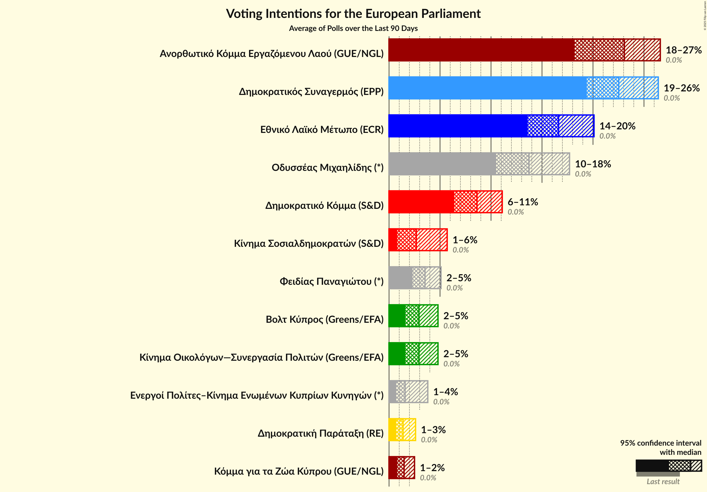

# Overview

The table below lists the most recent polls (less than 14 days old) registered and analyzed so far.

| Period     | Polling firm/Commissioner(s) | ΔΗΣΥ | ΑΚΕΛ | ΔΗΚΟ | ΕΛΑΜ | ΕΔΕΚ | ΣΥΠΟΛ | ΚΟ–ΣΠ | ΚΑ | ΔΙΠΑ | ΕΔΕΚ–ΣΥΠΟΛ | ΑΝΕΞ | Βολτ | Βολτ–ΝΚ | ΕΠ–ΚΕΚΚ | APC | Φειδίας |
|:----------:|:----------------------------:|:--:|:--:|:--:|:--:|:--:|:--:|:--:|:--:|:--:|:--:|:--:|:--:|:--:|:--:|:--:|:--:|
| 26 May 2019 | General Election | 0.0%   0 | 0.0%   0 | 0.0%   0 | 0.0%   0 | 0.0%   0 | 0.0%   0 | 0.0%   0 | 0.0%   0 | 0.0%   0 | 0.0%   0 | 0.0%   0 | 0.0%   0 | 0.0%   0 | 0.0%   0 | 0.0%   0 | 0.0%   0 |
| N/A | [Poll Average](average.html) | 24–31%   1–2 | 22–29%   1–2 | 8–14%   1 | 11–16%   1 | 3–6%   0 | N/A   N/A | 2–4%   0 | N/A   N/A | 2–6%   0 | N/A   N/A | N/A   N/A | 2–6%   0 | N/A   N/A | 2–3%   0 | 1–3%   0 | 2–10%   0–1 |
| [22–28 May 2024](2024-05-28-Cypronetwork.html) | Cypronetwork   CyBC | 26–31%   2 | 25–30%   2 | 10–14%   1 | 12–16%   1 | 3–5%   0 | N/A   N/A | 3–5%   0 | N/A   N/A | 1–3%   0 | N/A   N/A | N/A   N/A | 2–4%   0 | N/A   N/A | N/A   N/A | 1–3%   0 | 3–5%   0 |
| [20–25 May 2024](2024-05-25-RAIConsultants.html) | RAI Consultants   Alpha TV | 25–30%   1–2 | 23–27%   1–2 | 8–11%   0–1 | 11–14%   1 | 3–6%   0 | N/A   N/A | 2–3%   0 | N/A   N/A | 2–4%   0 | N/A   N/A | N/A   N/A | 4–6%   0 | N/A   N/A | 2–3%   0 | 1–2%   0 | 7–10%   0–1 |
| [13–25 May 2024](2024-05-25-CYMAR.html) | CYMAR   ANT1 | 24–28%   2 | 22–26%   1–2 | 10–14%   1 | 11–15%   1 | 4–6%   0 | N/A   N/A | 2–4%   0 | N/A   N/A | 2–4%   0 | N/A   N/A | N/A   N/A | 3–5%   0 | N/A   N/A | N/A   N/A | N/A   N/A | 5–7%   0–1 |
| [20–24 May 2024](2024-05-24-Symmetron.html) | Symmetron   Η Καθημερινή | 26–32%   2 | 24–30%   2 | 9–14%   1 | 11–16%   1 | 3–6%   0 | N/A   N/A | 2–4%   0 | N/A   N/A | 3–6%   0 | N/A   N/A | N/A   N/A | 2–5%   0 | N/A   N/A | N/A   N/A | N/A   N/A | 2–4%   0 |
| [17–24 May 2024](2024-05-24-PrimeConsulting.html) | Prime Consulting   Sigma TV | N/A   N/A | N/A   N/A | N/A   N/A | N/A   N/A | N/A   N/A | N/A   N/A | N/A   N/A | N/A   N/A | N/A   N/A | N/A   N/A | N/A   N/A | N/A   N/A | N/A   N/A | N/A   N/A | N/A   N/A | N/A   N/A |
| [16–22 May 2024](2024-05-22-Pulse.html) | Pulse   Omega TV | 24–28%   1–2 | 22–25%   1–2 | 11–14%   1 | 12–15%   1 | 4–6%   0 | N/A   N/A | 2–4%   0 | N/A   N/A | 2–4%   0 | N/A   N/A | N/A   N/A | 4–6%   0 | N/A   N/A | N/A   N/A | N/A   N/A | N/A   N/A |
| 26 May 2019 | General Election | 0.0%   0 | 0.0%   0 | 0.0%   0 | 0.0%   0 | 0.0%   0 | 0.0%   0 | 0.0%   0 | 0.0%   0 | 0.0%   0 | 0.0%   0 | 0.0%   0 | 0.0%   0 | 0.0%   0 | 0.0%   0 | 0.0%   0 | 0.0%   0 |

Only polls for which at least the sample size has been published are included in the table above.

**Legend:**
+ **Top half of each row:** Voting intentions (95% confidence interval)
+ **Bottom half of each row:** Seat projections for the European Parliament (95% confidence interval)
+ **ΔΗΣΥ:** Δημοκρατικός Συναγερμός (EPP)
+ **ΑΚΕΛ:** Ανορθωτικό Κόμμα Εργαζόμενου Λαού (GUE/NGL)
+ **ΔΗΚΟ:** Δημοκρατικό Κόμμα (S&D)
+ **ΕΛΑΜ:** Εθνικό Λαϊκό Μέτωπο (ECR)
+ **ΕΔΕΚ:** Κίνημα Σοσιαλδημοκρατών (S&D)
+ **ΣΥΠΟΛ:** Συμμαχία Πολιτών (RE)
+ **ΚΟ–ΣΠ:** Κίνημα Οικολόγων—Συνεργασία Πολιτών (Greens/EFA)
+ **ΚΑ:** Κίνημα Αλληλεγγύη (ECR)
+ **ΔΙΠΑ:** Δημοκρατική Παράταξη (RE)
+ **ΕΔΕΚ–ΣΥΠΟΛ:** Κίνημα Σοσιαλδημοκρατών–Συνεργασία Πολιτών (S&D)
+ **ΑΝΕΞ:** Ανεξάρτητοι (*)
+ **Βολτ:** Βολτ Κύπρος (Greens/EFA)
+ **Βολτ–ΝΚ:** Βολτ Κύπρος–Νέο Κύμα–Η Άλλη Κύπρος (Greens/EFA)
+ **ΕΠ–ΚΕΚΚ:** Ενεργοί Πολίτες–Κίνημα Ενωμένων Κυπρίων Κυνηγών (*)
+ **APC:** Κόμμα για τα Ζώα Κύπρου (GUE/NGL)
+ **Φειδίας:** Φειδίας Παναγιώτου (*)
+ **N/A (single party):** Party not included the published results
+ **N/A (entire row):** Calculation for this opinion poll not started yet

