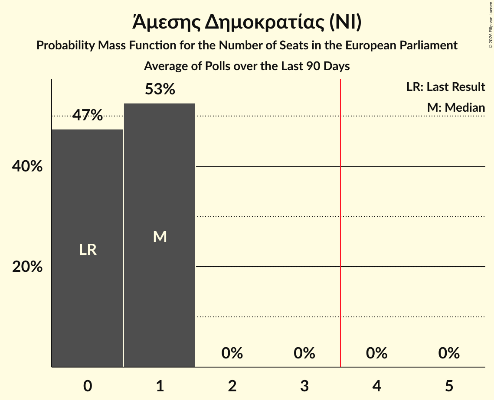

# Άμεσης Δημοκρατίας (NI)

<a href="#voting-intentions">Voting Intentions</a> | <a href="#seats">Seats</a>

## Voting Intentions

Last result: **0.0%** (General Election of 9 June 2024)

### Confidence Intervals

| Period     | Polling firm/Commissioner(s) | Median | 80% Confidence Interval | 90% Confidence Interval | 95% Confidence Interval | 99% Confidence Interval |
|:----------:|:----------------:|:-----------:|:-----------------------:|:-----------------------:|:-----------------------:|:-----------------------:|
| N/A | [Poll Average](average.html) | 8.3% | 6.5–10.3% | 6.2–10.8% | 5.8–11.1% | 5.3–11.9% |
| [14–17 April 2026](2026-04-17-PrimeConsulting.html) | Prime Consulting   Sigma TV | 9.2% | 8.1–10.5% | 7.7–10.9% | 7.5–11.3% | 7.0–11.9% |
| [30 March–6 April 2026](2026-04-06-Explorer.html) | Explorer   Phileleftheros | 7.4% | 6.3–8.7% | 6.0–9.1% | 5.8–9.4% | 5.3–10.1% |
| [10–26 March 2026](2026-03-26-Cypronetwork.html) | Cypronetwork   CyBC | 7.0% | 5.9–8.3% | 5.6–8.6% | 5.4–9.0% | 4.9–9.6% |
| [26 February–11 March 2026](2026-03-11-Noverna.html) | Noverna   Politis | 9.8% | 8.7–11.1% | 8.4–11.5% | 8.1–11.8% | 7.6–12.4% |
| [17–25 February 2026](2026-02-25-Explorer.html) | Explorer   Φ | 8.8% | 7.6–10.2% | 7.3–10.6% | 7.0–11.0% | 6.4–11.7% |
| [9–17 February 2026](2026-02-17-RAIConsultants.html) | RAI Consultants   Alpha TV | 7.9% | 6.7–9.3% | 6.4–9.8% | 6.1–10.1% | 5.5–10.9% |
| [6–14 February 2026](2026-02-14-PrimeConsulting.html) | Prime Consulting   Sigma TV | 8.1% | 7.0–9.5% | 6.6–10.0% | 6.4–10.3% | 5.8–11.0% |
| [10–16 January 2026](2026-01-16-RAIConsultants.html) | RAI Consultants   Alpha TV | 10.1% | 8.9–11.4% | 8.6–11.8% | 8.4–12.1% | 7.8–12.7% |
| [27 November–3 December 2025](2025-12-03-Stratego-IMR.html) | Stratego-IMR   Η Καθημερινή | 9.2% | 7.9–10.8% | 7.6–11.2% | 7.3–11.6% | 6.7–12.4% |
| [4–13 November 2025](2025-11-13-Pulse.html) | Pulse   Omega TV | 8.7% | 7.5–10.2% | 7.1–10.7% | 6.8–11.1% | 6.3–11.8% |
| [3–10 November 2025](2025-11-10-IMRUNic.html) | IMR/UNic   Reporter | 6.9% | 5.9–8.2% | 5.6–8.5% | 5.3–8.8% | 4.9–9.5% |
| [29 September–17 October 2025](2025-10-17-Cypronetwork.html) | Cypronetwork   CyBC | 6.0% | 5.2–7.1% | 5.0–7.4% | 4.8–7.7% | 4.4–8.2% |
| [12–22 September 2025](2025-09-22-Stratego-IMR.html) | Stratego-IMR   Η Καθημερινή | 3.4% | 2.7–4.5% | 2.5–4.8% | 2.3–5.1% | 2.0–5.7% |
| [11 August 2025](2025-08-11-Cypronetwork.html) | Cypronetwork | 0.0% | N/A | N/A | N/A | N/A |
| [1–8 July 2025](2025-07-08-Symmetron.html) | Symmetron   2Dots | 0.0% | N/A | N/A | N/A | N/A |
| [24–28 June 2025](2025-06-28-IMRUNic.html) | IMR/UNic   Reporter | 0.0% | N/A | N/A | N/A | N/A |
| [1–31 March 2025](2025-03-31-Symmetron.html) | Symmetron   2Dots | 0.0% | N/A | N/A | N/A | N/A |
| [10–21 March 2025](2025-03-21-Redwolf.html) | Redwolf | 0.0% | N/A | N/A | N/A | N/A |
| [5–11 March 2025](2025-03-11-IMRUNic.html) | IMR/UNic   Reporter | 0.0% | N/A | N/A | N/A | N/A |
| [21 October–1 November 2024](2024-11-01-RAIConsultants.html) | RAI Consultants   Alpha TV | 1.5% | N/A | N/A | N/A | N/A |
| [14–16 October 2024](2024-10-16-RetailZoom.html) | RetailZoom | 0.0% | N/A | N/A | N/A | N/A |
| [25 September–5 October 2024](2024-10-05-Symmetron.html) | Symmetron   2Dots | 0.0% | N/A | N/A | N/A | N/A |

### Probability Mass Function

The following table shows the probability mass function per percentage block of voting intentions for the [poll average](average.html) for Άμεσης Δημοκρατίας (NI).

| Voting Intentions | Probability | Accumulated | Special Marks |
|:-----------------:|:-----------:|:-----------:|:-------------:|
| 0.0–0.5% | 0% | 100% | Last Result |
| 0.5–1.5% | 0% | 100% |  |
| 1.5–2.5% | 0% | 100% |  |
| 2.5–3.5% | 0% | 100% |  |
| 3.5–4.5% | 0% | 100% |  |
| 4.5–5.5% | 1.1% | 100% |  |
| 5.5–6.5% | 9% | 98.9% |  |
| 6.5–7.5% | 22% | 89% |  |
| 7.5–8.5% | 24% | 67% | Median |
| 8.5–9.5% | 21% | 43% |  |
| 9.5–10.5% | 15% | 22% |  |
| 10.5–11.5% | 6% | 7% |  |
| 11.5–12.5% | 1.0% | 1.1% |  |
| 12.5–13.5% | 0.1% | 0.1% |  |
| 13.5–14.5% | 0% | 0% |  |

## Seats

Last result: **0** seats (General Election of 9 June 2024)

### Confidence Intervals

| Period     | Polling firm/Commissioner(s) | Median | 80% Confidence Interval | 90% Confidence Interval | 95% Confidence Interval | 99% Confidence Interval |
|:----------:|:----------------:|:------:|:-----------------------:|:-----------------------:|:-----------------------:|:-----------------------:|
| N/A | [Poll Average](average.html) | 1 | 0–1 | 0–1 | 0–1 | 0–1 |
| [14–17 April 2026](2026-04-17-PrimeConsulting.html) | Prime Consulting   Sigma TV | 1 | 1 | 1 | 0–1 | 0–1 |
| [30 March–6 April 2026](2026-04-06-Explorer.html) | Explorer   Phileleftheros | 1 | 0–1 | 0–1 | 0–1 | 0–1 |
| [10–26 March 2026](2026-03-26-Cypronetwork.html) | Cypronetwork   CyBC | 1 | 0–1 | 0–1 | 0–1 | 0–1 |
| [26 February–11 March 2026](2026-03-11-Noverna.html) | Noverna   Politis | 1 | 1 | 1 | 1 | 0–1 |
| [17–25 February 2026](2026-02-25-Explorer.html) | Explorer   Φ | 1 | 1 | 1 | 0–1 | 0–1 |
| [9–17 February 2026](2026-02-17-RAIConsultants.html) | RAI Consultants   Alpha TV | 1 | 1 | 0–1 | 0–1 | 0–1 |
| [6–14 February 2026](2026-02-14-PrimeConsulting.html) | Prime Consulting   Sigma TV | 1 | 0–1 | 0–1 | 0–1 | 0–1 |
| [10–16 January 2026](2026-01-16-RAIConsultants.html) | RAI Consultants   Alpha TV | 1 | 1 | 1 | 1 | 1 |
| [27 November–3 December 2025](2025-12-03-Stratego-IMR.html) | Stratego-IMR   Η Καθημερινή | 1 | 1 | 0–1 | 0–1 | 0–1 |
| [4–13 November 2025](2025-11-13-Pulse.html) | Pulse   Omega TV | 1 | 1 | 0–1 | 0–1 | 0–1 |
| [3–10 November 2025](2025-11-10-IMRUNic.html) | IMR/UNic   Reporter | 1 | 0–1 | 0–1 | 0–1 | 0–1 |
| [29 September–17 October 2025](2025-10-17-Cypronetwork.html) | Cypronetwork   CyBC | 0 | 0–1 | 0–1 | 0–1 | 0–1 |
| [12–22 September 2025](2025-09-22-Stratego-IMR.html) | Stratego-IMR   Η Καθημερινή | 0 | 0 | 0 | 0 | 0 |
| [11 August 2025](2025-08-11-Cypronetwork.html) | Cypronetwork |  |  |  |  |  |
| [1–8 July 2025](2025-07-08-Symmetron.html) | Symmetron   2Dots |  |  |  |  |  |
| [24–28 June 2025](2025-06-28-IMRUNic.html) | IMR/UNic   Reporter |  |  |  |  |  |
| [1–31 March 2025](2025-03-31-Symmetron.html) | Symmetron   2Dots |  |  |  |  |  |
| [10–21 March 2025](2025-03-21-Redwolf.html) | Redwolf |  |  |  |  |  |
| [5–11 March 2025](2025-03-11-IMRUNic.html) | IMR/UNic   Reporter |  |  |  |  |  |
| [21 October–1 November 2024](2024-11-01-RAIConsultants.html) | RAI Consultants   Alpha TV |  |  |  |  |  |
| [14–16 October 2024](2024-10-16-RetailZoom.html) | RetailZoom |  |  |  |  |  |
| [25 September–5 October 2024](2024-10-05-Symmetron.html) | Symmetron   2Dots |  |  |  |  |  |

### Probability Mass Function

The following table shows the probability mass function per seat for the [poll average](average.html) for Άμεσης Δημοκρατίας (NI).

| Number of Seats | Probability | Accumulated | Special Marks |
|:---------------:|:-----------:|:-----------:|:-------------:|
| 0 | 16% | 100% | Last Result |
| 1 | 84% | 84% | Median |
| 2 | 0% | 0% |  |

