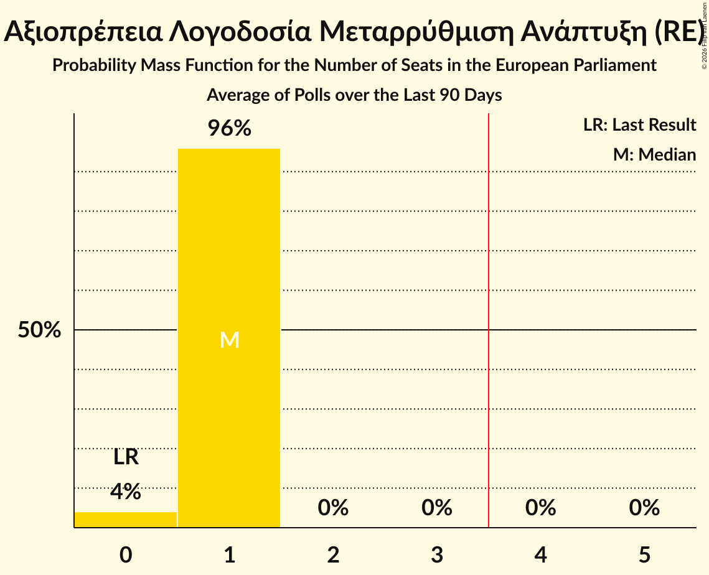

# Αξιοπρέπεια Λογοδοσία Μεταρρύθμιση Ανάπτυξη (RE)

<a href="#voting-intentions">Voting Intentions</a> | <a href="#seats">Seats</a>

## Voting Intentions

Last result: **0.0%** (General Election of 9 June 2024)

### Confidence Intervals

| Period     | Polling firm/Commissioner(s) | Median | 80% Confidence Interval | 90% Confidence Interval | 95% Confidence Interval | 99% Confidence Interval |
|:----------:|:----------------:|:-----------:|:-----------------------:|:-----------------------:|:-----------------------:|:-----------------------:|
| N/A | [Poll Average](average.html) | 10.2% | 7.9–12.7% | 7.5–13.3% | 7.1–13.8% | 6.6–14.7% |
| [27 November–3 December 2025](2025-12-03-Stratego-IMR.html) | Stratego-IMR   Η Καθημερινή | 10.1% | 8.7–11.7% | 8.4–12.2% | 8.1–12.6% | 7.5–13.4% |
| [4–13 November 2025](2025-11-13-Pulse.html) | Pulse   Omega TV | 10.1% | 8.8–11.8% | 8.4–12.2% | 8.1–12.6% | 7.5–13.4% |
| [3–10 November 2025](2025-11-10-IMRUNic.html) | IMR/UNic   Reporter | 12.2% | 10.8–13.8% | 10.5–14.2% | 10.1–14.6% | 9.5–15.4% |
| [29 September–17 October 2025](2025-10-17-Cypronetwork.html) | Cypronetwork   CyBC | 8.1% | 7.1–9.3% | 6.9–9.6% | 6.6–9.9% | 6.2–10.5% |
| [12–22 September 2025](2025-09-22-Stratego-IMR.html) | Stratego-IMR   Η Καθημερινή | 12.5% | 11.0–14.3% | 10.6–14.8% | 10.2–15.3% | 9.6–16.2% |
| [11 August 2025](2025-08-11-Cypronetwork.html) | Cypronetwork | 12.3% | N/A | N/A | N/A | N/A |
| [1–8 July 2025](2025-07-08-Symmetron.html) | Symmetron   2Dots | 15.2% | N/A | N/A | N/A | N/A |
| [24–28 June 2025](2025-06-28-IMRUNic.html) | IMR/UNic   Reporter | 14.8% | N/A | N/A | N/A | N/A |
| [1–31 March 2025](2025-03-31-Symmetron.html) | Symmetron   2Dots | 0.0% | N/A | N/A | N/A | N/A |
| [10–21 March 2025](2025-03-21-Redwolf.html) | Redwolf | 11.1% | N/A | N/A | N/A | N/A |
| [5–11 March 2025](2025-03-11-IMRUNic.html) | IMR/UNic   Reporter | 13.9% | N/A | N/A | N/A | N/A |
| [21 October–1 November 2024](2024-11-01-RAIConsultants.html) | RAI Consultants   Alpha TV | 0.0% | N/A | N/A | N/A | N/A |
| [14–16 October 2024](2024-10-16-RetailZoom.html) | RetailZoom | 0.0% | N/A | N/A | N/A | N/A |
| [25 September–5 October 2024](2024-10-05-Symmetron.html) | Symmetron   2Dots | 0.0% | N/A | N/A | N/A | N/A |

### Probability Mass Function

The following table shows the probability mass function per percentage block of voting intentions for the [poll average](average.html) for Αξιοπρέπεια Λογοδοσία Μεταρρύθμιση Ανάπτυξη (RE).

| Voting Intentions | Probability | Accumulated | Special Marks |
|:-----------------:|:-----------:|:-----------:|:-------------:|
| 0.0–0.5% | 0% | 100% | Last Result |
| 0.5–1.5% | 0% | 100% |  |
| 1.5–2.5% | 0% | 100% |  |
| 2.5–3.5% | 0% | 100% |  |
| 3.5–4.5% | 0% | 100% |  |
| 4.5–5.5% | 0% | 100% |  |
| 5.5–6.5% | 0.5% | 100% |  |
| 6.5–7.5% | 5% | 99.5% |  |
| 7.5–8.5% | 14% | 94% |  |
| 8.5–9.5% | 18% | 80% |  |
| 9.5–10.5% | 19% | 62% | Median |
| 10.5–11.5% | 18% | 43% |  |
| 11.5–12.5% | 13% | 25% |  |
| 12.5–13.5% | 8% | 11% |  |
| 13.5–14.5% | 3% | 4% |  |
| 14.5–15.5% | 0.6% | 0.7% |  |
| 15.5–16.5% | 0.1% | 0.1% |  |
| 16.5–17.5% | 0% | 0% |  |

## Seats

Last result: **0** seats (General Election of 9 June 2024)

### Confidence Intervals

| Period     | Polling firm/Commissioner(s) | Median | 80% Confidence Interval | 90% Confidence Interval | 95% Confidence Interval | 99% Confidence Interval |
|:----------:|:----------------:|:------:|:-----------------------:|:-----------------------:|:-----------------------:|:-----------------------:|
| N/A | [Poll Average](average.html) | 1 | 1 | 1 | 1 | 0–1 |
| [27 November–3 December 2025](2025-12-03-Stratego-IMR.html) | Stratego-IMR   Η Καθημερινή | 1 | 1 | 1 | 1 | 0–1 |
| [4–13 November 2025](2025-11-13-Pulse.html) | Pulse   Omega TV | 1 | 1 | 1 | 1 | 1 |
| [3–10 November 2025](2025-11-10-IMRUNic.html) | IMR/UNic   Reporter | 1 | 1 | 1 | 1 | 1 |
| [29 September–17 October 2025](2025-10-17-Cypronetwork.html) | Cypronetwork   CyBC | 1 | 1 | 1 | 0–1 | 0–1 |
| [12–22 September 2025](2025-09-22-Stratego-IMR.html) | Stratego-IMR   Η Καθημερινή | 1 | 1 | 1 | 1 | 1 |
| [11 August 2025](2025-08-11-Cypronetwork.html) | Cypronetwork |  |  |  |  |  |
| [1–8 July 2025](2025-07-08-Symmetron.html) | Symmetron   2Dots |  |  |  |  |  |
| [24–28 June 2025](2025-06-28-IMRUNic.html) | IMR/UNic   Reporter |  |  |  |  |  |
| [1–31 March 2025](2025-03-31-Symmetron.html) | Symmetron   2Dots |  |  |  |  |  |
| [10–21 March 2025](2025-03-21-Redwolf.html) | Redwolf |  |  |  |  |  |
| [5–11 March 2025](2025-03-11-IMRUNic.html) | IMR/UNic   Reporter |  |  |  |  |  |
| [21 October–1 November 2024](2024-11-01-RAIConsultants.html) | RAI Consultants   Alpha TV |  |  |  |  |  |
| [14–16 October 2024](2024-10-16-RetailZoom.html) | RetailZoom |  |  |  |  |  |
| [25 September–5 October 2024](2024-10-05-Symmetron.html) | Symmetron   2Dots |  |  |  |  |  |

### Probability Mass Function

The following table shows the probability mass function per seat for the [poll average](average.html) for Αξιοπρέπεια Λογοδοσία Μεταρρύθμιση Ανάπτυξη (RE).

| Number of Seats | Probability | Accumulated | Special Marks |
|:---------------:|:-----------:|:-----------:|:-------------:|
| 0 | 1.5% | 100% | Last Result |
| 1 | 98.5% | 98.5% | Median |
| 2 | 0% | 0% |  |

