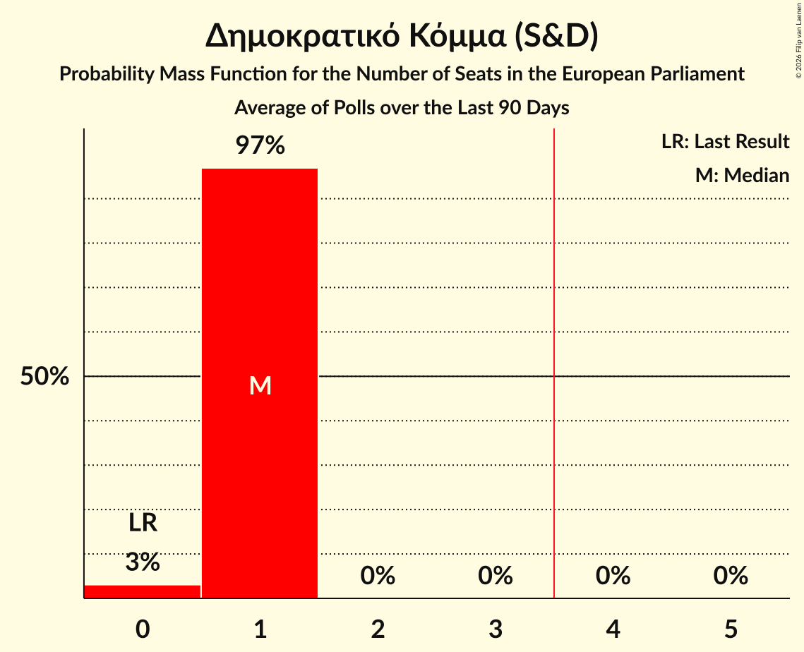

# Δημοκρατικό Κόμμα (S&D)

<a href="#voting-intentions">Voting Intentions</a> | <a href="#seats">Seats</a>

## Voting Intentions

Last result: **0.0%** (General Election of 9 June 2024)

### Confidence Intervals

| Period     | Polling firm/Commissioner(s) | Median | 80% Confidence Interval | 90% Confidence Interval | 95% Confidence Interval | 99% Confidence Interval |
|:----------:|:----------------:|:-----------:|:-----------------------:|:-----------------------:|:-----------------------:|:-----------------------:|
| N/A | [Poll Average](average.html) | 9.0% | 7.6–10.7% | 7.1–11.2% | 6.8–11.7% | 6.2–12.6% |
| [11–15 May 2026](2026-05-15-Stratego-IMR.html) | Stratego-IMR   Η Καθημερινή | 8.7% | 7.5–10.1% | 7.1–10.6% | 6.8–10.9% | 6.3–11.7% |
| [6–13 May 2026](2026-05-13-Pulse.html) | Pulse   Omega TV | 8.6% | 7.5–9.8% | 7.2–10.2% | 7.0–10.5% | 6.5–11.1% |
| [6–13 May 2026](2026-05-13-Explorer.html) | Explorer   Philenews | 9.8% | 8.7–10.9% | 8.5–11.2% | 8.2–11.5% | 7.8–12.1% |
| [1–12 May 2026](2026-05-12-Noverna.html) | Noverna   Politis | 8.1% | 7.0–9.5% | 6.6–9.8% | 6.4–10.2% | 5.9–10.9% |
| [1–11 May 2026](2026-05-11-RAIConsultants.html) | RAI Consultants   Alpha Cyprus | 9.7% | 8.5–11.1% | 8.2–11.6% | 7.9–11.9% | 7.4–12.6% |
| [30 April–10 May 2026](2026-05-10-IMR.html) | IMR   Reporter | 8.5% | 7.9–9.2% | 7.7–9.4% | 7.5–9.5% | 7.3–9.9% |
| [28 April–10 May 2026](2026-05-10-CYMAR.html) | CYMAR   ANT1 | 10.8% | 9.7–12.1% | 9.4–12.5% | 9.1–12.8% | 8.6–13.5% |
| [2–9 May 2026](2026-05-09-PrimeConsulting.html) | Prime Consulting   Sigma TV | 9.4% | 8.3–10.7% | 8.0–11.0% | 7.8–11.3% | 7.3–12.0% |
| [5–8 May 2026](2026-05-08-AnalyticaMarketResearch.html) | Analytica Market Research   Cyprus Times | 8.6% | 8.1–9.2% | 8.0–9.3% | 7.9–9.5% | 7.7–9.7% |
| [20 April–7 May 2026](2026-05-07-Cypronetwork.html) | Cypronetwork   CyBC | 9.5% | 8.6–10.6% | 8.3–10.9% | 8.1–11.2% | 7.6–11.7% |
| [4–6 May 2026](2026-05-06-RealPolls.html) | RealPolls   afentiko.eu and CyprusNews | 7.4% | 6.6–8.5% | 6.3–8.8% | 6.1–9.0% | 5.7–9.6% |
| [1–3 May 2026](2026-05-03-Stratego-IMR.html) | Stratego-IMR   Η Καθημερινή | 8.5% | 7.3–10.0% | 7.0–10.5% | 6.7–10.9% | 6.1–11.6% |
| [9–24 April 2026](2026-04-24-AnalyticaMarketResearch.html) | Analytica Market Research   Cyprus Times | 8.7% | 8.1–9.3% | 7.9–9.5% | 7.8–9.6% | 7.5–9.9% |
| [7–21 April 2026](2026-04-21-RAIConsultants.html) | RAI Consultants   Alpha Cyprus | 7.8% | 6.9–8.8% | 6.7–9.1% | 6.5–9.3% | 6.1–9.8% |
| [14–21 April 2026](2026-04-21-Pulse.html) | Pulse   Omega TV | 7.5% | 6.2–9.3% | 5.8–9.8% | 5.5–10.2% | 4.9–11.1% |
| [14–17 April 2026](2026-04-17-PrimeConsulting.html) | Prime Consulting   Sigma TV | 9.2% | 8.1–10.5% | 7.7–10.9% | 7.5–11.3% | 7.0–11.9% |
| [6–17 April 2026](2026-04-17-CYMAR.html) | CYMAR   ANT1 | 11.9% | 10.5–13.5% | 10.1–13.9% | 9.8–14.4% | 9.1–15.2% |
| [30 March–6 April 2026](2026-04-06-Explorer.html) | Explorer   Phileleftheros | 9.6% | 8.4–11.1% | 8.1–11.5% | 7.8–11.9% | 7.2–12.6% |
| [10–26 March 2026](2026-03-26-Cypronetwork.html) | Cypronetwork   CyBC | 9.5% | 8.3–11.0% | 7.9–11.4% | 7.6–11.8% | 7.1–12.5% |
| [6–14 March 2026](2026-03-14-CYMAR.html) | CYMAR   ANT1 | 11.6% | N/A | N/A | N/A | N/A |
| [26 February–11 March 2026](2026-03-11-Noverna.html) | Noverna   Politis | 9.5% | 8.4–10.8% | 8.1–11.2% | 7.8–11.5% | 7.4–12.1% |
| [1–8 March 2026](2026-03-08-IMR.html) | IMR   Reporter | 8.8% | 7.7–10.2% | 7.4–10.6% | 7.1–10.9% | 6.6–11.6% |
| [17–25 February 2026](2026-02-25-Explorer.html) | Explorer   Φ | 8.9% | N/A | N/A | N/A | N/A |
| [9–17 February 2026](2026-02-17-RAIConsultants.html) | RAI Consultants   Alpha TV | 9.2% | N/A | N/A | N/A | N/A |
| [6–14 February 2026](2026-02-14-PrimeConsulting.html) | Prime Consulting   Sigma TV | 8.8% | N/A | N/A | N/A | N/A |
| [10–16 January 2026](2026-01-16-RAIConsultants.html) | RAI Consultants   Alpha TV | 7.9% | N/A | N/A | N/A | N/A |
| [27 November–3 December 2025](2025-12-03-Stratego-IMR.html) | Stratego-IMR   Η Καθημερινή | 8.1% | N/A | N/A | N/A | N/A |
| [4–13 November 2025](2025-11-13-Pulse.html) | Pulse   Omega TV | 8.7% | N/A | N/A | N/A | N/A |
| [3–10 November 2025](2025-11-10-IMR.html) | IMR   Reporter | 8.6% | N/A | N/A | N/A | N/A |
| [29 September–17 October 2025](2025-10-17-Cypronetwork.html) | Cypronetwork   CyBC | 10.1% | N/A | N/A | N/A | N/A |
| [12–22 September 2025](2025-09-22-Stratego-IMR.html) | Stratego-IMR   Η Καθημερινή | 9.1% | N/A | N/A | N/A | N/A |
| [11 August 2025](2025-08-11-Cypronetwork.html) | Cypronetwork | 8.2% | N/A | N/A | N/A | N/A |
| [1–8 July 2025](2025-07-08-Symmetron.html) | Symmetron   2Dots | 8.2% | N/A | N/A | N/A | N/A |
| [24–28 June 2025](2025-06-28-IMRUNic.html) | IMR/UNic   Reporter | 8.6% | N/A | N/A | N/A | N/A |
| [1–31 March 2025](2025-03-31-Symmetron.html) | Symmetron   2Dots | 8.8% | N/A | N/A | N/A | N/A |
| [10–21 March 2025](2025-03-21-Redwolf.html) | Redwolf | 9.5% | N/A | N/A | N/A | N/A |
| [5–11 March 2025](2025-03-11-IMR.html) | IMR   Reporter | 8.9% | N/A | N/A | N/A | N/A |
| [21 October–1 November 2024](2024-11-01-RAIConsultants.html) | RAI Consultants   Alpha TV | 11.4% | N/A | N/A | N/A | N/A |
| [14–16 October 2024](2024-10-16-RetailZoom.html) | RetailZoom | 3.7% | N/A | N/A | N/A | N/A |
| [25 September–5 October 2024](2024-10-05-Symmetron.html) | Symmetron   2Dots | 10.8% | N/A | N/A | N/A | N/A |

### Probability Mass Function

The following table shows the probability mass function per percentage block of voting intentions for the [poll average](average.html) for Δημοκρατικό Κόμμα (S&D).

| Voting Intentions | Probability | Accumulated | Special Marks |
|:-----------------:|:-----------:|:-----------:|:-------------:|
| 0.0–0.5% | 0% | 100% | Last Result |
| 0.5–1.5% | 0% | 100% |  |
| 1.5–2.5% | 0% | 100% |  |
| 2.5–3.5% | 0% | 100% |  |
| 3.5–4.5% | 0% | 100% |  |
| 4.5–5.5% | 0% | 100% |  |
| 5.5–6.5% | 1.4% | 100% |  |
| 6.5–7.5% | 8% | 98.6% |  |
| 7.5–8.5% | 25% | 90% |  |
| 8.5–9.5% | 33% | 65% | Median |
| 9.5–10.5% | 20% | 32% |  |
| 10.5–11.5% | 9% | 12% |  |
| 11.5–12.5% | 3% | 3% |  |
| 12.5–13.5% | 0.5% | 0.5% |  |
| 13.5–14.5% | 0% | 0% |  |

## Seats

Last result: **0** seats (General Election of 9 June 2024)

### Confidence Intervals

| Period     | Polling firm/Commissioner(s) | Median | 80% Confidence Interval | 90% Confidence Interval | 95% Confidence Interval | 99% Confidence Interval |
|:----------:|:----------------:|:------:|:-----------------------:|:-----------------------:|:-----------------------:|:-----------------------:|
| N/A | [Poll Average](average.html) | 1 | 1 | 1 | 0–1 | 0–1 |
| [11–15 May 2026](2026-05-15-Stratego-IMR.html) | Stratego-IMR   Η Καθημερινή | 1 | 1 | 0–1 | 0–1 | 0–1 |
| [6–13 May 2026](2026-05-13-Pulse.html) | Pulse   Omega TV | 1 | 1 | 0–1 | 0–1 | 0–1 |
| [6–13 May 2026](2026-05-13-Explorer.html) | Explorer   Philenews | 1 | 1 | 1 | 1 | 0–1 |
| [1–12 May 2026](2026-05-12-Noverna.html) | Noverna   Politis | 1 | 1 | 0–1 | 0–1 | 0–1 |
| [1–11 May 2026](2026-05-11-RAIConsultants.html) | RAI Consultants   Alpha Cyprus | 1 | 1 | 1 | 1 | 1 |
| [30 April–10 May 2026](2026-05-10-IMR.html) | IMR   Reporter | 1 | 1 | 1 | 1 | 0–1 |
| [28 April–10 May 2026](2026-05-10-CYMAR.html) | CYMAR   ANT1 | 1 | 1 | 1 | 1 | 1 |
| [2–9 May 2026](2026-05-09-PrimeConsulting.html) | Prime Consulting   Sigma TV | 1 | 1 | 1 | 1 | 0–1 |
| [5–8 May 2026](2026-05-08-AnalyticaMarketResearch.html) | Analytica Market Research   Cyprus Times | 1 | 1 | 1 | 1 | 1 |
| [20 April–7 May 2026](2026-05-07-Cypronetwork.html) | Cypronetwork   CyBC | 1 | 1 | 1 | 1 | 1 |
| [4–6 May 2026](2026-05-06-RealPolls.html) | RealPolls   afentiko.eu and CyprusNews | 1 | 1 | 0–1 | 0–1 | 0–1 |
| [1–3 May 2026](2026-05-03-Stratego-IMR.html) | Stratego-IMR   Η Καθημερινή | 1 | 1 | 1 | 1 | 0–1 |
| [9–24 April 2026](2026-04-24-AnalyticaMarketResearch.html) | Analytica Market Research   Cyprus Times | 1 | 1 | 1 | 1 | 1 |
| [7–21 April 2026](2026-04-21-RAIConsultants.html) | RAI Consultants   Alpha Cyprus | 1 | 1 | 1 | 1 | 0–1 |
| [14–21 April 2026](2026-04-21-Pulse.html) | Pulse   Omega TV | 1 | 1 | 0–1 | 0–1 | 0–1 |
| [14–17 April 2026](2026-04-17-PrimeConsulting.html) | Prime Consulting   Sigma TV | 1 | 1 | 1 | 0–1 | 0–1 |
| [6–17 April 2026](2026-04-17-CYMAR.html) | CYMAR   ANT1 | 1 | 1 | 1 | 1 | 1 |
| [30 March–6 April 2026](2026-04-06-Explorer.html) | Explorer   Phileleftheros | 1 | 1 | 1 | 1 | 0–1 |
| [10–26 March 2026](2026-03-26-Cypronetwork.html) | Cypronetwork   CyBC | 1 | 1 | 1 | 1 | 1 |
| [6–14 March 2026](2026-03-14-CYMAR.html) | CYMAR   ANT1 |  |  |  |  |  |
| [26 February–11 March 2026](2026-03-11-Noverna.html) | Noverna   Politis | 1 | 1 | 1 | 0–1 | 0–1 |
| [1–8 March 2026](2026-03-08-IMR.html) | IMR   Reporter | 1 | 1 | 1 | 1 | 1 |
| [17–25 February 2026](2026-02-25-Explorer.html) | Explorer   Φ |  |  |  |  |  |
| [9–17 February 2026](2026-02-17-RAIConsultants.html) | RAI Consultants   Alpha TV |  |  |  |  |  |
| [6–14 February 2026](2026-02-14-PrimeConsulting.html) | Prime Consulting   Sigma TV |  |  |  |  |  |
| [10–16 January 2026](2026-01-16-RAIConsultants.html) | RAI Consultants   Alpha TV |  |  |  |  |  |
| [27 November–3 December 2025](2025-12-03-Stratego-IMR.html) | Stratego-IMR   Η Καθημερινή |  |  |  |  |  |
| [4–13 November 2025](2025-11-13-Pulse.html) | Pulse   Omega TV |  |  |  |  |  |
| [3–10 November 2025](2025-11-10-IMR.html) | IMR   Reporter |  |  |  |  |  |
| [29 September–17 October 2025](2025-10-17-Cypronetwork.html) | Cypronetwork   CyBC |  |  |  |  |  |
| [12–22 September 2025](2025-09-22-Stratego-IMR.html) | Stratego-IMR   Η Καθημερινή |  |  |  |  |  |
| [11 August 2025](2025-08-11-Cypronetwork.html) | Cypronetwork |  |  |  |  |  |
| [1–8 July 2025](2025-07-08-Symmetron.html) | Symmetron   2Dots |  |  |  |  |  |
| [24–28 June 2025](2025-06-28-IMRUNic.html) | IMR/UNic   Reporter |  |  |  |  |  |
| [1–31 March 2025](2025-03-31-Symmetron.html) | Symmetron   2Dots |  |  |  |  |  |
| [10–21 March 2025](2025-03-21-Redwolf.html) | Redwolf |  |  |  |  |  |
| [5–11 March 2025](2025-03-11-IMR.html) | IMR   Reporter |  |  |  |  |  |
| [21 October–1 November 2024](2024-11-01-RAIConsultants.html) | RAI Consultants   Alpha TV |  |  |  |  |  |
| [14–16 October 2024](2024-10-16-RetailZoom.html) | RetailZoom |  |  |  |  |  |
| [25 September–5 October 2024](2024-10-05-Symmetron.html) | Symmetron   2Dots |  |  |  |  |  |

### Probability Mass Function

The following table shows the probability mass function per seat for the [poll average](average.html) for Δημοκρατικό Κόμμα (S&D).

| Number of Seats | Probability | Accumulated | Special Marks |
|:---------------:|:-----------:|:-----------:|:-------------:|
| 0 | 3% | 100% | Last Result |
| 1 | 97% | 97% | Median |
| 2 | 0% | 0% |  |

