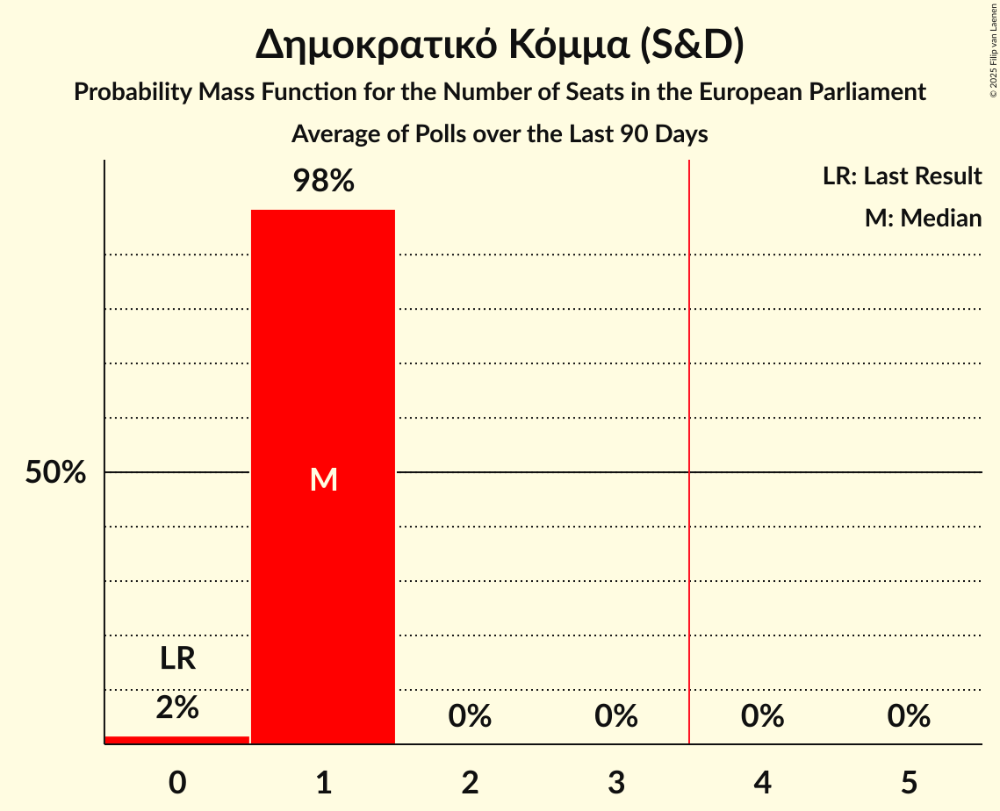

# Δημοκρατικό Κόμμα (S&D)

<a href="#voting-intentions">Voting Intentions</a> | <a href="#seats">Seats</a>

## Voting Intentions

Last result: **0.0%** (General Election of 25 May 2014)

### Confidence Intervals

| Period     | Polling firm/Commissioner(s) | Median | 80% Confidence Interval | 90% Confidence Interval | 95% Confidence Interval | 99% Confidence Interval |
|:----------:|:----------------:|:-----------:|:-----------------------:|:-----------------------:|:-----------------------:|:-----------------------:|
| N/A | [Poll Average](average.html) | 13.1% | 11.6–14.6% | 11.2–15.1% | 10.9–15.5% | 10.2–16.3% |
| [16–29 January 2019](2019-01-29-PulseMarketResearch.html) | Pulse Market Research | 13.0% | 11.6–14.6% | 11.2–15.1% | 10.9–15.5% | 10.2–16.3% |
| [24 September–3 October 2018](2018-10-03-Symmetron.html) | Symmetron | 15.0% | 13.5–16.7% | 13.1–17.2% | 12.7–17.6% | 12.0–18.5% |
| [11–16 January 2018](2018-01-16-Symmetron.html) | Symmetron | 16.0% | 14.6–17.6% | 14.2–18.0% | 13.9–18.4% | 13.2–19.2% |

### Probability Mass Function

The following table shows the probability mass function per percentage block of voting intentions for the [poll average](average.html) for Δημοκρατικό Κόμμα (S&D).

| Voting Intentions | Probability | Accumulated | Special Marks |
|:-----------------:|:-----------:|:-----------:|:-------------:|
| 0.0–0.5% | 0% | 100% | Last Result |
| 0.5–1.5% | 0% | 100% |  |
| 1.5–2.5% | 0% | 100% |  |
| 2.5–3.5% | 0% | 100% |  |
| 3.5–4.5% | 0% | 100% |  |
| 4.5–5.5% | 0% | 100% |  |
| 5.5–6.5% | 0% | 100% |  |
| 6.5–7.5% | 0% | 100% |  |
| 7.5–8.5% | 0% | 100% |  |
| 8.5–9.5% | 0.1% | 100% |  |
| 9.5–10.5% | 1.1% | 99.9% |  |
| 10.5–11.5% | 8% | 98.8% |  |
| 11.5–12.5% | 23% | 91% |  |
| 12.5–13.5% | 33% | 67% | Median |
| 13.5–14.5% | 23% | 34% |  |
| 14.5–15.5% | 9% | 11% |  |
| 15.5–16.5% | 2% | 2% |  |
| 16.5–17.5% | 0.3% | 0.3% |  |
| 17.5–18.5% | 0% | 0% |  |

## Seats

Last result: **0** seats (General Election of 25 May 2014)

### Confidence Intervals

| Period     | Polling firm/Commissioner(s) | Median | 80% Confidence Interval | 90% Confidence Interval | 95% Confidence Interval | 99% Confidence Interval |
|:----------:|:----------------:|:------:|:-----------------------:|:-----------------------:|:-----------------------:|:-----------------------:|
| N/A | [Poll Average](average.html) | 1 | 1 | 1 | 1 | 1 |
| [16–29 January 2019](2019-01-29-PulseMarketResearch.html) | Pulse Market Research | 1 | 1 | 1 | 1 | 1 |
| [24 September–3 October 2018](2018-10-03-Symmetron.html) | Symmetron | 1 | 1 | 1 | 1 | 1 |
| [11–16 January 2018](2018-01-16-Symmetron.html) | Symmetron | 1 | 1 | 1 | 1 | 1 |

### Probability Mass Function

The following table shows the probability mass function per seat for the [poll average](average.html) for Δημοκρατικό Κόμμα (S&D).

| Number of Seats | Probability | Accumulated | Special Marks |
|:---------------:|:-----------:|:-----------:|:-------------:|
| 0 | 0% | 100% | Last Result |
| 1 | 100% | 100% | Median |

