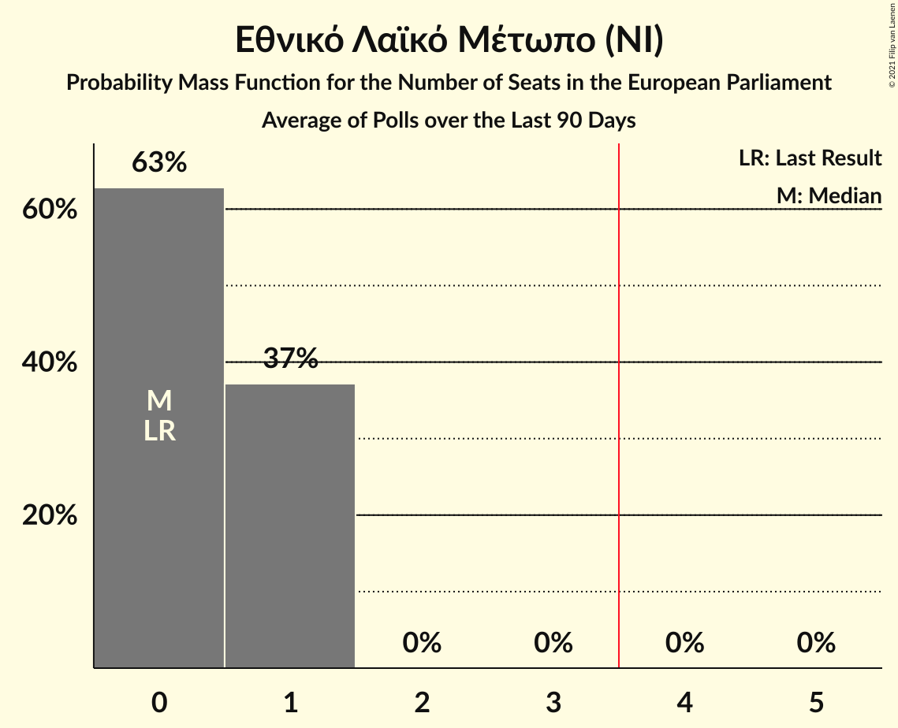

# Εθνικό Λαϊκό Μέτωπο (NI)

<a href="#voting-intentions">Voting Intentions</a> | <a href="#seats">Seats</a>

## Voting Intentions

Last result: **0.0%** (General Election of 26 May 2019)

### Confidence Intervals

| Period     | Polling firm/Commissioner(s) | Median | 80% Confidence Interval | 90% Confidence Interval | 95% Confidence Interval | 99% Confidence Interval |
|:----------:|:----------------:|:-----------:|:-----------------------:|:-----------------------:|:-----------------------:|:-----------------------:|
| N/A | [Poll Average](average.html) | 6.6% | 5.4–8.4% | 5.1–8.9% | 4.9–9.4% | 4.4–10.2% |
| [4–7 May 2021](2021-05-07-Pulse.html) | Pulse   Alpha TV | 7.1% | 6.2–8.1% | 6.0–8.4% | 5.8–8.7% | 5.4–9.2% |
| [7–23 April 2021](2021-04-23-Noverna.html) | Noverna   Politis | 6.5% | 5.5–7.8% | 5.2–8.2% | 5.0–8.5% | 4.5–9.2% |
| [13–17 April 2021](2021-04-17-Cypronetwork.html) | Cypronetwork   Omega TV | 6.2% | 5.3–7.3% | 5.1–7.6% | 4.9–7.9% | 4.5–8.4% |
| [12–16 April 2021](2021-04-16-PrimeConsulting.html) | Prime Consulting   Τηλεόραση ΣΙΓΜΑ | 6.7% | 5.8–7.8% | 5.5–8.1% | 5.3–8.4% | 4.9–8.9% |
| [31 March–16 April 2021](2021-04-16-IMR.html) | IMR   University of Nicosia | 6.1% | 5.3–7.0% | 5.1–7.2% | 4.9–7.5% | 4.6–7.9% |
| [2–9 April 2021](2021-04-09-Symmetron.html) | Symmetron   Η Καθημερινή | 5.8% | 4.8–6.9% | 4.6–7.3% | 4.3–7.6% | 3.9–8.2% |
| [26 March–9 April 2021](2021-04-09-CYMAR.html) | CYMAR   ANT1 | 8.5% | 7.5–9.7% | 7.2–10.1% | 6.9–10.4% | 6.4–11.0% |
| [9 March–4 April 2021](2021-04-04-Conread.html) | Conread   CyprusNews | 6.2% | 5.2–7.4% | 4.9–7.7% | 4.7–8.0% | 4.3–8.6% |
| [21–30 March 2021](2021-03-30-Cypronetwork.html) | Cypronetwork   Ὁ Φιλελεύθερος | 7.4% | 6.4–8.6% | 6.2–8.9% | 5.9–9.2% | 5.5–9.8% |
| [8–20 March 2021](2021-03-20-IMR.html) | IMR   University of Nicosia | 6.2% | 5.5–7.1% | 5.2–7.4% | 5.1–7.6% | 4.7–8.0% |
| [8–18 March 2021](2021-03-18-Pulse.html) | Pulse   Alpha TV | 4.5% | 3.8–5.5% | 3.6–5.7% | 3.4–6.0% | 3.0–6.5% |
| [8–12 March 2021](2021-03-12-PrimeConsulting.html) | Prime Consulting   Τηλεόραση ΣΙΓΜΑ | 6.4% | 5.5–7.5% | 5.3–7.8% | 5.1–8.0% | 4.7–8.6% |
| [25 February–2 March 2021](2021-03-02-GPO.html) | GPO   Χαραυγή | 9.0% | 7.8–10.4% | 7.5–10.8% | 7.2–11.2% | 6.7–11.9% |
| [12–19 February 2021](2021-02-19-Symmetron.html) | Symmetron   Η Καθημερινή | 6.1% | 5.2–7.4% | 4.9–7.7% | 4.7–8.0% | 4.2–8.6% |
| [1–6 February 2021](2021-02-06-PrimeConsulting.html) | Prime Consulting   Τηλεόραση ΣΙΓΜΑ | 6.7% | 5.9–7.8% | 5.6–8.1% | 5.4–8.4% | 5.0–8.9% |
| [20–25 January 2021](2021-01-25-Interview.html) | Interview   Politis | 4.8% | 3.9–6.0% | 3.7–6.4% | 3.5–6.7% | 3.1–7.3% |
| [16–23 October 2020](2020-10-23-PrimeConsulting.html) | Prime Consulting   Τηλεόραση ΣΙΓΜΑ | 6.2% | 5.3–7.3% | 5.1–7.6% | 4.9–7.8% | 4.5–8.4% |
| [19–25 June 2020](2020-06-25-Symmetron.html) | Symmetron | 4.7% | 3.7–6.0% | 3.5–6.3% | 3.2–6.7% | 2.9–7.3% |
| [13–14 May 2020](2020-05-14-RetailZoom.html) | RetailZoom   Politis | 5.0% | 4.5–5.7% | 4.3–5.9% | 4.2–6.0% | 3.9–6.3% |

### Probability Mass Function

The following table shows the probability mass function per percentage block of voting intentions for the [poll average](average.html) for Εθνικό Λαϊκό Μέτωπο (NI).

| Voting Intentions | Probability | Accumulated | Special Marks |
|:-----------------:|:-----------:|:-----------:|:-------------:|
| 0.0–0.5% | 0% | 100% | Last Result |
| 0.5–1.5% | 0% | 100% |  |
| 1.5–2.5% | 0% | 100% |  |
| 2.5–3.5% | 0% | 100% |  |
| 3.5–4.5% | 0.9% | 100% |  |
| 4.5–5.5% | 12% | 99.1% |  |
| 5.5–6.5% | 35% | 87% |  |
| 6.5–7.5% | 30% | 53% | Median |
| 7.5–8.5% | 14% | 23% |  |
| 8.5–9.5% | 6% | 8% |  |
| 9.5–10.5% | 2% | 2% |  |
| 10.5–11.5% | 0.2% | 0.2% |  |
| 11.5–12.5% | 0% | 0% |  |

## Seats

Last result: **0** seats (General Election of 26 May 2019)

### Confidence Intervals

| Period     | Polling firm/Commissioner(s) | Median | 80% Confidence Interval | 90% Confidence Interval | 95% Confidence Interval | 99% Confidence Interval |
|:----------:|:----------------:|:------:|:-----------------------:|:-----------------------:|:-----------------------:|:-----------------------:|
| N/A | [Poll Average](average.html) | 0 | 0–1 | 0–1 | 0–1 | 0–1 |
| [4–7 May 2021](2021-05-07-Pulse.html) | Pulse   Alpha TV | 1 | 0–1 | 0–1 | 0–1 | 0–1 |
| [7–23 April 2021](2021-04-23-Noverna.html) | Noverna   Politis | 0 | 0–1 | 0–1 | 0–1 | 0–1 |
| [13–17 April 2021](2021-04-17-Cypronetwork.html) | Cypronetwork   Omega TV | 0 | 0–1 | 0–1 | 0–1 | 0–1 |
| [12–16 April 2021](2021-04-16-PrimeConsulting.html) | Prime Consulting   Τηλεόραση ΣΙΓΜΑ | 0 | 0–1 | 0–1 | 0–1 | 0–1 |
| [31 March–16 April 2021](2021-04-16-IMR.html) | IMR   University of Nicosia | 0 | 0–1 | 0–1 | 0–1 | 0–1 |
| [2–9 April 2021](2021-04-09-Symmetron.html) | Symmetron   Η Καθημερινή | 0 | 0–1 | 0–1 | 0–1 | 0–1 |
| [26 March–9 April 2021](2021-04-09-CYMAR.html) | CYMAR   ANT1 | 1 | 1 | 0–1 | 0–1 | 0–1 |
| [9 March–4 April 2021](2021-04-04-Conread.html) | Conread   CyprusNews | 0 | 0–1 | 0–1 | 0–1 | 0–1 |
| [21–30 March 2021](2021-03-30-Cypronetwork.html) | Cypronetwork   Ὁ Φιλελεύθερος | 1 | 0–1 | 0–1 | 0–1 | 0–1 |
| [8–20 March 2021](2021-03-20-IMR.html) | IMR   University of Nicosia | 0 | 0–1 | 0–1 | 0–1 | 0–1 |
| [8–18 March 2021](2021-03-18-Pulse.html) | Pulse   Alpha TV | 0 | 0 | 0 | 0 | 0 |
| [8–12 March 2021](2021-03-12-PrimeConsulting.html) | Prime Consulting   Τηλεόραση ΣΙΓΜΑ | 0 | 0–1 | 0–1 | 0–1 | 0–1 |
| [25 February–2 March 2021](2021-03-02-GPO.html) | GPO   Χαραυγή | 1 | 0–1 | 0–1 | 0–1 | 0–1 |
| [12–19 February 2021](2021-02-19-Symmetron.html) | Symmetron   Η Καθημερινή | 0 | 0–1 | 0–1 | 0–1 | 0–1 |
| [1–6 February 2021](2021-02-06-PrimeConsulting.html) | Prime Consulting   Τηλεόραση ΣΙΓΜΑ | 0 | 0–1 | 0–1 | 0–1 | 0–1 |
| [20–25 January 2021](2021-01-25-Interview.html) | Interview   Politis | 0 | 0–1 | 0–1 | 0–1 | 0–1 |
| [16–23 October 2020](2020-10-23-PrimeConsulting.html) | Prime Consulting   Τηλεόραση ΣΙΓΜΑ | 0 | 0–1 | 0–1 | 0–1 | 0–1 |
| [19–25 June 2020](2020-06-25-Symmetron.html) | Symmetron | 0 | 0–1 | 0–1 | 0–1 | 0–1 |
| [13–14 May 2020](2020-05-14-RetailZoom.html) | RetailZoom   Politis | 0 | 0 | 0 | 0 | 0 |

### Probability Mass Function

The following table shows the probability mass function per seat for the [poll average](average.html) for Εθνικό Λαϊκό Μέτωπο (NI).

| Number of Seats | Probability | Accumulated | Special Marks |
|:---------------:|:-----------:|:-----------:|:-------------:|
| 0 | 60% | 100% | Last Result, Median |
| 1 | 40% | 40% |  |
| 2 | 0% | 0% |  |

