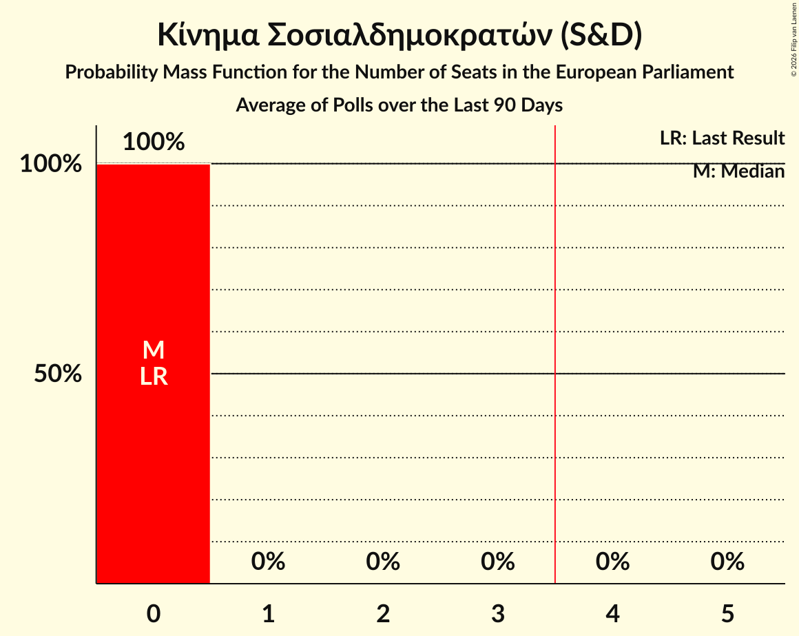

# Κίνημα Σοσιαλδημοκρατών (S&D)

<a href="#voting-intentions">Voting Intentions</a> | <a href="#seats">Seats</a>

## Voting Intentions

Last result: **0.0%** (General Election of 9 June 2024)

### Confidence Intervals

| Period     | Polling firm/Commissioner(s) | Median | 80% Confidence Interval | 90% Confidence Interval | 95% Confidence Interval | 99% Confidence Interval |
|:----------:|:----------------:|:-----------:|:-----------------------:|:-----------------------:|:-----------------------:|:-----------------------:|
| N/A | [Poll Average](average.html) | 3.2% | 2.2–4.6% | 2.0–5.0% | 1.9–5.3% | 1.6–5.9% |
| [11–15 May 2026](2026-05-15-Stratego-IMR.html) | Stratego-IMR   Η Καθημερινή | 2.5% | 1.9–3.4% | 1.7–3.6% | 1.6–3.9% | 1.3–4.4% |
| [6–13 May 2026](2026-05-13-Pulse.html) | Pulse   Omega TV | 3.7% | 3.0–4.6% | 2.8–4.8% | 2.7–5.0% | 2.4–5.5% |
| [6–13 May 2026](2026-05-13-Explorer.html) | Explorer   Philenews | 2.4% | 1.9–3.1% | 1.8–3.3% | 1.7–3.4% | 1.5–3.8% |
| [1–12 May 2026](2026-05-12-Noverna.html) | Noverna   Politis | 3.9% | 3.2–5.0% | 2.9–5.2% | 2.8–5.5% | 2.5–6.1% |
| [1–11 May 2026](2026-05-11-RAIConsultants.html) | RAI Consultants   Alpha Cyprus | 2.6% | 2.0–3.5% | 1.9–3.7% | 1.7–3.9% | 1.5–4.4% |
| [30 April–10 May 2026](2026-05-10-IMR.html) | IMR   Reporter | 2.5% | 2.1–2.9% | 2.0–3.0% | 2.0–3.1% | 1.8–3.3% |
| [28 April–10 May 2026](2026-05-10-CYMAR.html) | CYMAR   ANT1 | 2.7% | 2.1–3.4% | 2.0–3.6% | 1.8–3.8% | 1.6–4.2% |
| [2–9 May 2026](2026-05-09-PrimeConsulting.html) | Prime Consulting   Sigma TV | 2.9% | 2.4–3.7% | 2.2–4.0% | 2.1–4.2% | 1.8–4.6% |
| [5–8 May 2026](2026-05-08-AnalyticaMarketResearch.html) | Analytica Market Research   Cyprus Times | 3.9% | 3.5–4.3% | 3.4–4.4% | 3.4–4.5% | 3.2–4.6% |
| [20 April–7 May 2026](2026-05-07-Cypronetwork.html) | Cypronetwork   CyBC | 4.0% | 3.4–4.8% | 3.2–5.0% | 3.1–5.2% | 2.8–5.5% |
| [4–6 May 2026](2026-05-06-RealPolls.html) | RealPolls   afentiko.eu and CyprusNews | 4.8% | 4.1–5.6% | 3.9–5.9% | 3.7–6.1% | 3.4–6.6% |
| [1–3 May 2026](2026-05-03-Stratego-IMR.html) | Stratego-IMR   Η Καθημερινή | 2.6% | 2.0–3.6% | 1.8–3.8% | 1.6–4.1% | 1.4–4.6% |
| [9–24 April 2026](2026-04-24-AnalyticaMarketResearch.html) | Analytica Market Research   Cyprus Times | 3.9% | 3.5–4.3% | 3.4–4.4% | 3.3–4.5% | 3.1–4.8% |
| [7–21 April 2026](2026-04-21-RAIConsultants.html) | RAI Consultants   Alpha Cyprus | 3.3% | 2.7–3.9% | 2.6–4.1% | 2.5–4.3% | 2.2–4.7% |
| [14–21 April 2026](2026-04-21-Pulse.html) | Pulse   Omega TV | 3.1% | 2.3–4.4% | 2.1–4.8% | 1.9–5.1% | 1.6–5.8% |
| [14–17 April 2026](2026-04-17-PrimeConsulting.html) | Prime Consulting   Sigma TV | 1.2% | 0.9–1.9% | 0.8–2.0% | 0.7–2.2% | 0.5–2.5% |
| [6–17 April 2026](2026-04-17-CYMAR.html) | CYMAR   ANT1 | 3.9% | 3.1–5.0% | 2.9–5.3% | 2.8–5.5% | 2.4–6.1% |
| [30 March–6 April 2026](2026-04-06-Explorer.html) | Explorer   Phileleftheros | 2.8% | 2.1–3.7% | 2.0–3.9% | 1.8–4.1% | 1.6–4.6% |
| [10–26 March 2026](2026-03-26-Cypronetwork.html) | Cypronetwork   CyBC | 3.2% | 2.5–4.1% | 2.3–4.4% | 2.1–4.6% | 1.9–5.1% |
| [6–14 March 2026](2026-03-14-CYMAR.html) | CYMAR   ANT1 | 4.3% | N/A | N/A | N/A | N/A |
| [26 February–11 March 2026](2026-03-11-Noverna.html) | Noverna   Politis | 2.0% | 1.5–2.7% | 1.4–2.8% | 1.3–3.0% | 1.1–3.4% |
| [1–8 March 2026](2026-03-08-IMR.html) | IMR   Reporter | 2.3% | 1.8–3.1% | 1.6–3.4% | 1.5–3.6% | 1.3–4.0% |
| [17–25 February 2026](2026-02-25-Explorer.html) | Explorer   Φ | 2.6% | N/A | N/A | N/A | N/A |
| [9–17 February 2026](2026-02-17-RAIConsultants.html) | RAI Consultants   Alpha TV | 2.2% | N/A | N/A | N/A | N/A |
| [6–14 February 2026](2026-02-14-PrimeConsulting.html) | Prime Consulting   Sigma TV | 2.7% | N/A | N/A | N/A | N/A |
| [10–16 January 2026](2026-01-16-RAIConsultants.html) | RAI Consultants   Alpha TV | 1.5% | N/A | N/A | N/A | N/A |
| [27 November–3 December 2025](2025-12-03-Stratego-IMR.html) | Stratego-IMR   Η Καθημερινή | 2.0% | N/A | N/A | N/A | N/A |
| [4–13 November 2025](2025-11-13-Pulse.html) | Pulse   Omega TV | 2.9% | N/A | N/A | N/A | N/A |
| [3–10 November 2025](2025-11-10-IMR.html) | IMR   Reporter | 2.3% | N/A | N/A | N/A | N/A |
| [29 September–17 October 2025](2025-10-17-Cypronetwork.html) | Cypronetwork   CyBC | 3.4% | N/A | N/A | N/A | N/A |
| [12–22 September 2025](2025-09-22-Stratego-IMR.html) | Stratego-IMR   Η Καθημερινή | 1.2% | N/A | N/A | N/A | N/A |
| [11 August 2025](2025-08-11-Cypronetwork.html) | Cypronetwork | 2.7% | N/A | N/A | N/A | N/A |
| [1–8 July 2025](2025-07-08-Symmetron.html) | Symmetron   2Dots | 4.2% | N/A | N/A | N/A | N/A |
| [24–28 June 2025](2025-06-28-IMRUNic.html) | IMR/UNic   Reporter | 2.5% | N/A | N/A | N/A | N/A |
| [1–31 March 2025](2025-03-31-Symmetron.html) | Symmetron   2Dots | 3.5% | N/A | N/A | N/A | N/A |
| [10–21 March 2025](2025-03-21-Redwolf.html) | Redwolf | 3.2% | N/A | N/A | N/A | N/A |
| [5–11 March 2025](2025-03-11-IMR.html) | IMR   Reporter | 2.5% | N/A | N/A | N/A | N/A |
| [21 October–1 November 2024](2024-11-01-RAIConsultants.html) | RAI Consultants   Alpha TV | 4.0% | N/A | N/A | N/A | N/A |
| [14–16 October 2024](2024-10-16-RetailZoom.html) | RetailZoom | 1.2% | N/A | N/A | N/A | N/A |
| [25 September–5 October 2024](2024-10-05-Symmetron.html) | Symmetron   2Dots | 4.3% | N/A | N/A | N/A | N/A |

### Probability Mass Function

The following table shows the probability mass function per percentage block of voting intentions for the [poll average](average.html) for Κίνημα Σοσιαλδημοκρατών (S&D).

| Voting Intentions | Probability | Accumulated | Special Marks |
|:-----------------:|:-----------:|:-----------:|:-------------:|
| 0.0–0.5% | 0% | 100% | Last Result |
| 0.5–1.5% | 0.4% | 100% |  |
| 1.5–2.5% | 23% | 99.6% |  |
| 2.5–3.5% | 36% | 76% | Median |
| 3.5–4.5% | 30% | 40% |  |
| 4.5–5.5% | 9% | 11% |  |
| 5.5–6.5% | 1.4% | 1.4% |  |
| 6.5–7.5% | 0.1% | 0.1% |  |
| 7.5–8.5% | 0% | 0% |  |

## Seats

Last result: **0** seats (General Election of 9 June 2024)

### Confidence Intervals

| Period     | Polling firm/Commissioner(s) | Median | 80% Confidence Interval | 90% Confidence Interval | 95% Confidence Interval | 99% Confidence Interval |
|:----------:|:----------------:|:------:|:-----------------------:|:-----------------------:|:-----------------------:|:-----------------------:|
| N/A | [Poll Average](average.html) | 0 | 0 | 0 | 0 | 0 |
| [11–15 May 2026](2026-05-15-Stratego-IMR.html) | Stratego-IMR   Η Καθημερινή | 0 | 0 | 0 | 0 | 0 |
| [6–13 May 2026](2026-05-13-Pulse.html) | Pulse   Omega TV | 0 | 0 | 0 | 0 | 0 |
| [6–13 May 2026](2026-05-13-Explorer.html) | Explorer   Philenews | 0 | 0 | 0 | 0 | 0 |
| [1–12 May 2026](2026-05-12-Noverna.html) | Noverna   Politis | 0 | 0 | 0 | 0 | 0 |
| [1–11 May 2026](2026-05-11-RAIConsultants.html) | RAI Consultants   Alpha Cyprus | 0 | 0 | 0 | 0 | 0 |
| [30 April–10 May 2026](2026-05-10-IMR.html) | IMR   Reporter | 0 | 0 | 0 | 0 | 0 |
| [28 April–10 May 2026](2026-05-10-CYMAR.html) | CYMAR   ANT1 | 0 | 0 | 0 | 0 | 0 |
| [2–9 May 2026](2026-05-09-PrimeConsulting.html) | Prime Consulting   Sigma TV | 0 | 0 | 0 | 0 | 0 |
| [5–8 May 2026](2026-05-08-AnalyticaMarketResearch.html) | Analytica Market Research   Cyprus Times | 0 | 0 | 0 | 0 | 0 |
| [20 April–7 May 2026](2026-05-07-Cypronetwork.html) | Cypronetwork   CyBC | 0 | 0 | 0 | 0 | 0 |
| [4–6 May 2026](2026-05-06-RealPolls.html) | RealPolls   afentiko.eu and CyprusNews | 0 | 0 | 0 | 0 | 0 |
| [1–3 May 2026](2026-05-03-Stratego-IMR.html) | Stratego-IMR   Η Καθημερινή | 0 | 0 | 0 | 0 | 0 |
| [9–24 April 2026](2026-04-24-AnalyticaMarketResearch.html) | Analytica Market Research   Cyprus Times | 0 | 0 | 0 | 0 | 0 |
| [7–21 April 2026](2026-04-21-RAIConsultants.html) | RAI Consultants   Alpha Cyprus | 0 | 0 | 0 | 0 | 0 |
| [14–21 April 2026](2026-04-21-Pulse.html) | Pulse   Omega TV | 0 | 0 | 0 | 0 | 0 |
| [14–17 April 2026](2026-04-17-PrimeConsulting.html) | Prime Consulting   Sigma TV | 0 | 0 | 0 | 0 | 0 |
| [6–17 April 2026](2026-04-17-CYMAR.html) | CYMAR   ANT1 | 0 | 0 | 0 | 0 | 0 |
| [30 March–6 April 2026](2026-04-06-Explorer.html) | Explorer   Phileleftheros | 0 | 0 | 0 | 0 | 0 |
| [10–26 March 2026](2026-03-26-Cypronetwork.html) | Cypronetwork   CyBC | 0 | 0 | 0 | 0 | 0 |
| [6–14 March 2026](2026-03-14-CYMAR.html) | CYMAR   ANT1 |  |  |  |  |  |
| [26 February–11 March 2026](2026-03-11-Noverna.html) | Noverna   Politis | 0 | 0 | 0 | 0 | 0 |
| [1–8 March 2026](2026-03-08-IMR.html) | IMR   Reporter | 0 | 0 | 0 | 0 | 0 |
| [17–25 February 2026](2026-02-25-Explorer.html) | Explorer   Φ |  |  |  |  |  |
| [9–17 February 2026](2026-02-17-RAIConsultants.html) | RAI Consultants   Alpha TV |  |  |  |  |  |
| [6–14 February 2026](2026-02-14-PrimeConsulting.html) | Prime Consulting   Sigma TV |  |  |  |  |  |
| [10–16 January 2026](2026-01-16-RAIConsultants.html) | RAI Consultants   Alpha TV |  |  |  |  |  |
| [27 November–3 December 2025](2025-12-03-Stratego-IMR.html) | Stratego-IMR   Η Καθημερινή |  |  |  |  |  |
| [4–13 November 2025](2025-11-13-Pulse.html) | Pulse   Omega TV |  |  |  |  |  |
| [3–10 November 2025](2025-11-10-IMR.html) | IMR   Reporter |  |  |  |  |  |
| [29 September–17 October 2025](2025-10-17-Cypronetwork.html) | Cypronetwork   CyBC |  |  |  |  |  |
| [12–22 September 2025](2025-09-22-Stratego-IMR.html) | Stratego-IMR   Η Καθημερινή |  |  |  |  |  |
| [11 August 2025](2025-08-11-Cypronetwork.html) | Cypronetwork |  |  |  |  |  |
| [1–8 July 2025](2025-07-08-Symmetron.html) | Symmetron   2Dots |  |  |  |  |  |
| [24–28 June 2025](2025-06-28-IMRUNic.html) | IMR/UNic   Reporter |  |  |  |  |  |
| [1–31 March 2025](2025-03-31-Symmetron.html) | Symmetron   2Dots |  |  |  |  |  |
| [10–21 March 2025](2025-03-21-Redwolf.html) | Redwolf |  |  |  |  |  |
| [5–11 March 2025](2025-03-11-IMR.html) | IMR   Reporter |  |  |  |  |  |
| [21 October–1 November 2024](2024-11-01-RAIConsultants.html) | RAI Consultants   Alpha TV |  |  |  |  |  |
| [14–16 October 2024](2024-10-16-RetailZoom.html) | RetailZoom |  |  |  |  |  |
| [25 September–5 October 2024](2024-10-05-Symmetron.html) | Symmetron   2Dots |  |  |  |  |  |

### Probability Mass Function

The following table shows the probability mass function per seat for the [poll average](average.html) for Κίνημα Σοσιαλδημοκρατών (S&D).

| Number of Seats | Probability | Accumulated | Special Marks |
|:---------------:|:-----------:|:-----------:|:-------------:|
| 0 | 100% | 100% | Last Result, Median |

