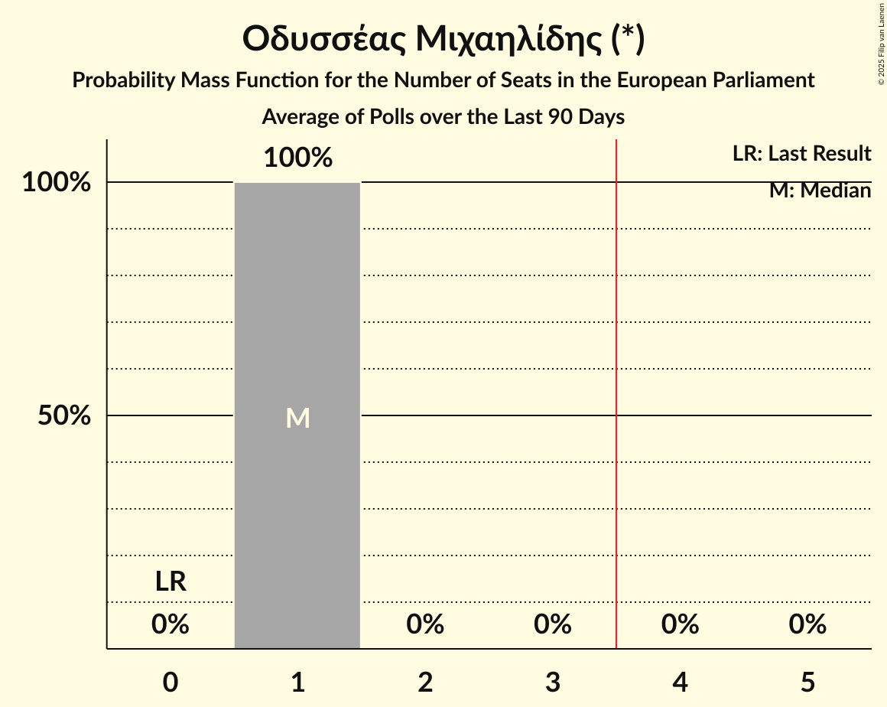

# Οδυσσέας Μιχαηλίδης (*)

<a href="#voting-intentions">Voting Intentions</a> | <a href="#seats">Seats</a>

## Voting Intentions

Last result: **0.0%** (General Election of 9 June 2024)

### Confidence Intervals

| Period     | Polling firm/Commissioner(s) | Median | 80% Confidence Interval | 90% Confidence Interval | 95% Confidence Interval | 99% Confidence Interval |
|:----------:|:----------------:|:-----------:|:-----------------------:|:-----------------------:|:-----------------------:|:-----------------------:|
| N/A | [Poll Average](average.html) | 13.7% | 11.5–16.3% | 11.0–17.1% | 10.5–17.7% | 9.8–19.1% |
| [12–22 September 2025](2025-09-22-Stratego-IMR.html) | Stratego-IMR   Η Καθημερινή | 12.5% | 11.0–14.3% | 10.6–14.8% | 10.2–15.3% | 9.6–16.2% |
| [11 August 2025](2025-08-11-Cypronetwork.html) | Cypronetwork | 12.3% | 10.9–14.0% | 10.5–14.5% | 10.1–14.9% | 9.5–15.8% |
| [1–8 July 2025](2025-07-08-Symmetron.html) | Symmetron   2Dots | 15.2% | 13.1–17.6% | 12.5–18.3% | 12.1–18.9% | 11.2–20.1% |
| [24–28 June 2025](2025-06-28-IMRUNic.html) | IMR/UNic   Reporter | 14.8% | 13.3–16.5% | 12.9–17.0% | 12.5–17.4% | 11.8–18.3% |
| [1–31 March 2025](2025-03-31-Symmetron.html) | Symmetron   2Dots | 0.0% | N/A | N/A | N/A | N/A |
| [10–21 March 2025](2025-03-21-Redwolf.html) | Redwolf | 11.1% | 9.8–12.7% | 9.4–13.2% | 9.1–13.6% | 8.4–14.4% |
| [5–11 March 2025](2025-03-11-IMRUNic.html) | IMR/UNic   Reporter | 13.9% | 12.5–15.6% | 12.0–16.1% | 11.7–16.5% | 11.0–17.4% |
| [21 October–1 November 2024](2024-11-01-RAIConsultants.html) | RAI Consultants   Alpha TV | 0.0% | N/A | N/A | N/A | N/A |
| [14–16 October 2024](2024-10-16-RetailZoom.html) | RetailZoom | 0.0% | N/A | N/A | N/A | N/A |
| [25 September–5 October 2024](2024-10-05-Symmetron.html) | Symmetron   2Dots | 0.0% | N/A | N/A | N/A | N/A |

### Probability Mass Function

The following table shows the probability mass function per percentage block of voting intentions for the [poll average](average.html) for Οδυσσέας Μιχαηλίδης (*).

| Voting Intentions | Probability | Accumulated | Special Marks |
|:-----------------:|:-----------:|:-----------:|:-------------:|
| 0.0–0.5% | 0% | 100% | Last Result |
| 0.5–1.5% | 0% | 100% |  |
| 1.5–2.5% | 0% | 100% |  |
| 2.5–3.5% | 0% | 100% |  |
| 3.5–4.5% | 0% | 100% |  |
| 4.5–5.5% | 0% | 100% |  |
| 5.5–6.5% | 0% | 100% |  |
| 6.5–7.5% | 0% | 100% |  |
| 7.5–8.5% | 0% | 100% |  |
| 8.5–9.5% | 0.3% | 100% |  |
| 9.5–10.5% | 2% | 99.7% |  |
| 10.5–11.5% | 9% | 97% |  |
| 11.5–12.5% | 16% | 89% |  |
| 12.5–13.5% | 19% | 72% |  |
| 13.5–14.5% | 19% | 53% | Median |
| 14.5–15.5% | 16% | 34% |  |
| 15.5–16.5% | 11% | 19% |  |
| 16.5–17.5% | 5% | 8% |  |
| 17.5–18.5% | 2% | 3% |  |
| 18.5–19.5% | 0.7% | 1.0% |  |
| 19.5–20.5% | 0.2% | 0.3% |  |
| 20.5–21.5% | 0% | 0.1% |  |
| 21.5–22.5% | 0% | 0% |  |

## Seats

Last result: **0** seats (General Election of 9 June 2024)

### Confidence Intervals

| Period     | Polling firm/Commissioner(s) | Median | 80% Confidence Interval | 90% Confidence Interval | 95% Confidence Interval | 99% Confidence Interval |
|:----------:|:----------------:|:------:|:-----------------------:|:-----------------------:|:-----------------------:|:-----------------------:|
| N/A | [Poll Average](average.html) | 1 | 1 | 1 | 1 | 1 |
| [12–22 September 2025](2025-09-22-Stratego-IMR.html) | Stratego-IMR   Η Καθημερινή | 1 | 1 | 1 | 1 | 1 |
| [11 August 2025](2025-08-11-Cypronetwork.html) | Cypronetwork | 1 | 1 | 1 | 1 | 1 |
| [1–8 July 2025](2025-07-08-Symmetron.html) | Symmetron   2Dots | 1 | 1 | 1 | 1 | 1 |
| [24–28 June 2025](2025-06-28-IMRUNic.html) | IMR/UNic   Reporter | 1 | 1 | 1 | 1 | 1 |
| [1–31 March 2025](2025-03-31-Symmetron.html) | Symmetron   2Dots |  |  |  |  |  |
| [10–21 March 2025](2025-03-21-Redwolf.html) | Redwolf | 1 | 1 | 1 | 1 | 1 |
| [5–11 March 2025](2025-03-11-IMRUNic.html) | IMR/UNic   Reporter | 1 | 1 | 1 | 1 | 1 |
| [21 October–1 November 2024](2024-11-01-RAIConsultants.html) | RAI Consultants   Alpha TV |  |  |  |  |  |
| [14–16 October 2024](2024-10-16-RetailZoom.html) | RetailZoom |  |  |  |  |  |
| [25 September–5 October 2024](2024-10-05-Symmetron.html) | Symmetron   2Dots |  |  |  |  |  |

### Probability Mass Function

The following table shows the probability mass function per seat for the [poll average](average.html) for Οδυσσέας Μιχαηλίδης (*).

| Number of Seats | Probability | Accumulated | Special Marks |
|:---------------:|:-----------:|:-----------:|:-------------:|
| 0 | 0% | 100% | Last Result |
| 1 | 100% | 100% | Median |

